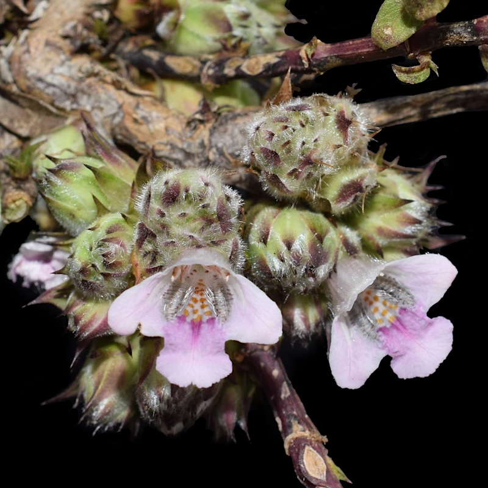
## Acanthaceae

Administers: Acanthaceae

Primary TENs contact: [Iain Darbyshire](mailto:) from [Royal Botanic Gardens, Kew](https://about.worldfloraonline.org/consortium-members/royal-botanic-gardens-kew)

> *Acanthaceae: A pantropical and subtropical family of exceptional diversity, ecological importance and conservation value*
>
> **

With an estimated 4,900 species across over 190 genera, the Acanthaceae are amongst the most diverse lineages of flowering plants globally, particularly in the tropics where they regularly fall within the top 10 most species-rich families on regional checklists. Species of Acanthaceae can be of high ecological significance, often forming an important component of the ground flora. An unusually high proportion of the species are very range-restricted and so face potentially heightened extinction risk, rendering the family of high conservation concern. Acanthaceae are also of horticultural importance, with many ornamental species being common in gardens and glasshouses such as members of the genera *Acanthus*, *Justicia* s.l., *Odontonema*, *Sanchezia* and *Strobilanthes*, whilst a range of Acanthaceae species have ethnopharmacological value. Despite these facts, our understanding of the evolutionary history and taxonomy of the Acanthaceae remains incomplete, and it is acknowledged to be amongst the plant families with the lowest ratio of ​"scholars to species" in taxonomic terms.

The Acanthaceae Taxonomic Expert Network brings together the most active taxonomists and systematists with an interest in or focus on Acanthaceae from around the world. We are a newly formed group and actively seeking new members, particularly for geographic gaps in our membership.

---

[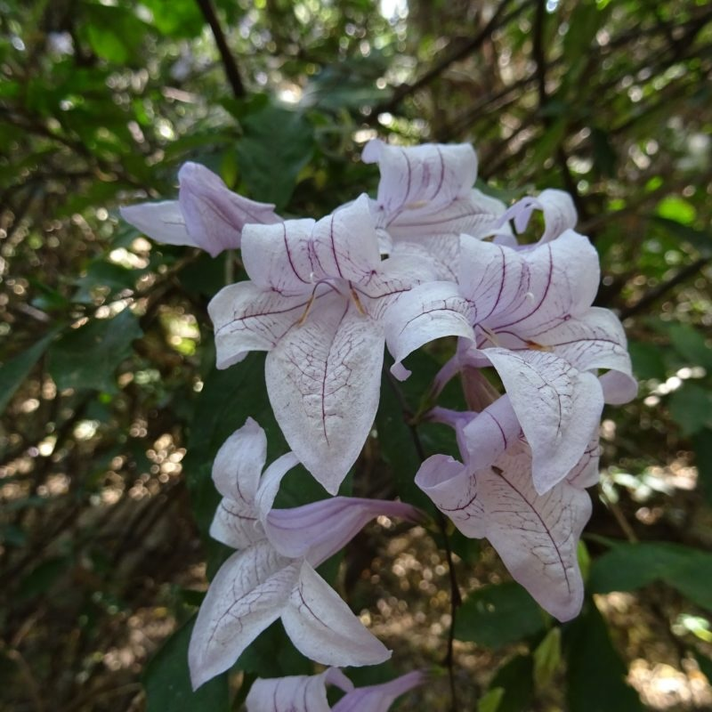](./_Acanthaceae/fig_01.jpg)
[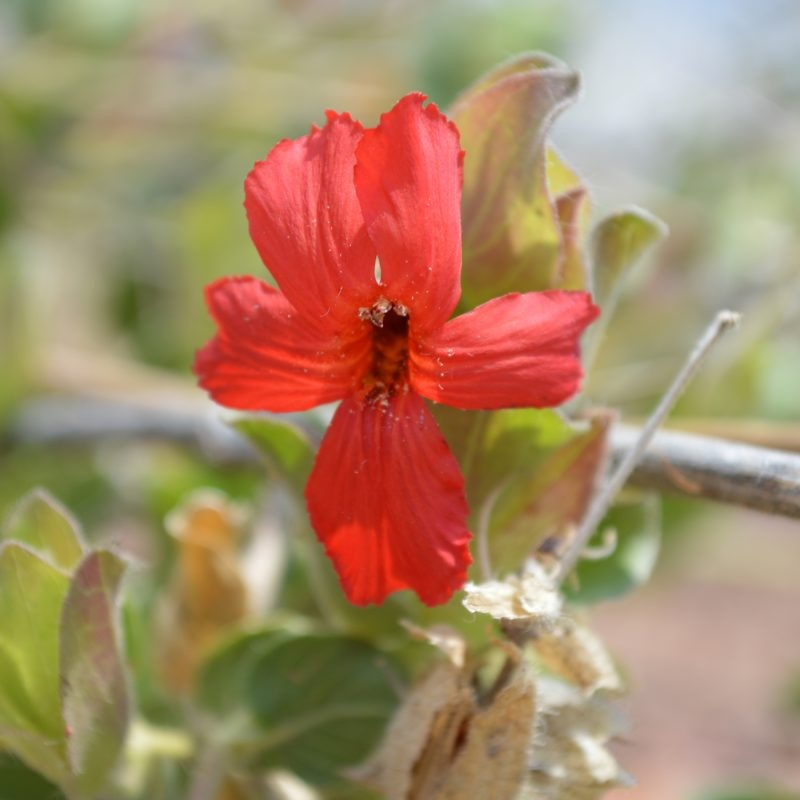](./_Acanthaceae/fig_02.jpg)
[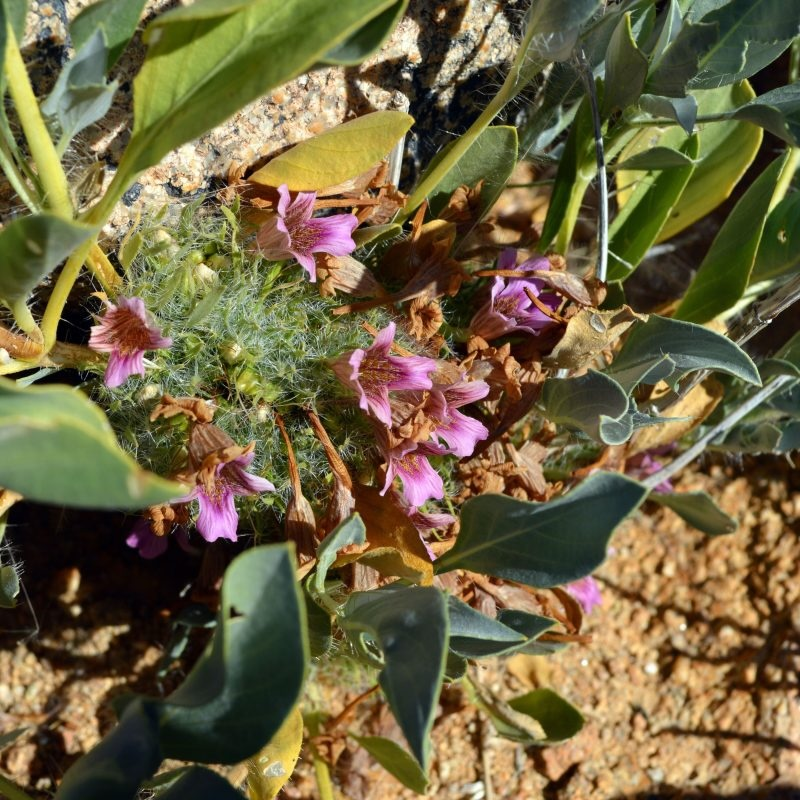](./_Acanthaceae/fig_03.jpg)
[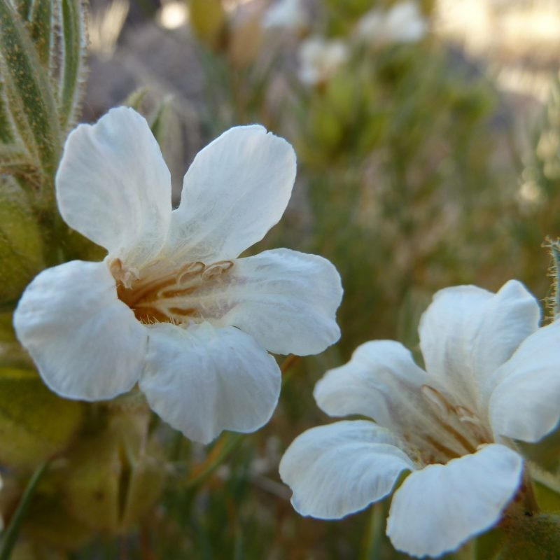](./_Acanthaceae/fig_04.jpg)
[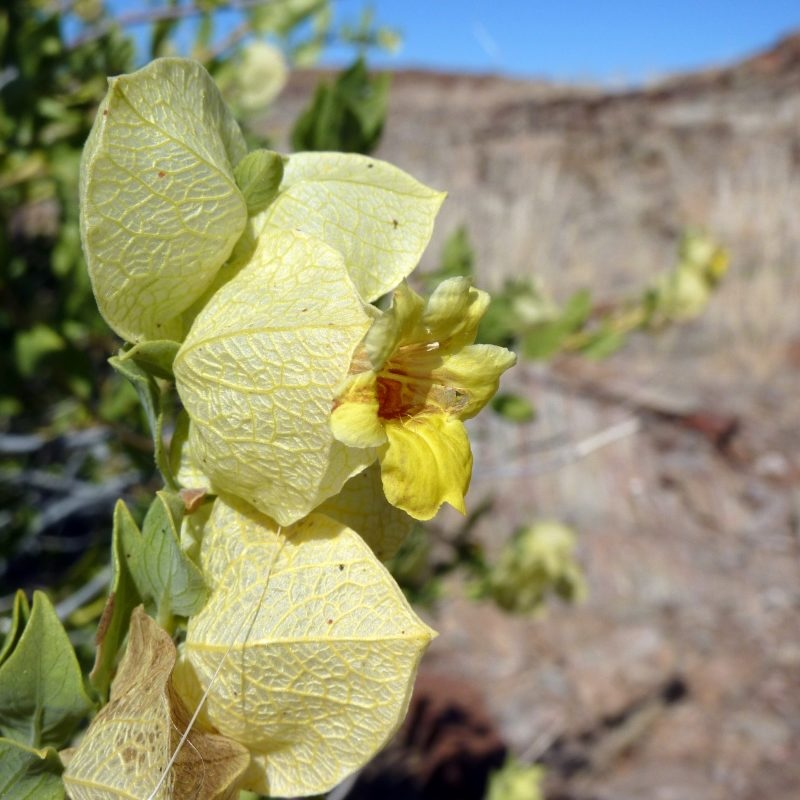](./_Acanthaceae/fig_05.jpg)

[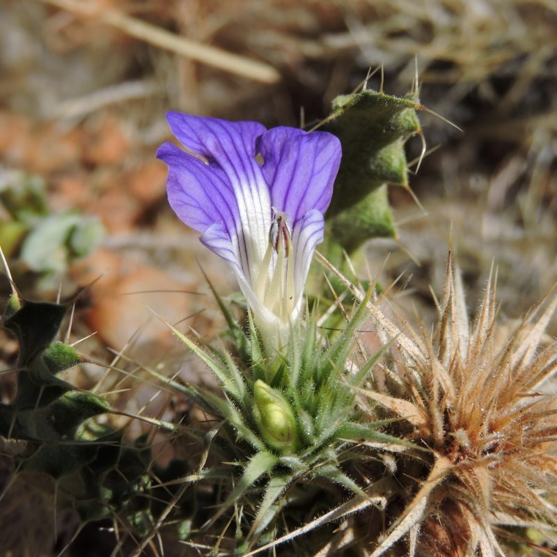](./_Acanthaceae/fig_06.jpg)
[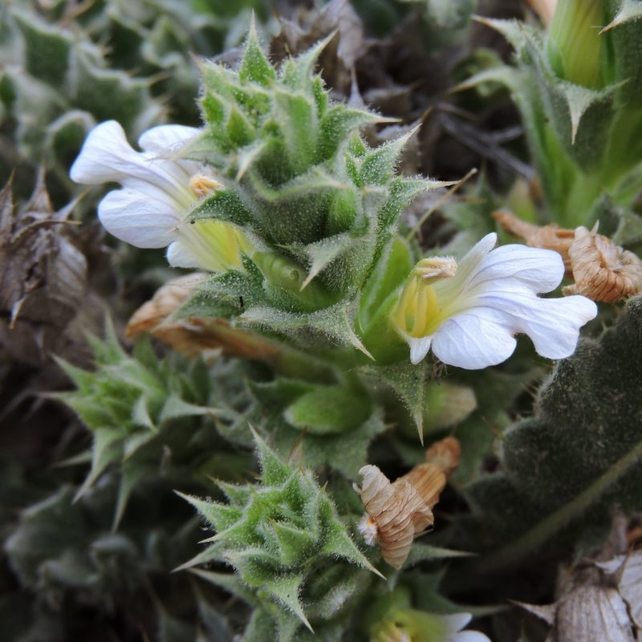](./_Acanthaceae/fig_07.jpg)
[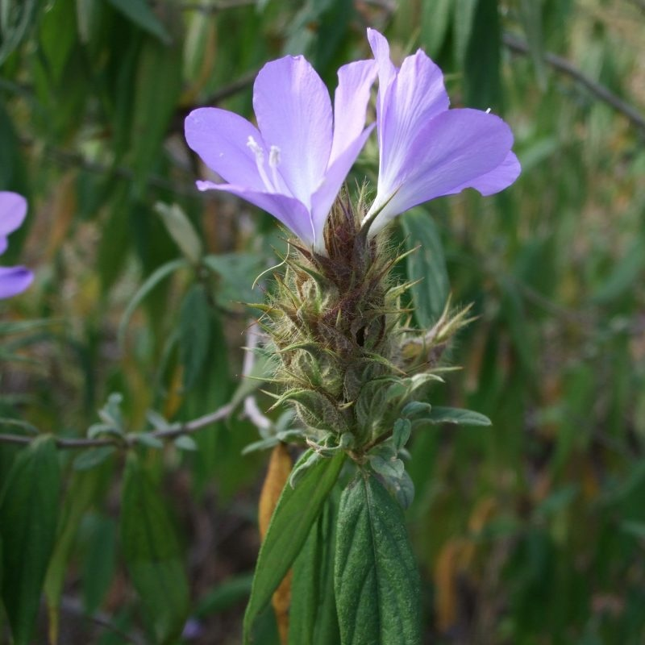](./_Acanthaceae/fig_08.jpg)
[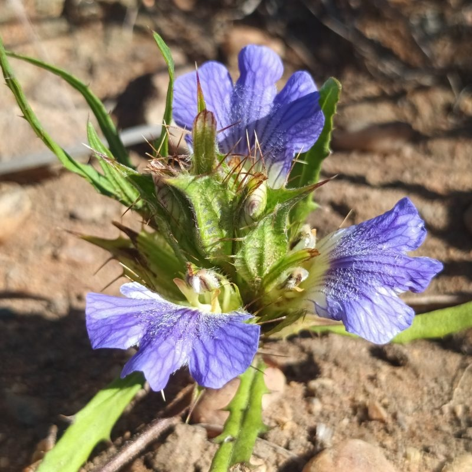](./_Acanthaceae/fig_09.jpg)
[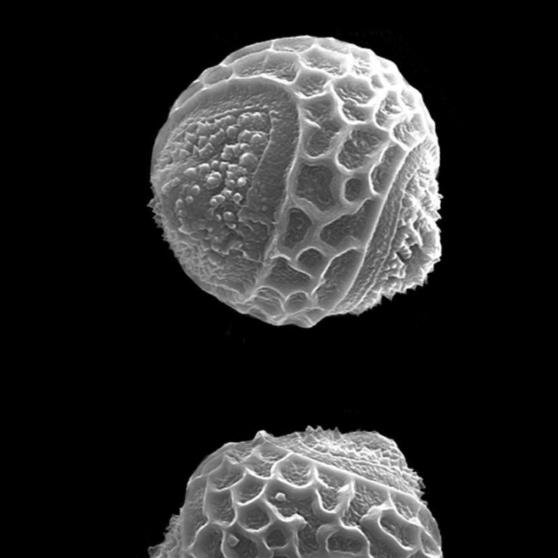](./_Acanthaceae/fig_10.jpg)

---

Acanthaceae images.

### Key Contributors

-   Amanda Fisher (California State University, Long Beach, USA)
-   Bhaskhar Adhikari (Royal Botanic Garden Edinburgh, UK)
-   Carrie Kiel (California Botanic Garden, USA)
-   Cecilia Ezcurra (INIBIOMA, CONICET-UN Comahue, Argentina)
-   Cintia Kameyama (Instituto de Botânica, Brazil)
-   Deng Yunfei (South China Botanical Garden, Chinese Academy of Sciences, China)
-   Denise Monte Braz (Universidade Federal Rural do Rio de Janeiro, Brazil)
-   Dieter Wasshausen (Smithsonian Museum, USA)
-   Erin Manzitto-Tripp (University of Colorado, USA)
-   Fabio Araujo da Silva (Herbarium COOE, Instituto Federal de Rondônia, Brazil)
-   Gunadalayan Gnanasekaran (Madras Christian College, India)
-   Hester Steyn (South African National Biodiversity Institute, South Africa)
-   Iain Darbyshire (Royal Botanic Gardens Kew, UK)
-   Igor Azevedo (Universidade Federal do Mato Grosso, Brazil)
-   John Wood (University of Oxford, UK)
-   Kaj Vollesen (Royal Botanic Gardens Kew, UK)
-   Kanokorn Rueangsawang (Ramkhamhaeng University, Thailand)
-   Kevin Balkwill (University of the Witwatersrand, South Africa)
-   Lucinda McDade (California Botanic Garden, USA)
-   Pete Phillipson (Missouri Botanical Garden, USA)
-   Tom Daniel (California Academy of Sciences, USA)

### Acknowledgements

We thank Alan Elliott of Royal Botanic Garden Edinburgh for supporting the establishment of the Acanthaceae TEN, and to all the researchers who have contributed taxonomic data on Acanthaceae.

[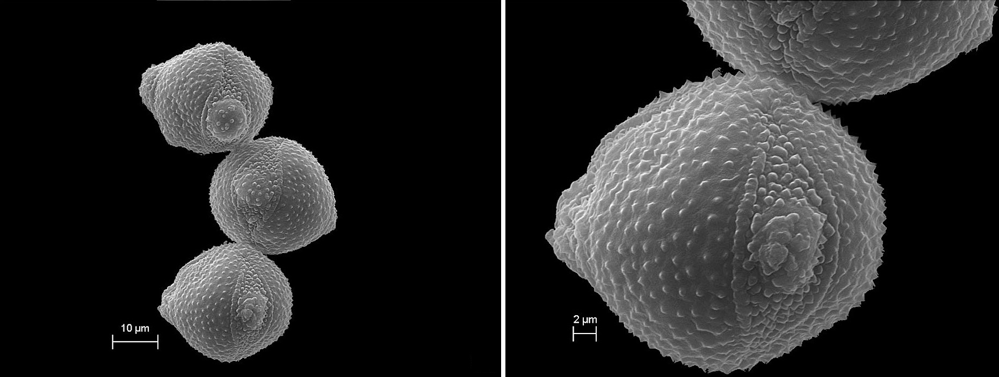](./_Acanthaceae/pollen.jpg)

Andrographis alata pollen. (India) © G. Gnanasekaran

#### Key Literature

-   [Manzitto-Tripp, E.A., Darbyshire, I., Daniel, T.F., Kiel, C.A. & McDade, L.A. (2022). Revised classification of Acanthaceae and worldwide dichotomous keys. Taxon 71: 103 -- 153.](https://doi.org/10.1002/tax.12600)
-   [Fernandes, U.G., Manzitto-Tripp, E.A., Medina, N., Simão-Bianchini, R. & Kameyama, C. (2024). Novelties in Ruellia (Acanthaceae) for the Brazilian Cerrado. Systematic Botany 49: 1 -- 36.](https://doi.org/10.1600/036364424X17110456120721)
-   [Steyn, H.M. & Van Wyk A.E. (2024). Notes on morphological characteristics and life history strategy of the genus Acanthopsis Harv. (Acanthaceae). Bothalia - African Biodiversity & Conservation 54(1): a7](https://doi.org/10.38201/btha.abc.v54.7)
-   [Wood, J.R.I., Hoyos-Gómez, S.E., & Zarate, D.E.G. (2024). A glimpse into the diversity of Colombian Acanthaceae. Kew Bulletin 79: 145 -- 183.](https://doi.org/10.1007/s12225-023-10146-4)
-   [Cornejo, X., Wasshausen, D., Exe, N. & Johnson, M. (2023). The reinstatement of Aphanandrium (Acanthaceae), a new species from Ecuador and four new combinations. Harvard Papers in Botany 28: 31 -- 35.](https://doi.org/10.3100/hpib.v28iss1.2023.n4)
-   [Daniel, T. F. (2023). Revision of Calycacanthus (Acanthaceae: Justicieae: Monotheciinae) with a new species from Papua New Guinea. Harvard Papers in Botany 28: 37 -- 49.](https://doi.org/10.3100/hpib.v28iss1.2023.n5)
-   [Darbyshire, I., Onjalalaina, G. E., Callmander, M. W., Phillipson, P.B. & Kiel, C.A. (2023). Notes on Isoglossinae (Acanthaceae) in Madagascar, with four new species of Isoglossa. Kew Bulletin 78: 43 -- 65.](https://doi.org/10.1007/s12225-022-10066-9)
-   [Gnanasekaran, G., King, A. F. J., Kasim, S. M. & Arisdason, W. (2023). Lepidagathis gandhii (Barlerieae: Acanthaceae), a new species from Tamil Nadu, India. Kew Bulletin 78: 203 -- 212.](https://doi.org/10.1007/s12225-023-10086-z)
-   [Kiel, C.A., Manzitto-Tripp, E., Fisher, A.E., Porter, J. M. & McDade, L.A. (2023). Remarkable variation in androecial morphology is closely associated with corolla traits in Western Hemisphere Justiciinae (Acanthaceae: Justicieae). Annals of Botany 132: 43 -- 60.](https://doi.org/10.1093/aob/mcad068)
-   [Manzitto‐Tripp, E.A. & Daniel, T.F. (2023). Phylogeny and revised classification of New World Ruellia. Taxon 72: 1034 -- 1056.](https://doi.org/10.1002/tax.13001)
-   [Silva, F.A., Feio, A.C., Mendonça, R.A., Kameyama, C. & Zappi, D.C. (2023). On the true identity of Mendoncia "stellate" trichomes. Acta Botanica Brasilica 37: 1 -- 10.](https://doi.org/10.1590/1677-941X-ABB-2022-0245)
-   [Braz, D.M., Azevedo, I.H.F., Salimena, F.R. G. & Menini, L. (2022). Acanthaceae in the Serra Negra, Minas Gerais, Brazil. Rodriguésia 73: e00732021.](https://doi.org/10.1590/2175-7860202273070)
-   [Comito, R., Darbyshire, I., Kiel, C., McDade, L. & Fisher, A.E. (2022). A RADseq phylogeny of Barleria (Acanthaceae) resolves fine-scale relationships. Molecular Phylogenetics and Evolution 169: 107428.](https://doi.org/10.1016/j.ympev.2022.107428)
-   Darbyshire, I., Balkwill, K., & Froneman, W. (2022). Two new species of Barleria (Acanthaceae) from the Soutpansberg of Limpopo Province, South Africa. Kew Bulletin 77(2), 475-489.
-   Phillipson, P.B., Andriamahefarivo, L., Callmander, M.W., Daniel, T.F., Darbyshire, I., Kiel, C.A., Letsara, R., McDade, L. & Tripp, E. (2022). Acanthaceae. pp. 789 -- 799 in: S.M. Goodman (ed.), The New Natural History of Madagascar. Volume 1. Princeton University Press, Princeton and Oxford.
-   [Silva, F.A.D., Kameyama, C., Zappi, D. & Gil, A.D.S.B. (2022). The genus Justicia (Acanthaceae) in the state of Pará, Amazon, Brazil. Rodriguésia 73: e00522020.](https://doi.org/10.1590/2175-7860202273046)
-   [Azevedo, I. H., & Moraes, P. L. (2021). An intriguing new species of Sanchezia (Acanthaceae) from Southeastern Peru. Systematic Botany 46: 1080 -- 1085.](https://doi.org/10.1600/036364421X16370110179483)
-   [Braz, D.M., Daniel, T.F., Kiel, C., Gao, A., Jawadi, S. & Monteiro, R. (2021). Aymoreana (Nelsonioideae, Acanthaceae), a new genus endemic to Brazil. Systematic Botany 46: 211 -- 217.](https://doi.org/10.1600/036364421X16128061189530)
-   [Darbyshire, I., Manzitto-Tripp, E.A. & Chase, F.M. (2021). A taxonomic revision of Acanthaceae tribe Barlerieae in Angola and Namibia. Part 2. Kew Bulletin 76: 127 -- 190.](https://doi.org/10.1007/s12225-021-09928-5)
-   Hammes, J. K., Silva, M.G.D., Kameyama, C. & Temponi, L. G. (2021). Flora of Acanthaceae of Iguaçu National Park, Paraná, Brazil. Rodriguésia 72: e00762019.
-   [McDade, L.A., Daniel, T.F., Darbyshire, I. & Kiel, C.A. (2021). Justicieae II: Resolved placement of many genera and recognition of a new lineage sister to Isoglossinae. Aliso: A Journal of Systematic and Floristic Botany 38: Iss. 1, Article 2, 1 -- 31.](https://doi.org/10.5642/aliso.20213801.02)
-   [Silva, F.A., Taylor, N.P. & Zappi, D.C. (2021). Superseding the type of Mendoncia (Acanthaceae) with a species from eastern Brazil. Taxon 70: 875 -- 879.](https://doi.org/10.1002/tax.12504)
-   [Wood, J.R.I. & Scotland, R. W. (2021). A Strobilanthes (Acanthaceae) miscellany. Kew Bulletin 76: 827 -- 840.](https://doi.org/10.1007/s12225-021-09990-z)
-   [Adhikari, B. & Wood, J.R.I. (2020). Thunbergia kasajuana, a new species of Acanthaceae from Nepal. Kew Bulletin 75, 26.](https://doi.org/10.1007/s12225-020-9883-5)
-   [Braz, D.M., Chagas, E.C.O., Fernandes, U.G., Costa-Lima, J.L., Zanatta, M.R.V., Kameyama, C., Côrtes, A.L.A., Indriunas, A., Silva, F.A., Monteiro, F.K.S., Azevedo, I.H.F., Zuntini, A.R., Rodrigues, M.C., Paglia, I., Souza, V.C., Pioner, N.C., Melo, J.I.M., Gil, A.S.B., Ezcurra, C., Pessoa, C.S., Hirao, Y.V. & Fernando, E.M.P. (2020). Acanthaceae. In: Flora do Brasil. Jardim Botânico do Rio de Janeiro.](https://floradobrasil2020.jbrj.gov.br/FB33)
-   [Darbyshire, I., Kiel, C.A., Astroth, C.M., Dexter, K.G., Chase, F.M. & Tripp, E.A. (2020). Phylogenomic study of Monechma reveals two divergent plant lineages of ecological importance in the African savanna and succulent biomes. Diversity 12: 237.](https://doi.org/10.3390/d12060237)
-   [Deng, Y., Tan, Y., Lin, Z. & Huang, Y. (2020). Gymnostachyum morsei (Acanthaceae: Andrographideae), a new species from Guangxi, China. Kew Bulletin 75: 1 --6.](https://doi.org/10.1007/s12225-020-09920-5)
-   Rueangsawang, K., Simpson, D. A. & Chantaranothai, P. (2020). Justicia larsenii and J. saksuwaniae, two new species of Acanthaceae from Peninsular Thailand. Tropical Natural History 20: 116 -- 124.
-   [Rueangsawang, K., Suddee, S., Chantaranothai, P. & Simpson, D. (2020). A synopsis of Rungia (Acanthaceae) in Thailand. Thai Forest Bulletin (Botany) 48: 61-- 71.](https://doi.org/10.20531/tfb.2020.48.1.11)
-   [Tripp, E.A. & Darbyshire, I. (2020). Mcdadea: A new genus of Acanthaceae endemic to the Namib Desert of Southwestern Angola. Systematic Botany 45: 200 -- 211.](https://doi.org/10.1600/036364420X15801369352478)
-   [Zanatta, M.R.V., Daniel, T. F., Kameyama, C. & Proença, C. E. (2020). Two New Rare, Endangered Species of Stenandrium (Acanthaceae: Acantheae) Reinforce Proposed Centers of Endemism and Key Biodiversity Areas in the Serra do Espinhaço, Brazil. Systematic Botany 45: 349 -- 360.](https://doi.org/10.1600/036364420X15862837791357)
-   [Darbyshire, I., Fisher, A.E., Kiel, C.A. & McDade, L.A. (2019). Phylogenetic relationships among species of Barleria (Acanthaceae, Lamiales): Molecular data reveal complex patterns of morphological evolution and support a revised classification. Taxon 68: 92 -- 111](https://doi.org/10.1002/tax.12029)
-   [Darbyshire, I., Kiel, C.A., Daniel, T.F., McDade, L.A. & Luke, W.R.Q. (2019). Two new genera of Acanthaceae from tropical Africa. Kew Bulletin 74: 39.](https://doi.org/10.1007/s12225-019-9828-z)
-   Ezcurra, C. (2019). Acanthaceae. In: F. Zuloaga & M. Belgrano (eds.), Flora Argentina. Flora Vascular de la República Argentina 20: 1 -- 76. IBODA CONICET, Buenos Aires.
-   [Ezcurra, C., Côrtes, L.A., & Daniel, T.F. (2019). A synopsis of Thyrsacanthus (Acanthaceae) in Argentina and Paraguay, with notes on generic delimitation, a new combination, and lectotypifications. Phytotaxa 395: 81 -- 88.](https://doi.org/10.11646/phytotaxa.395.2.4)
-   [Gao, C., Deng, Y., & Wang, J. (2019). The complete chloroplast genomes of Echinacanthus species (Acanthaceae): phylogenetic relationships, adaptive evolution, and screening of molecular markers. Frontiers in Plant Science 9: 411624.](https://doi.org/10.3389/fpls.2018.01989)
-   [Steyn, H.M., Von Staden, L., Bellstedt, D.U., Van der Merwe, P.D.W. & Van Wyk, A.E. (2019). Notes on the phytogeography and conservation status of the genus Acanthopsis (Acantheae, Acanthaceae). Phytotaxa 415: 157 -- 178.](https://doi.org/10.11646/phytotaxa.415.4.1)
-   [Wood, J.R.I. (2019). Stenostephanus (Acanthaceae) in Peru. Kew Bulletin 74: 64.](https://doi.org/10.1007/s12225-019-9843-0)
-   [Kiel, C.A., Daniel, T.F. & McDade, L.A. (2018). Phylogenetics of New World 'justicioids'(Justicieae: Acanthaceae): Major lineages, morphological patterns, and widespread incongruence with classification. Systematic Botany 43: 459 -- 484.](https://doi.org/10.1600/036364418X697201)
-   [McDade, L.A., Daniel, T.F. & Kiel, C.A. (2018). The Tetramerium Lineage (Acanthaceae, Justicieae) revisited: Phylogenetic relationships reveal polyphyly of many New World genera accompanied by rampant evolution of floral morphology. Systematic Botany 43: 97 -- 116.](https://doi.org/10.1600/036364418X697003)
-   [Balkwill, K., Sebola, R. J. & Poriazis, D. L. (2017). Taxonomic revision of white-flowered Isoglossa Oerst.(Acanthaceae) in southern Africa. South African Journal of Botany 108: 48 -- 80.](https://doi.org/10.1016/j.sajb.2016.09.013)
-   [Braz, D.M. & Monteiro, R. (2017). Taxonomic revision of Staurogyne (Nelsonioideae, Acanthaceae) in the Neotropics. Phytotaxa 296: 1 -- 40.](https://doi.org/10.11646/phytotaxa.296.1.1)
-   [Kiel, C.A., Daniel, T.F., Darbyshire, I. & McDade, L.A. (2017). Unraveling relationships in the morphologically diverse and taxonomically challenging "justicioid" lineage (Acanthaceae: Justicieae). Taxon 66: 645 -- 674.](https://doi.org/10.12705/663.8)
-   [Steyn, H.M., & Van Wyk, A. E. (2017). Taxonomic notes on Acanthopsis Harv.(Acanthaceae, tribe Acantheae): the group with trifid bracts. Phytotaxa 295: 201 -- 217.](https://doi.org/10.11646/phytotaxa.295.3.1)
-   [Tripp, E.A. & Darbyshire, I. (2017). Phylogenetic relationships among Old World Ruellia L.: a new classification and reinstatement of the genus Dinteracanthus Schinz. Systematic Botany 42: 470 -- 483.](https://doi.org/10.1600/036364417X695961)
-   [Deng, Y., Gao, C., Xia, N. & Peng, H. (2016). Wuacanthus (Acanthaceae), a new Chinese endemic genus segregated from Justicia (Acanthaceae). Plant Diversity 38: 312 -- 321.](https://doi.org/10.1016/j.pld.2016.11.010)
-   [Gnanasekaran, G., Murthy, G.V.S. & Deng, Y.F. (2016). Resurrection of the genus Haplanthus (Acanthaceae: Andrographinae). Blumea 61: 165 -- 169.](https://doi.org/10.3767/000651916X693185)