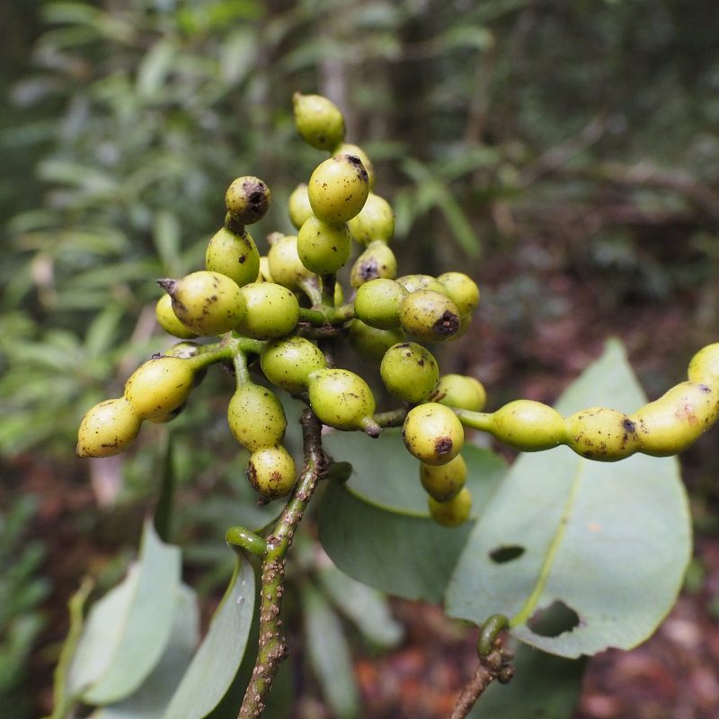
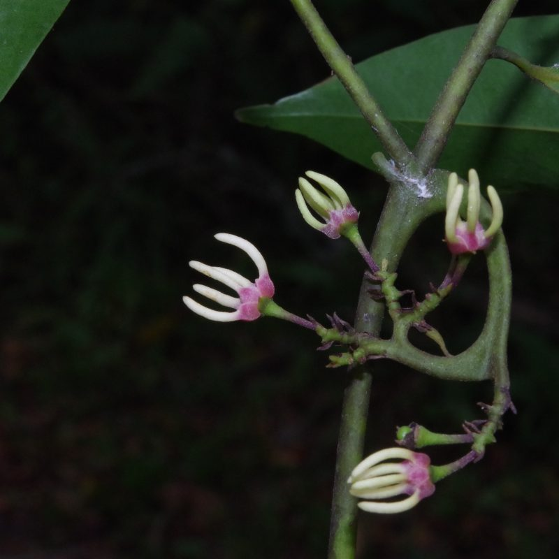
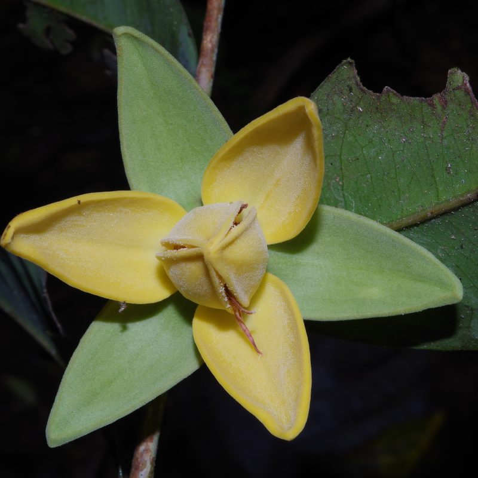
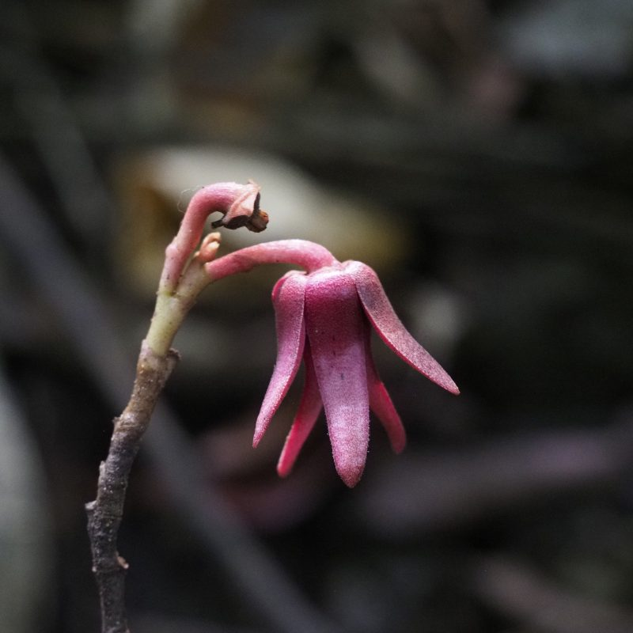
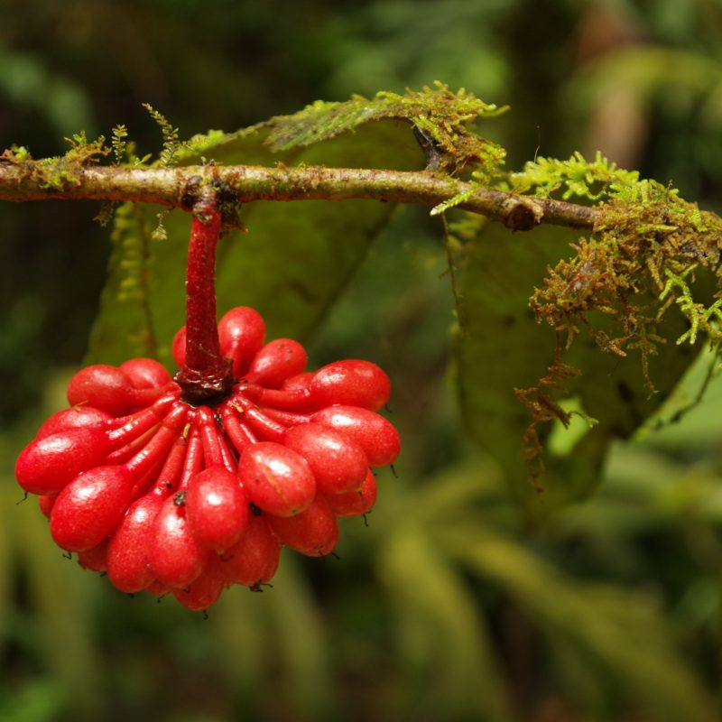

## Annonaceae

__Administers:__ [Annonaceae](wfo-7000000031)

Primary TENs contact: [Thomas Couvreur](mailto:thomas.couvreur[at]rd.fr)

### Annonaceae -- The Annonaceae Global Phylogenetic Consortium (AGPC)

Annonaceae is an ecologically important tropical plant family of ca. 2500 species and 108 genera occurring in India, South East Asia, Malay archipelago, New Guinea, Pacific islands, northern Australia, India, Africa, Madagascar, Neotropics and eastern North America.

A central goal of the Annonaceae Global Phylogenetic Consortium is to generate a check list of accepted names for Annonaceae. This objective is crucial for several underlining projects around Annonaceae systematics, phylogenetics, evolution and conservation. This is especially relevant within the context of biodiversity research focusing on understating tropical rain forest ecology, evolution and its preservation. Ultimately, we expect the WFO Annonaceae checklist to serve as the taxonomic backbone for several large scale databases underpinning biodiversity research such as the International Union of Conservation of Nature (IUCN) in particular Red Listing, the Global Biodiversity Information Facility (GBIF), Catalogue of Life, World Flora Online, and several ongoing phylogenomic projects, in particular the Annonaceae Tree of Life.

The Annonaceae TEN was initially based on the AnnonBase database created and curated under the leadership of Heimo Rainer (Naturhistorisches Museum Wien, Austria) and Lars Chatour (Ghent University, Belgium). In April 2023 the taxonomy was updated following Plants of the World Online taxonomy (this was curated by Rafaël Govaerts at the Royal Botanic Gardens, Kew). Now the data is curated directly within the Rhakhis dataset system by the TEN editors.

### Joining The Annonaceae TEN

If you want to contribute to this global effort, please contact the Annonaceae TEN curator.

### Acknowledgements

This is a large international effort that started with AnnoBase lead by Heimo Rainer and Lars Chatrou during the 2000s. In addition, the TEN Annonaceae acknowledges the huge international effort that has been done over the past four decades around Annonaceae systematics which started in the 80s at the National Herbarium Netherlands (Utrecht branch) under Paul Maas leadership.

We also thank Rafaël Govaerts at the Royal Botanic Gardens, Kew for updating and curating the POWO Annonaceae list.

The current advancements are undertaken within the Annonaceae Global Phylogenetic Consortium and in the ERC GLOBAL project (see [www​.cou​vreurlab​.org](http://www.couvreurlab.org/) for details) supported by funding from the European Research Council (ERC) under the European Union's Horizon 2020 research and innovation program (grant agreement No. 865787).

#### Recent classification

-   [Chatrou LW, Pirie MD, Erkens RHJ, Couvreur TLP, Neubig KM, Abbott JR, Mols JB, Maas JW, Saunders RMK, Chase MW (2012) A new subfamilial and tribal classification of the pantropical flowering plant family Annonaceae informed by molecular phylogenetics. Botanical Journal of the Linnean Society 169: 5--40. https://doi.org/10.1111/j.1095-8339.2012.01235.x](https://doi.org/10.1111/j.1095-8339.2012.01235.x)
-   [Couvreur TLP, Helmstetter AJ, Koenen EJM, Bethune K, Brandão RD, Little SA, Sauquet H, Erkens RHJ (2019) Phylogenomics of the Major Tropical Plant Family Annonaceae Using Targeted Enrichment of Nuclear Genes. Frontiers in Plant Science 9. https://doi.org/10.3389/fpls.2018.01941](https://doi.org/10.3389/fpls.2018.01941)
-   [Guo X, Tang CC, Thomas DC, Couvreur TLP, Saunders RMK (2017) A mega-phylogeny of the Annonaceae: taxonomic placement of five enigmatic genera and support for a new tribe, Phoenicantheae. Scientific Reports 7: 7323. https://doi.org/10.1038/s41598-017-07252-2](https://doi.org/10.1038/s41598-017-07252-2)

Older classification

-   Baillon, H. 1868. Mémoire sur la famille des Anonacées. *Adansonia* 8:295--344.
-   Bentham, G., & Hooker, D.J. 1862. Anonaceae. Pp. 20--29 in: Bentham, G., & Hooker, D.J., (eds), Genera plantarum. Black, London. p 20--29
-   Engler, A., & Diels, L. 1902. Anonaceae. Pp. 1--96 in: Engler, A., (ed), *Monographien afrikanischer Pflanzen-Familien und-Gattungen*. Engelmann, Leipzig. p 1--96
-   Fries, R.E. 1959. Annonaceae. Pp. 1--171 in: Engler, A., & K, P., (eds), *Die natürlichen Pflanzenfamilien*. Duncker & Humblot, Berlin. p 1--171.
-   Hutchinson, J. 1923. Contributions towards a phylogenetic classification of flowering plants. II. *Bulletin of Miscellaneous Information (Royal Botanic Gardens, Kew)* 1923:241--261.
-   Walker, J.W. 1971. Pollen morphology, phytogeography, and phylogeny of the Annonaceae. *Contributions from the Gray Herbarium of Harvard University*:1--130.
-   van Heusden, E.C.H. 1992. Flowers of Annonaceae: morphology, classification, and evolution. Rijksherbarium/​Hortus Botanicus, Leiden.
-   van Setten, A.K., & Koek-Noorman, J. 1986. Studies in Annonaceae. VI. A leaf anatomical survey of genera of Annonaceae in the Neotropics. *Botanische Jahrbücher für Systematik, Pflanzengeschichte und Pflanzengeographie* 108:17--50.

Selection of Annonaceae species from across the world (photos: Thomas L.P. Couvreur)