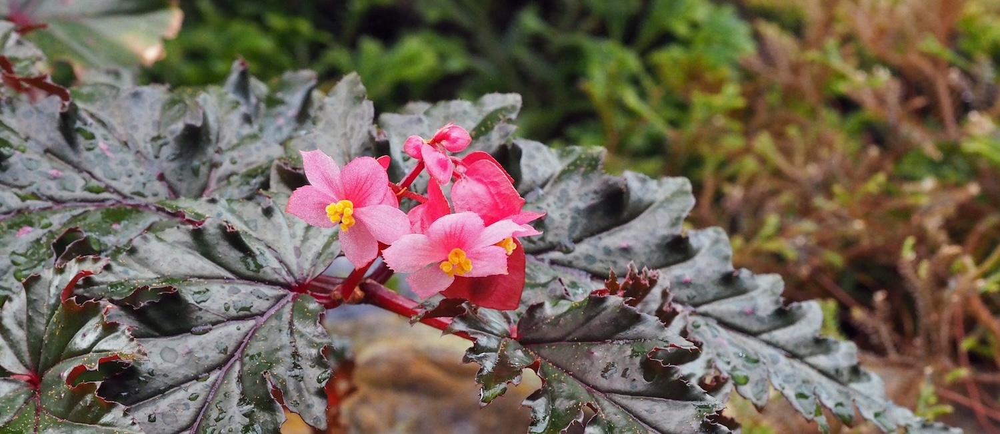

## Begoniaceae - Begonia Resource Centre

Administers: Begoniaceae

External website: <https://padme.rbge.org.uk/Begonia/>

Primary TENs contact: [Mark Hughes](mailto:mhughes@rbge.org.uk) from [Royal Botanic Garden Edinburgh](https://about.worldfloraonline.org/consortium-members/royal-botanic-garden-edinburgh)

> *Begonia* is one of the largest flowering plant genera and a research focus of the Royal Botanic Garden Edinburgh.
>
> **

The Begonia Resource Centre contains all names in *Begonia**,* (Accepted species: 1991, Accepted sections: 70, Updated: 8 September 2020). Linked to the names are type specimens and images of the protologue. Herbarium specimen data is also available, with over 55K records, many georeferenced and with images. Some species also have field photographs. If you would like to contribute any field images or specimen records, please contact us.

This is an ongoing project which has grown out of our previous Southeast Asian database to become global in scope, and although we believe all names to be present the type and protologue information is not yet completed for a few of them.

### Begonia Resource Centre

-   [Hughes, M., Moonlight, P.W., Jara-Muñoz, A., Tebbitt, M.C., Wilson, H.P. & Pullan, M. (2015--). Begonia Resource Centre. http://padme.rbge.org.uk/begonia/](http://padme.rbge.org.uk/begonia/)

### Acknowledgements

The following are gratefully acknowledged for permission to display their content on the Begonia Resource Centre, to be used for the common good in the areas of research, conservation and education. Botanische Jahrbücher für Systematik, Pflanzengeschichte und Pflanzengeographie; Gardens Bulletin Singapore; Kew Bulletin; Phillippine Journal of Science; Plant Systematics and Evolution, Webbia and the Biodiversity Heritage Library. We thank the curators of following herbaria for allowing us access to specimens: A, AA, ABD, AMAZ, ALCB, ANDA, B, BISH, BK, BKF, BKL, BM, BO, BRIT, C, CAS, CEB, CHAPA, CLEMS, COL, CPUN, CR, CUVC, E, EAC, F, FHO, FI, FMB, FRIM, G, G, GB, GH, HAST, HBG, HLDG, HOXA, HUA, HUEFS, HUSA, HUT, IZTA, K, KATH, KEP, KUN, K‑W, L, LAE, LPB, LY, MEX, MEXU, MICH, MO, MOL, NY, OXF, P, PDA, PNH, PSU, QCA, QCNE, QPLS, RB, S, SING, TI, TUCH, U, UC, UPNG, US, USM, VEN, WAG, Z.

This project was funded by the M.L. MacIntyre Begonia Trust, the Sibbald Trust and SYNTHESYS (awards NL-TAF 1608, FR-TAF 1416 and DE-TAF 2181). The Begonia Resource Centre is maintained at the Royal Botanic Garden Edinburgh, supported by the Scottish Government's Rural and Environment Science and Analytical Services Division (*RESAS*).

### Key Contributions

-   [Mark Hughes - Royal Botanic Garden Edinburgh - Southeast Asian Begonia and Begonia section Jackia](https://orcid.org/0000-0002-2168-0514)
-   [Peter W. Moonlight - Trinity College Dublin - Peruvian Begonia and Begonia section Pilderia](https://orcid.org/0000-0003-4342-2089)
-   [Adolfo Jara-Muñoz - Universidad Nacional de Colombia - Colombian Begonia and Begonia section Casparya](https://orcid.org/0000-0002-7123-124X)
-   [Mark C. Tebbitt - California University of Pennsylvania - Begonia sections Australes, Eupetalum, and Gobenia](https://www.calu.edu/inside/faculty-staff/profiles/mark-tebbitt.aspx)
-   [Daniel C. Thomas - Research and Conservation, Singapore Botanic Gardens, National Parks Board - SE Asian Begonia](https://orcid.org/0000-0002-1307-6042)
-   [Hannah P. Wilson - Royal Botanic Garden Edinburgh - Begonia of New Guinea](https://orcid.org/0000-0002-5231-3987)

### Key Literature

-   [Golding, J., & Wasshausen, D. (2002). Begoniaceae, Edition 2: Part I: Annotated Species List: Part II: Illustrated Key, Abridgment and Supplement. Contributions from the United States National Herbarium, 43, 1-289.](http://www.jstor.org/stable/23492596)
-   Hughes, M. (2008) An annotated checklist of Southeast Asian Begonia. Royal Botanic Garden Edinburgh, UK.
-   Doorenbos, J., Sosef, M.S.M. & de Wilde, J.J.F.E. (1998) The sections of Begonia: including descriptions, keys and species lists. Agricultural University, Wageningen.
-   [Moonlight, P.W., Ardi, W.H., Arroyo Padilla, L., Chung, K.-F., Fuller, D., Girmansyah, D., Hollands, R., Jara-Muñoz, A., Kiew, R., Leong, W.-C., Liu, Y., Mahardika, A., Marasinghe, L.D.K., O'Connor, M., Peng, C.-I., Pérez, A.J., Phutthai, T., Pullan, M, Rajbhandary, S., Reynel, C., Rubite, R.R., Sang, J., Scherberich, D., Shui, Y.-M., Tebbitt, M.C., Thomas, D.C., Wilson, H.P., Zaini, N.H. & Hughes, M. (2018). Dividing and conquering the fastest--growing genus: Towards a natural sectional classification of the mega--diverse genus Begonia (Begoniaceae). Taxon 67(2): 267-323.](https://doi.org/10.12705/672.3)
-   [Burt-Utley, K. (2015). Begoniaceae In (eds. Davidse, G., Sousa Sánchez, M., Knapp, S. & Chiang Cabrera, F.) Flora Mesoamericana Saururacece a Zygophyllaceae 2(3): 1-102.](https://www.tropicos.org/docs/meso/begoniaceae.pdf)
-   Sosef, M. (1994). Refuge Begonias. Taxonomy, phylogeny and historical biogeography of Begonia sect. Loasibegonia and sect. Scutobegonia in relation to glacial rain forest refuges in Africa. Wageningen Agricultural University Papers 26(1): 1-306.