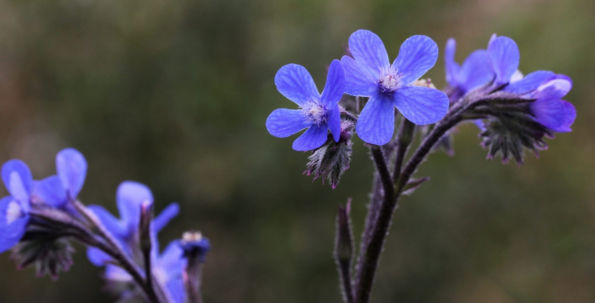
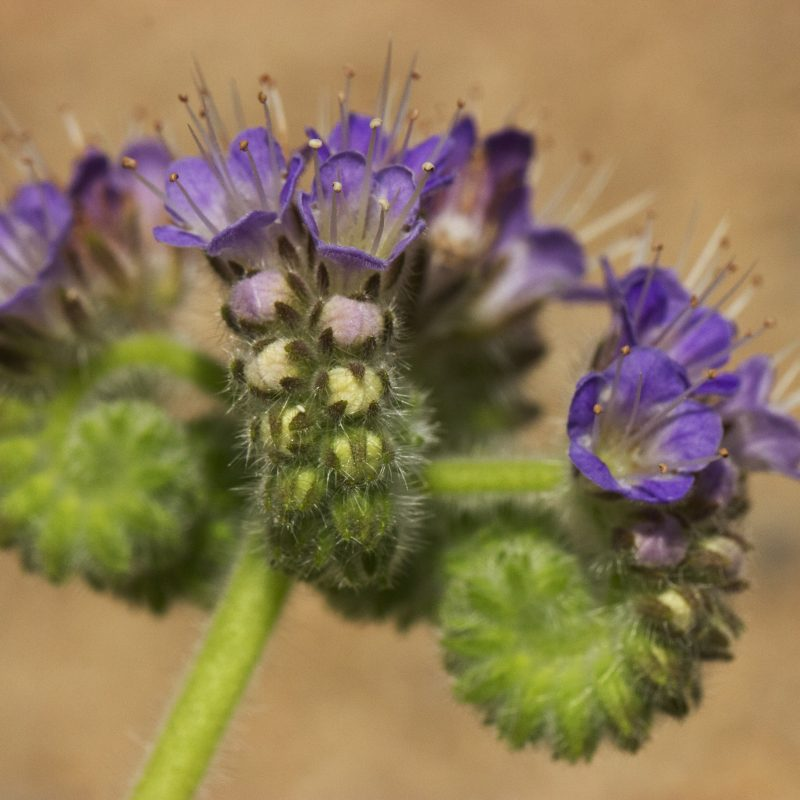
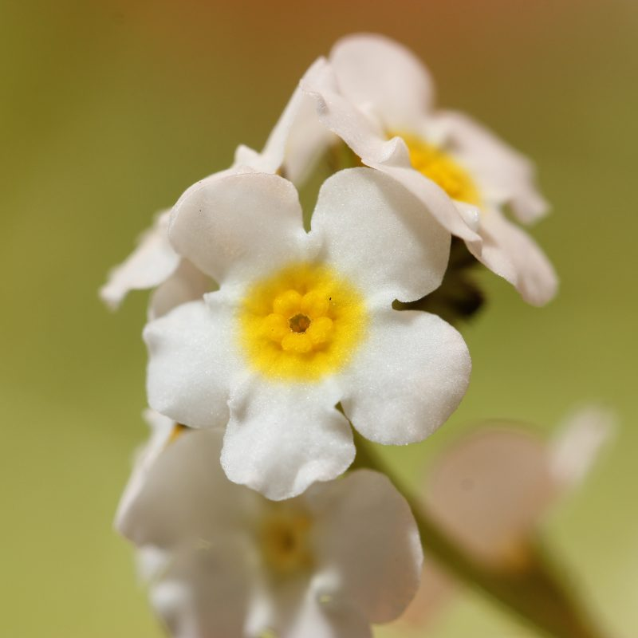
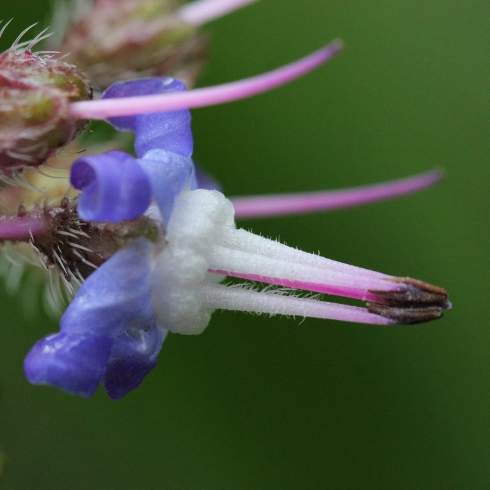
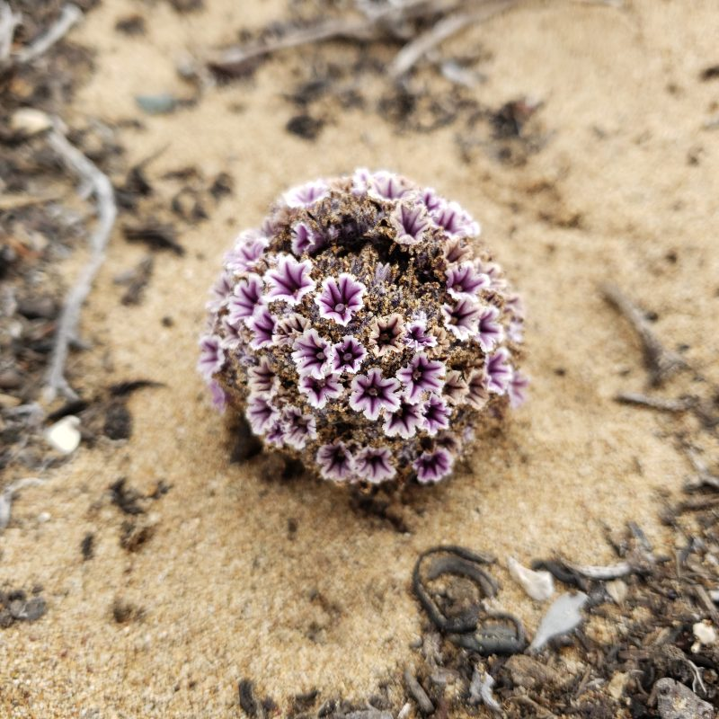
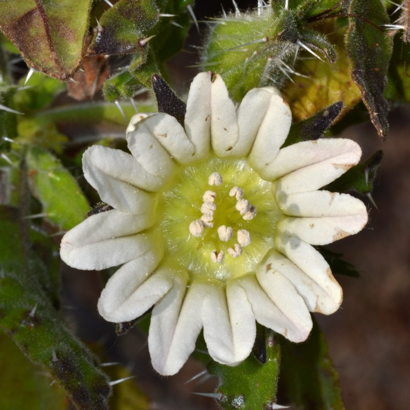
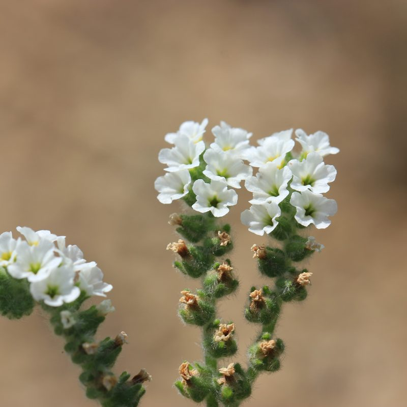

## Boraginales

__Administers:__ [Boraginales](/wfo-9000000067) (incl. Codonaceae, Wellstediaceae, Boraginaceae, Hydrophyllaceae, Ehretiaceae, Cordiaceae, Coldeniaceae, Hoplestigmataceae, Heliotropiaceae)

Primary TENs contact: Maximilian Weigend from [University of Bonn](https://about.worldfloraonline.org/consortium-members/university-of-bonn)

Coordinators: Maria-Anna Vasile from Berlin Botanical Garden and Botanical Museum\
 Michael G. Simpson from San Diego State University\
 Makenzie Mabry from Florida Museum of Natural History

> *Boraginales is a medium-sized yet very diverse order of angiosperms within lamiids, subcosmopolitan in distribution, predominantly found in seasonally arid habitats across temperate and tropical regions. *
>
> **

Boraginales classification has been in flux. The primary goal of this TEN is, therefore, to provide a stable backbone for the order and a consensus list of genera and species names and their synonyms. Based on recent phylogenomic and morphological data Boraginales are currently recognized in 9 families comprising about 133 genera and around 2700 species of herbs, shrubs, trees and lianas. The stem node of Boraginales is estimated at ca. 109 Ma, likely originating in West Gondwana during the Early Cretaceous. The two major clades Boraginales I (Codonaceae, Wellstediaceae and Boraginaceae) and Boraginales II (Hydrophyllaceae, Ehretiaceae, Cordiaceae, Coldeniaceae, Hoplestigmataceae, Heliotropiaceae) diverged in the Late Cretaceous, likely after West Gondwana vicariance.

The outstanding feature of Boraginales is their diverse fruit morphology, which has been central to its systematics, ranging from dehiscent capsules to various indehiscent fruit types. The dispersal units vary widely due to different degrees of seed and pericarp integration (e.g., mericarpids, endomericarpids)

This is an ongoing project and you are welcome to contact us if you would like to contribute to the Boraginales TEN.

Taxonomic data curation for the TEN utilises Rhakhis --- the WFO's taxonomic curation tool.

Contributors (in alphabetical order)

-   Tim Böhnert (Bonn Institute of Organismic Biology, University of Bonn, Germany)
-   Matt Buys (New Zealand Institute for Bioeconomy Science Limited, New Zealand)
-   Lorenzo Cecchi (University of Florence, Italy)
-   Jim Cohen (Weber State University, USA)
-   Matt C. Guilliams (Santa Barbara Botanic Garden, USA)
-   Julius Jeiter (Dresden University of Technology, Germany)
-   Martin Hamilton (Clemson University, USA)
-   Kristen Hasenstab-Lehman (Santa Barbara Botanic Garden, USA)
-   Lucie Kobrlová (Palacky University Olomouc, Czech Republic)
-   Asli Doğru-Koca (Hacettepe University, Turkey)
-   Federico Luebert (Universidad de Chile)
-   Makenzie Mabry (Florida Museum of Natural History, USA)
-   Iranildo Melo (Universidade Estadual da Paraíba, Brazil)
-   Heidi Meudt (Museum of New Zealand Te Papa Tongarewa, New Zealand)
-   Peter Moonlight (Trinity College Dublin, Ireland)
-   Francis Jason Nge (National Herbarium of New South Wales, Australia)
-   Jessica Prebble (Bioeconomy Science Institute, Manaaki Whenua Landcare Research, New Zealand)
-   Federico Selvi (University of Florence, Italy)
-   Erik Simons (Naturalis Biodiversity Center, The Netherlands)
-   Michael G. Simpson (San Diego State University, USA)
-   Maria-Anna Vasile (Berlin Botanical Garden and Botanical Museum, Free University of Berlin, Germany)
-   Maximilian Weigend (Bonn Institute of Organismic Biology, University of Bonn, Germany)

Acknowledgements

We thank Alan Elliott and Mark Watson of Royal Botanic Garden Edinburgh for supporting the establishment of the Boraginales TEN as well as all the researchers who contribute data on taxonomy, systematics, evolutionary and functional morphology of Boraginales.

#### Key Literature

-   [Chacón J, Luebert F, Hilger HH, Ovchinnikova S, Selvi F, Cecchi L, Guilliams CM, Hasenstab-Lehman K, Sutorý K, Simpson MG, et al. 2016. The borage family (Boraginaceae s.str.): A revised infrafamilial classification based on new phylogenetic evidence, with emphasis on the placement of some enigmatic genera. TAXON 65: 523--546.](https://doi.org/10.12705/653.6)
-   [Chacón J, Luebert F, Weigend M. 2017. Biogeographic events are not correlated with diaspore dispersal modes in Boraginaceae. Frontiers in Ecology and Evolution 5: 26.](https://doi.org/10.3389/fevo.2017.00026)
-   [Chacón J, Siwakoti M, Hilger HH, Weigend M. 2017. Dwarves on the roof of the world: A taxonomic revision of the Himalayan Lasiocaryeae Weigend (Boraginaceae). Phytotaxa 297: 1--14.](https://doi.org/10.11646/phytotaxa.297.1.1)
-   [Cohen J. 2022. Phylogenomics, floral evolution, and biogeography of Lithospermum L. (Boraginaceae). Molecular Phylogenetics and Evolution 166: 107317.](https://doi.org/10.1016/j.ympev.2021.107317)
-   Diane N, Hilger HH, Förther M, Weigend M, Luebert F. 2016. Heliotropiaceae. In: Kadereit JW, Bittrich V, eds. The Families and Genera of Vascular Plants. Flowering Plants. Eudicots: Aquifoliales, Boraginales, Bruniales, Dipsacales, Escalloniales, Garryales, Paracryphiales, Solanales (except Convolvulaceae), Icacinaceae, Metteniusaceae, Vahliaceae. Cham: Springer, 203--211.
-   [Diane N, Hilger HH, Gottschling M. 2002. Transfer cells in the seeds of Boraginales. Botanical Journal of the Linnean Society 140: 155--164.](https://doi.org/10.1046/j.1095-8339.2002.00085.x)
-   [Frohlich MW, Sage RF, Craven LA, Schuster S, Gigot G, Hilger HH, Akhani H, Mahdavi P, Luebert F, Weigend M, et al. 2022. Molecular phylogenetics of Euploca (Boraginaceae): homoplasy in many characters, including the C4 photosynthetic pathway. Botanical Journal of the Linnean Society 199: 497--537.](https://doi.org/10.1093/botlinnean/boab082)
-   [Gottschling M, Luebert F, Hilger HH, Miller JS. 2014a. Molecular delimitations in the Ehretiaceae (Boraginales). Molecular Phylogenetics and Evolution 72: 1--6.](https://doi.org/10.1016/j.ympev.2013.12.005)
-   Gottschling M, Miller JS, Weigend M, Hilger HH. 2005. Congruence of a phylogeny of Cordiaceae (Boraginales) inferred from ITS1 sequence data with morphology, ecology, and biogeography. Annals of the Missouri Botanical Garden 92: 425--437.
-   [Gottschling M, Nagelmüller S, Hilger HH. 2014b. Generative ontogeny in Tiquilia (Ehretiaceae: Boraginales) and phylogenetic implications. Biological Journal of the Linnean Society 112: 520--534.](https://doi.org/10.1111/bij.12266)
-   Gottschling M, Weigend M, Hilger HH. 2016. Ehretiaceae. In: Kadereit JW, Bittrich V, eds. The Families and Genera of Vascular Plants. Flowering Plants. Eudicots: Aquifoliales, Boraginales, Bruniales, Dipsacales, Escalloniales, Garryales, Paracryphiales, Solanales (except Convolvulaceae), Icacinaceae, Metteniusaceae, Vahliaceae. Cham: Springer, 165--178.
-   [Guilliams CM, Hasenstab-Lehman KE. 2024. Conservation genetics of the endangered Lompoc yerba santa (Eriodictyon capitatum Eastw., Namaceae), including phylogenomic insights into the evolution of Eriodictyon. Plants 13: 90.](https://doi.org/10.3390/plants13010090)
-   [Hasenstab-Lehman KE, Simpson MG. 2012. Cat's eyes and popcorn flowers: phylogenetic systematics of the genus Cryptantha s. l. (Boraginaceae). Systematic Botany 37: 738--757.](https://doi.org/10.1600/036364412X648706)
-   [Hilger HH. 2014. Ontogeny, morphology, and systematic significance of glochidiate and winged fruits of Cynoglosseae and Eritrichieae (Boraginaceae). Plant Diversity and Evolution 131: 167--214.](https://doi.org/10.1127/1869-6155/2014/0131-0080)
-   Hilger HH, Weigend M. 2016. Wellstediaceae. In: Kadereit JW, Bittrich V, eds. The Families and Genera of Vascular Plants. Flowering Plants. Eudicots: Aquifoliales, Boraginales, Bruniales, Dipsacales, Escalloniales, Garryales, Paracryphiales, Solanales (except Convolvulaceae), Icacinaceae, Metteniusaceae, Vahliaceae. Cham: Springer, 403--406.
-   Hofmann M, Walden GK, Hilger HH, Weigend M. 2016. Hydrophyllaceae. In: Kadereit JW, Bittrich V, eds. The Families and Genera of Vascular Plants. Flowering Plants. Eudicots: Aquifoliales, Boraginales, Bruniales, Dipsacales, Escalloniales, Garryales, Paracryphiales, Solanales (except Convolvulaceae), Icacinaceae, Metteniusaceae, Vahliaceae. Cham: Springer, 221--238.
-   [Holstein N, Gottschling M. 2018. Waking sleeping beauties: a molecular phylogeny and nomenclator of Halgania (Ehretiaceae, Boraginales). Australian Systematic Botany 31: 107--119.](https://doi.org/10.1071/SB17017)
-   [Jeiter J, Vasile M-A, Lewin EM, Weigend M. 2023. The odd one out: a comparison of flower and fruit development in holoparasitic Pholisma arenarium (Lennoaceae, Boraginales) to that in closely related Ehretiaceae. International Journal of Plant Sciences 184: 1--18.](https://doi.org/10.1086/722593)
-   [Jeiter J, Weigend M. 2018. Simple scales make complex compartments: ontogeny and morphology of stamen--corolla tube modifications in Hydrophyllaceae (Boraginales). Biological Journal of the Linnean Society 125: 802--820.](https://doi.org/10.1093/biolinnean/bly167)
-   [Luebert F, Cecchi L, Frohlich MW, Gottschling M, Guilliams CM, Hasenstab-Lehman KE, Hilger HH, Miller JS, Mittelbach M, Nazaire M, et al. 2016. Familial classification of the Boraginales. TAXON 65: 502--522.](https://doi.org/10.12705/653.5)
-   [Luebert F, Couvreur TLP, Gottschling M, Hilger HH, Miller JS, Weigend M. 2017. Historical biogeography of Boraginales: West Gondwanan vicariance followed by long-distance dispersal? Journal of Biogeography 44: 158--169.](https://doi.org/10.1111/jbi.12841)
-   [Luebert F, Hilger HH, Weigend M. 2011. Diversification in the Andes: age and origins of South American Heliotropium lineages (Heliotropiaceae, Boraginales). Molecular Phylogenetics and Evolution 61: 90--102.](https://doi.org/10.1016/j.ympev.2011.06.001)
-   [Mabry ME, Simpson MG. 2018. Evaluating the monophyly and biogeography of Cryptantha (Boraginaceae). Systematic Botany 43: 53--76.](https://doi.org/10.1600/036364418X696978)
-   [Meudt HM, Pearson SM, Ning W, Prebble JM, Tate JA. 2025. Forget-me-not phylogenomics: Improving the resolution and taxonomy of a rapid island and mountain radiation in Aotearoa New Zealand (Myosotis; Boraginaceae). Molecular Phylogenetics and Evolution 204: 108250.](https://doi.org/10.1016/j.ympev.2024.108250)
-   [Otero A, Jiménez-Mejías P, Valcárcel V, Vargas P. 2019. Worldwide long-distance dispersal favored by epizoochorous traits in the biogeographic history of Omphalodeae (Boraginaceae). Journal of Systematics and Evolution 57: 579--593.](https://doi.org/10.1111/jse.12504)
-   [Otero A, Jiménez-Mejías P, Valcárcel V, Vargas P. 2019. Being in the right place at the right time? Parallel diversification bursts favored by the persistence of ancient epizoochorous traits and hidden factors in Cynoglossoideae. American Journal of Botany 106: 438--452.](https://doi.org/10.1002/ajb2.1251)
-   [Prebble J, Symonds VV, Tate AT, Meudt H. 2022. Taxonomic revision of the southern hemisphere pygmy forget-me-not group (Myosotis; Boraginaceae) based on morphological, population genetic and climate-edaphic niche modelling data. Australian Systematic Botany 35: 63-94.](https://doi.org/10.1071/SB21031)
-   [Pourghorban Z, Salmaki Y, Weigend M. 2023. Ancestral state reconstruction reveals extensive homoplasy in nutlet characters of Cynoglossinae (Boraginaceae, subfam. Cynoglossoideae, tribe Cynoglosseae). Systematics and Biodiversity 21: 2272835.](https://doi.org/10.1080/14772000.2023.2272835)
-   [Pourghorban Z, Salmaki Y, Böhnert T, Weigend M. 2025. Towards a monophyletic Cynoglossum: a dated molecular phylogeny and historical biogeography of Cynoglossinae (Boraginaceae). Cladistics 41: 427-447.](https://doi.org/10.1111/cla.70004)
-   Selvi F, Coppi A, Cecchi L. 2011. High epizoochorous specialization and low DNA sequence divergence in Mediterranean Cynoglossum (Boraginaceae): Evidence from fruit traits and ITS region. TAXON 60: 969--985.
-   [Vasile M-A, Böhnert T, Jeiter J, Cardoso D, Moonlight PW, Weigend M. in review2025. An updated phylogeny of Boraginales based on the Angiosperms353 probe set: a roadmap for understanding morphological evolution. Annals of Botany 136: 77-97.](https://doi.org/10.1093/aob/mcaf061)
-   [Vasile M-A, Jeiter J, Weigend M, Luebert F. 2020. Phylogeny and historical biogeography of Hydrophyllaceae and Namaceae, with a special reference to Phacelia and Wigandia. Systematics and Biodiversity 18: 757--770.](https://doi.org/10.1080/14772000.2020.1771471)
-   [Vasile M-A, Luebert F, Jeiter J, Weigend M. 2021. Fruit evolution in Hydrophyllaceae. American Journal of Botany 108: 925--945.](https://doi.org/10.1002/ajb2.1691)
-   [Walden GK, Garrison LM, Spicer GS, Cipriano FW, Patterson R. 2014. Phylogenies and chromosome evolution of Phacelia (Boraginaceae: Hydrophylloideae) inferred from nuclear ribosomal and chloroplast sequence data. Madroño 61: 16--47.](https://doi.org/10.3120/0024-9637-61.1.16)
-   [Weigend M, Gottschling M, Selvi F, Hilger HH. 2009. Marbleseeds are gromwells -- Systematics and evolution of Lithospermum and allies (Boraginaceae tribe Lithospermeae) based on molecular and morphological data. Molecular Phylogenetics and Evolution 52: 755--768.](https://doi.org/10.1016/j.ympev.2009.05.013)
-   Weigend M, Hilger HH. 2016. Codonaceae. In: The Families and Genera of Vascular Plants. Flowering Plants. Eudicots: Aquifoliales, Boraginales, Bruniales, Dipsacales, Escalloniales, Garryales, Paracryphiales, Solanales (except Convolvulaceae), Icacinaceae, Metteniusaceae, Vahliaceae. Cham: Springer, 137--140.
-   [Weigend M, Luebert F, Gottschling M, Couvreur TLP, Hilger HH, Miller JS. 2014. From capsules to nutlets---phylogenetic relationships in the Boraginales. Cladistics 30: 508--518.](https://doi.org/10.1111/cla.12061)
-   [Weigend M, Luebert F, Selvi F, Brokamp G, Hilger HH. 2013. Multiple origins for Hound's tongues (Cynoglossum L.) and Navel seeds (Omphalodes Mill.) -- The phylogeny of the borage family (Boraginaceae s.str.). Molecular Phylogenetics and Evolution 68: 604--618.](https://doi.org/10.1016/j.ympev.2013.04.009)
-   Weigend M, Selvi F, Thomas DC, Hilger HH. 2016. Boraginaceae. In: Kadereit JW, Bittrich V, eds. The Families and Genera of Vascular Plants. Flowering Plants. Eudicots: Aquifoliales, Boraginales, Bruniales, Dipsacales, Escalloniales, Garryales, Paracryphiales, Solanales (except Convolvulaceae), Icacinaceae, Metteniusaceae, Vahliaceae. Cham: Springer, 41--102.