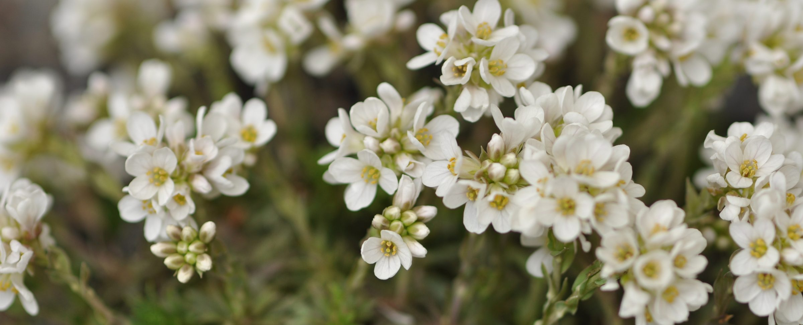

## Brassicaceae - BrassiBase

Administers: Brassicaceae

External website: <https://brassibase.cos.uni-heidelberg.de/>

Primary TENs contact: [Marcus A Koch](mailto:) from [Heidelberg Botanic Garden and Herbarium (HEID)](https://about.worldfloraonline.org/consortium-members/heidelberg-botanic-garden-and-herbarium-heid)

> Brassicaceae
> ------------
>
> Worldwide distributed family except the humid tropics with high diversity often under extreme environmental conditions and serving as a road model for various factettes of plant biology.
>
> **

Rapid advances in our understanding of phylogenetic relationships among Brassicaceae taxa are driving the development of modern classification schemes that accurately reflect current knowledge. Brassicaceae (Cruciferae) is a relatively large family, currently comprising ca. 4140 species (original data), for which various classification systems have been proposed, including influential historical classifications contributed by de Candolle (1821), Hayek (1911), Schulz (1936), Janchen (1942), Beilstein et al. (2006), and Al-Shehbaz (2012). None of these classification systems and major contributions was able to recognize or even consider the enormous amount of convergent evolution of almost any single morphological character in this family. This is only possible using 'omics approaches and building a reliable backbone phylogeny.

It is only since a few years, that we have convincing phylogenetic hypotheses and phylogenies at hand matching our knowledge on Brassicaceae evolutionary history (e.g. Nikolov et al. 2019, Walden et al. 2020, and Hendriks et al. 2022) and, thereby, having an enormous impact on our taxonomical understaning of this family.

More than 10 years ago we launched [*BrassiBase*](https://brassibase.cos.uni-heidelberg.de/) as central Brassicaceae knowledge hub serving a DFG priority research programme called ​„[*Adaptomics*](https://www.ruhr-uni-bochum.de/dfg-spp1529/Seiten/index.html)" and funding a consortium of research groups from Germany, Switzerland and Austria for more than 8 years. 

*BrassiBase* developed gradually not only into a valuable online knowledge tool, but even more important has been the growing network of Brassicaceae researchers contributing to update a species checklist as ​„backbone" over the past years. A number of contributions illustrate some aspects and version updates of *BrassiBase* (Koch et al. 2012, Kiefer et al. 2014, Koch et al. 2017)

The Brassicaceae Taxonomic Expert Network (*BrassiBase TEN*) brings together the very active and networked taxonomists, systematists and evolutionary biologists with an interest in or focus on Brassicaceae from around the world. We are group formed based on past and present relationships and we actively seeking new members, particularly for geographic gaps in our membership:

Key Contributors (in alphabetical order)

- __Al-Shehbaz, Ihsan:__ Missouri Botanical Garden (MO), St. Louis: USA
- __Bailey, Donovan:__ New Mexico State University: USA
- __Dönmez, Ali:__ Hacettepe University: Turkey
- __Franzke, Andreas:__ Centre for Organismal Studies (COS), Heidelberg University: Germany
- __German, Dmitry:__ South-Siberian Botanical Garden, Altai State University: Russia
- __Guggisberg, Alessia:__ Herbarium ZT, ETH Zurich: Switzerland
- __Hendriks, Kasper:__ Naturalis Biodiversity Center, Leiden: Netherlands 
- __Kiefer, Christiane:__ Centre for Organismal Studies (COS), Heidelberg University: Germany
- __Kiefer, Markus:__ Centre for Organismal Studies (COS), Heidelberg University: Germany
- __Koch, Marcus A.:__ Centre for Organismal Studies (COS), Heidelberg University: Germany
- __Lens, Frederic:__ Naturalis Biodiversity Center, Leiden: Netherlands 
- __Lysak, Martin:__ Central European Institute of Technology (CEITEC), Masaryk University: Czech Republic
- __Mandáková, Terezie Malík:__ Central European Institute of Technology (CEITEC), Masaryk University: Czech Republic
- __Marhold, Karol:__ Plant Science and Biodiversity Centre SAS, Bratislava: Slovak Republic
- __Mummenhoff, Klaus:__ Osnabrück University: Germany
- __Mutlu, Birol:__ Department of Biology, İnönü University: Turkey
- __Nikolov, Lachezar Atanasov:__ Department of Biology, Indiana University: USA
- __Özüdoğru, Barış:__ Hacettepe University: Turkey
- __Pires, Chris:__ Colorado State University: USA
- __Rešetnik, Ivana:__ Department of Biology, University of Zagreb: Croatia
- __Schmickl, Roswitha:__ Faculty of Science, Charles University Prague: Czech Republic
- __Schranz, Eric:__ Wageningen University, Biosystematics: Netherlands
- __Španiel, Stanislav:__ Institue of Botany, SAS: Slovak Republic
- __Toro, Oscar:__ Facultad de Cs. Naturales y Oceanográficas, Universidad de Concepción: Chile
- __Walden, Nora:__ Centre for Organismal Studies (COS), Heidelberg University: Germany
- __Windham, Michael:__ Department of Biology, Duke University: Durham
- __Zhao, Yun-Peng:__ Laboratory of Systematic & Evolutionary Botany and Biodiversity, College of Life Sciences, Zhejiang University

### Acknowledgements

We are grateful to Alan Elliott of Royal Botanic Garden Edinburgh for supporting the establishment of the Brassicaceae TEN.

#### Selected Literature

-   [Al-Shehbaz I.A. (2012) A generic and tribal synopsis of the Brassicaceae (Cruciferae). Taxon61(5): 931--954.](https://doi.org/10.1002/tax.615002)
-   [Beilstein M.A., Al-Shehbaz I.A., Kellogg E.A. (2006) Brassicaceae phylogeny and trichome evolution. American Journal of Botany 93(4): 607--619.](https://doi.org/10.3732/ajb.93.4.607)
-   [de Candolle AP (1821) Regni vegetabilis systema naturalle, sive ordines, genera et speciesplantarum secundum methodi naturalis normus digestarum et descriptarum (Vol. 2).Treuttel and Würtz, Paris, 745 pp](https://doi.org/10.5962/bhl.title.59874)
-   [German D.A., Hendriks K.P., Koch M.A., Lens F., Lysak M.A., Bailey C.D., Mummenhoff K., Al-Shehbaz I.A. (2023) An updated classification of the Brassicaceae (Cruciferae). PhytoKeys 220: 127-144.](https://doi.org/10.3897/phytokeys.220.97724)
-   Hayek A (1911) Entwurf eines Cruciferensystems auf phylogenetischer Grundlage. Beiheftezum Botanischen Centralblatt 27: 127--335.
-   [Hendriks K.P., Kiefer C., Al-Shehbaz I.A., Bailey D., Hooft van Huysduynen A., Nikolov L.A., Nauheimer L., Zuntini A.R., German D.A., Franzke A., Koch M.A., Lysak M.A., Toro-Nunez O., Özudogru B., Invernón V.R., Walden N., Maurin O., Hay N.M., Shushkov P., Mandakova T., Schranz M.E., Thulin M., Windham M.D., Resetnik I., Spaniel S., Ly E., Pires J.C., Harkess A., Neuffer B., Vogt R., Bräuchler C., Rainer H., Janssens S.B., Schmull M., Forrest A., Guggisberg A., Zmarzty S., Lepschi B.J., Scarlett N., Stauffer F.W., Schönberger I., Heenan P., Baker W.J., Forest F., Mummenhoff K., Lens F. (2023) Global Brassicaceae phylogeny based on filtering of 1,000-gene dataset. Current Biology 33: 1-17.](https://doi.org/10.1016/j.cub.2023.08.026)
-   [Janchen E. (1942) Das System der Cruciferen. Österreichische botanische Zeitschrift 91: 1--28.](https://doi.org/10.1007/BF01257342)
-   [Kiefer M., Schmickl R., German D., Lysak M., Al-Shehbaz I.A., Franzke A., Mummenhoff K., Stamatakis A., Koch M.A. (2014) BrassiBase: Introduction to a Novel Knowledge Database on Brassicaceae Evolution. Plant Cell and Physiology 55 (1): e3.](https://doi.org/10.1093/pcp/pct158)
-   [Koch M.A., German D.A., Kiefer M., and Franzke A. (2017) Database taxonomics as key to modern plant biology. Trends in Plant Sciences 23, 4-6.](https://doi.org/10.1016/j.tplants.2017.10.005)
-   [Koch M.A., Kiefer M., German D., Al-Shebhaz I.A., Franzke A., Mummenhoff M., Schmickl R. (2012) BrassiBase: Tools and biological resources to study characters and traits in the Brassicaceae -- version 1.1. TAXON 61: 1001-1009.](https://doi.org/10.1002/tax.615007)
-   Schulz OE (1936) Cruciferae. In: Engler A, Harms H (Eds) Die natürlichen Pflanzenfamilien (Vol. 17B). Verlag von Wilhelm Englemann, Leipzig, 227--658.
-   [Walden N., German D.A., Wolf E.M., Kiefer M., Rigault P., Huang X-C., Kiefer C., Schmickl R., Franzke A., Neuffer B., Mummenhoff K., and Koch M.A. (2020) Nested whole-genome duplications coincide with diversification and high morphological disparity in Brassicaceae. Nature Communications 11,3795.](https://doi.org/10.1038/s41467-020-17605-7)

