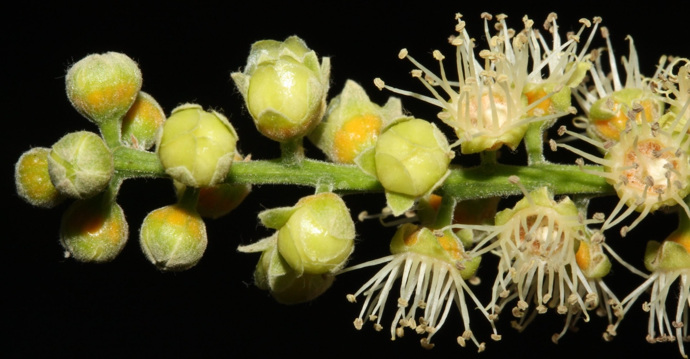
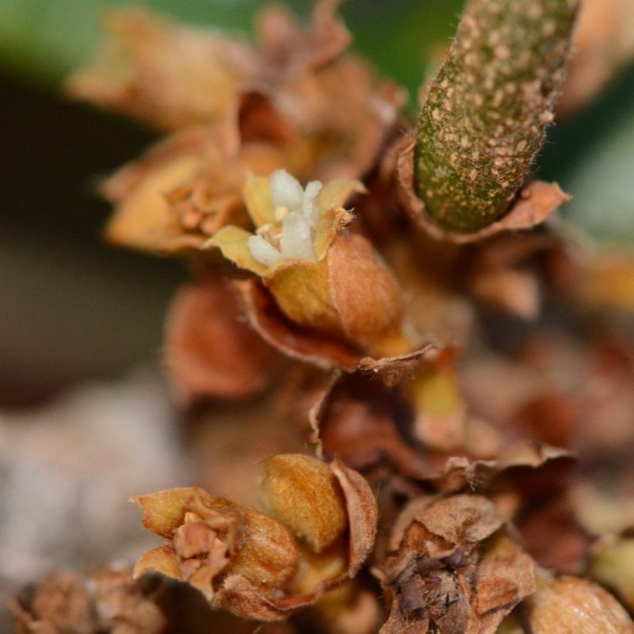
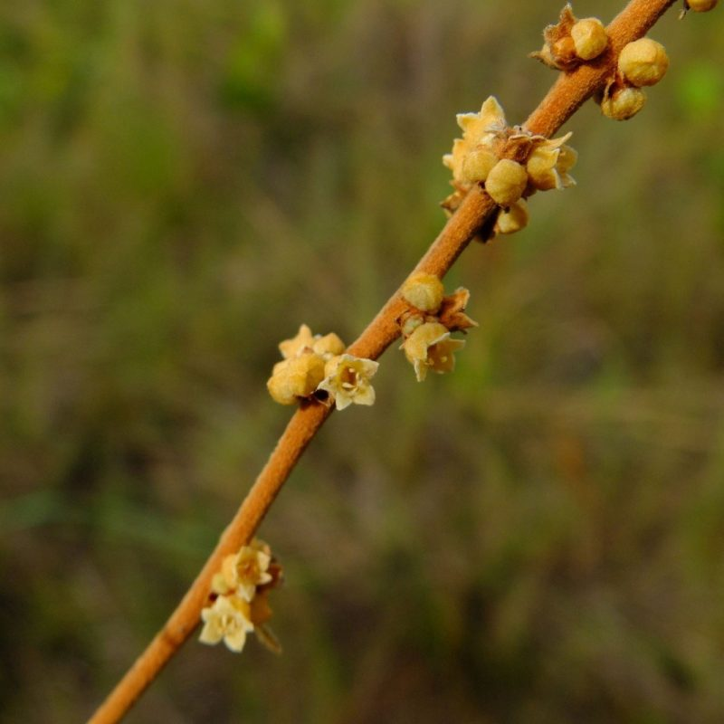
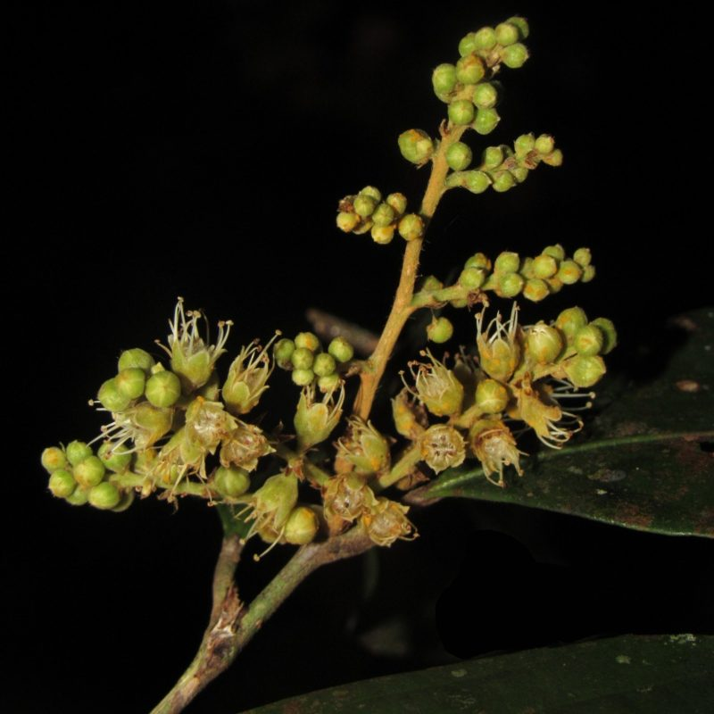

## Chrysobalanaceae

__Administers:__ [Chrysobalanaceae](/wfo-7000000132)

Primary TENs contact: Renata Camargo Asprino Pereira from [Botany Department of Trinity College Dublin](https://about.worldfloraonline.org/consortium-members/botany-department-of-trinity-college-dublin)

> Chrysobalanaceae: A pantropical family of woody plants ecologically prominent in tropical forests and undergoing active taxonomic revision informed by modern phylogenetic research
>
> **

Chrysobalanaceae is a pantropical family of woody plants and a conspicuous component of many lowland tropical forests. The family comprises 27 genera and 546 species, and is found in the Americas, Africa, Southeast Asia, northern Australia, and numerous Pacific islands. Although distributed across tropical regions worldwide, species richness is strongly concentrated in the American tropics, which account for c. 80% of its species diversity, and the Amazon region is a major centre of diversity.

The taxonomy of Chrysobalanaceae has a long history of study, notably through foundational work by G. T. Prance in the American tropics and F. White in the African tropics. Over the past two decades, phylogenetic research using DNA sequence data (including plastid genomes) has clarified evolutionary relationships within the family. These studies have demonstrated that several traditionally circumscribed genera are not monophyletic, leading to significant revisions in generic delimitation and classification.

The Chrysobalanaceae Taxonomic Expert Network brings together specialists working on the systematics of the family to support an accurate and up-to-date taxonomy. Our work includes updating accepted names and synonymy, incorporating newly published names, and addressing problematic or unclear taxonomic boundaries through collaborative review.

TEN Members

Renata C. Asprino (Trinity College Dublin, Ireland)

Ghillean T. Prance (RBG Kew, UK)

Cynthia A. Sothers (RBG Kew, UK)

Rafael G. Barbosa Silva (Serviço Florestal Brasileiro, Brazil)

### Key Literature

-   [Barbosa-Silva, R.G. (2024) A taxonomic treatment of Parinari (Chrysobalanaceae) in the Atlantic Forest, Brazil. Systematic Botany 49(2): 381--395. https://doi.org/10.1600/036364424X17110456120749](https://doi.org/10.1600/036364424X17110456120749)
-   [Bardon, L., Sothers, C., Prance, G.T., Male, P.G., Xi, Z., Davis, C.C., Murienne, J., Garcia- Villacorta, R., Coissac, E., Lavergne, S. & Chave, J. (2016) Unraveling the biogeographical history of Chrysobalanaceae from plastid genomes. American Journal of Botany 103(6): 1089--1102. https://doi.org/10.3732/ajb.1500463](https://doi.org/10.3732/ajb.1500463)
-   [Chave, J., Sothers, C., Iribar, A., Suescun, U., Chase, M.W. & Prance, G.T. (2020) Rapid diversification rates in Amazonian Chrysobalanaceae inferred from plastid genome phylogenetics. Botanical Journal of the Linnean Society 194(3): 271--289. https://doi.org/10.1093/botlinnean/boaa052](https://doi.org/10.1093/botlinnean/boaa052)
-   Prance, G.T. (1972) Chrysobalanaceae, in: Irwin, H.S., (Ed.), Flora Neotropica Monograph 9. Hafner Publishing Company, New York, pp. 1--410.
-   Prance, G.T. (1989) Chrysobalanaceae, in: Hammond, H.D., Lebrón-Luteyn, M.L., (Eds.), Flora Neotropica Monograph 9S. The New York Botanical Garden, New York, pp. 1--267.
-   [Prance, G.T. (2021) Sixty years with the Chrysobalanaceae. The Botanical Review 87: 197--232. https://doi.org/10.1007/s12229-020-09234-y](https://doi.org/10.1007/s12229-020-09234-y)
-   Prance, G.T. & Sothers, C.A. (2003) Chrysobalanaceae 1: Chrysobalanus to Parinari, in: Orchard, A.E., Wilson, A.J.G., (Eds.), Species Plantarum: Flora of the World Part 9. Australian Biological Resources, Canberra, pp. 1--319.
-   Prance, G.T. & Sothers, C.A. (2003) Chrysobalanaceae 2: Acioa to Magnistipula, in: Orchard, A.E., Wilson, A.J.G., (Eds.), Species Plantarum: Flora of the World Part 10. Australian Biological Resources, Canberra, pp. 1--268.
-   [Prance, G.T. & F. White (1988) The genera of Chrysobalanaceae: a study in practical and theoretical taxonomy and its relevance to evolutionary biology. Philosophical Transactions of the Royal Society of London B 320: 1--184. https://doi.org/10.1098/rstb.1988.0071](https://doi.org/10.1098/rstb.1988.0071)
-   [Sothers, C., Prance, G.T., Buerki, S., Kok, R.D. & Chase, M.W. (2014) Taxonomic novelties in Neotropical Chrysobalanaceae: towards a monophyletic Couepia. Phytotaxa 172(3): 176--200. https://doi.org/10.11646/phytotaxa.172.3.2](https://doi.org/10.11646/phytotaxa.172.3.2)
-   [Sothers, C., Prance, G.T. & Chase, M.W. (2016) Towards a monophyletic Licania: a new generic classification of the polyphyletic Neotropical genus Licania (Chrysobalanaceae). Kew Bulletin 71: 58. https://doi.org/10.1007/s12225-016-9664-3](https://doi.org/10.1007/s12225-016-9664-3)
-   [White, F. (1976) The taxonomy, ecology and chorology of African Chrysobalanaceae (excluding Acioa). Bulletin du Jardin botanique National de Belgique 46: 265--350. https://doi.org/10.2307/3667716](https://doi.org/10.2307/3667716)