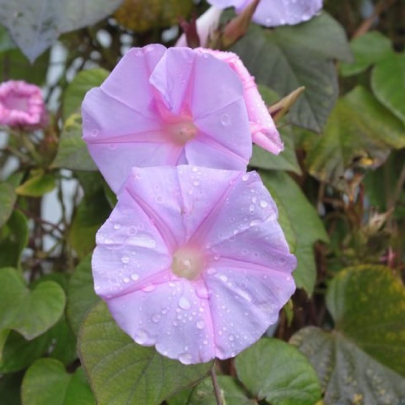
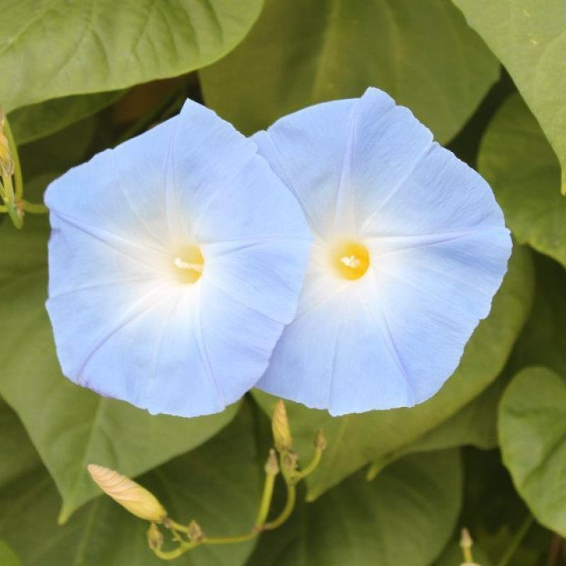
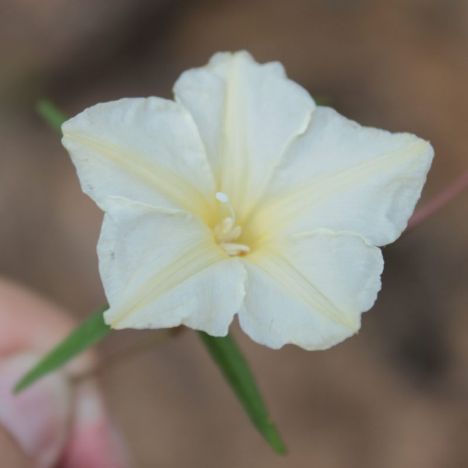

## Convolvulaceae - Taxonomic Expert Network (TEN)

Administers: Convolvulaceae

External website: <https://sites.google.com/view/theconvolvulaceaenetwork>

Primary TENs contacts: Ana Rita G. Simões (Missouri Botanical Garden), Guillermo Huerta-Ramos (ENES-Morelia, UNAM)

### Introduction 

Convolvulaceae (morning-glories, bindweeds, and dodders) is a megadiverse cosmopolitan family, especially in tropical and subtropical regions, with a few representatives extending into temperate zones. With 60 genera and an estimated 1,600--2,000 species, it represents a species-rich lineage within the order Solanales, sister to the family Solanaceae. Its largest genus, *Ipomoea*, comprises about 600 species, making it one of the 100 largest genera of flowering plants. Members of Convolvulaceae range from twining herbs and lianas to shrubs, trees, and parasitic vines, and include ecologically and economically important taxa, such as the globally important cultivated plant sweet potato (*Ipomoea batatas*), ornamental morning glories (e.g. Ipomoea alba, Ipomoea. tricolor), the parasitic dodders (*Cuscuta*), and bindweeds (*Convolvulus*), some of which are troublesome agricultural weeds. Accurate names and a stable classification are essential for linking biodiversity data, conservation assessments, and future research. Our group is committed to working collaboratively to improve the classification of the family and its genera, fulfill knowledge and geographical gaps, and regularly update the World Flora Online treatment to ensure its accuracy and usefulness.

### Who we are 

The Convolvulaceae TEN is a collaborative community of taxonomists, systematists, curators, and allied botanists working to maintain an up-to-date, expert-curated taxonomy for the family within World Flora Online (WFO). We welcome colleagues from all regions and career stages, particularly those covering underrepresented genera and geographic areas. 

### Objectives 

-   Curate and maintain an up-to-date, consensus-based taxonomy for Convolvulaceae in WFO.
-   Resolve unresolved, unplaced and deprecated names; standardize synonymy and author strings.
-   Harmonize generic concepts across regions; document decisions transparently.
-   Provide an authoritative backbone on which other data (descriptions, images, distributions) can be built.
-   Foster community, training, and knowledge exchange (short workshops, case reviews, hackathons). 

### Current priorities 

-   Review of large, taxonomically complex or diverse lineages (e.g., tribe Ipomoeeae, *Distimake*, *Convolvulus*, *Cuscuta*, *Evolvulus*).
-   Systematic reduction of currently ​"unplaced names" and clarification of invalid/​illegitimate names.
-   Region-by-region regular assessments, to flag knowledge and curation gaps or disparities.
-   Short, practice-oriented sessions and training courses to align with Rhakhis workflows and agree on special cases. 

### Key contributors (in alphabetical order) :

- Ana Rita G. Simões (Missouri Botanical Garden, USA) 
- André Luiz Moreira (Universidade Federal da Bahia, UFBA, Brazil)
- Guillermo Huerta-Ramos (ENES-Morelia, UNAM, México)
- Fernanda S. Petrongari (Instituto de Botânica de São Paulo, Herbarium SP, Brazil)
- Lauren Eserman (Atlanta Botanical Garden, USA)
- Maria Teresa Buril (Universidade Federal Rural de Pernambuco, UFRPE, Brazil)
- Pablo Muñoz-Rodríguez (Universidad Complutense de Madrid, Spain) 
- Pantamith Rattanakrajang (Mahidol University, Thailand)
- Richard E. Miller (Independent researcher, Colorado, USA)
- Rosângela Simão-Bianchini (Instituto de Botânica, São Paulo, Brazil)

> **

### Selected literature

-   [Eserman, L.A., Sosef, M.S.M., Simão-Bianchini, R., Utteridge, T.A., Barbosa, J.C.J., Buril, M.T., Chatrou, L.W., Clay, K., Delgado, G., Desquilbet, T. E., Ferreira, P.P.A., Allende, J.R.G., Hernández, A.L., Huerta-Ramos, G., Jarret, R. L., Kojima, R.K., Landrein, S., Lourenço, J.A.A.M., De Man, I., Miller, R.E., More, S., Moreira, A.L.C., Mwanga-Mwanga, I., Nhanala, S., Pastore, M., Petrongari, F.S., Pisuttimarn, P., Pornpongrungrueng, P., Rifkin, J., Santos, F.D.S., Shimpale, V.B., Silva, S.S., Stinchcombe, J.R., Traiperm, P., Vasconcelos, L.V., Wang, M.L., Villordon, A., Yang, J., Yencho, G.C., Heider, B., Simões, A.R.G. (2020). (2786) Proposal to change the conserved type of Ipomoea, nom. cons. (Convolvulaceae). Taxon 69 (6): 1369-1371. https://doi.org/10.1002/tax.12400](https://doi.org/10.1002/tax.12400)
-   [Simões, A. R. G., Huerta-Ramos, G., Moreira, A. L. C., Paz, J. R. L., Grande Allende, J., Pisuttimarn, P., Rattanakrajang, P., Barbosa, J. C. J., Simão-Bianchini, R., Kojima, R. K., Paixão, C. P., Declercq, M., Kagame, S. P., Luna, J. A., Pace, M. R., Alcantara, C., Williams, B. D., Duque, L. O., Gowda, V., ... Eserman, L. (2024). Sweet potato, morning glories, bindweeds: An overview of Convolvulaceae. Rheedea, 34(5), 267--308. https://doi.org/10.22244/rheedea.2024.34.05.02](https://doi.org/10.22244/rheedea.2024.34.05.02)
-   [Simões, A. R. G., Huerta-Ramos, G., Declercq, M., Barbosa, J. C. J., Rattanakrajang, P., Buril, M. T., Shimpale, V., Moreira, A. L. C., Ferreira, P. P. A., & Eserman, L. (2026). From zero to ten: Building a community of Convolvulaceae taxonomic experts. TAXON, 75(1), e70095. https://doi.org/10.1002/tax.70095](https://doi.org/10.1002/tax.70095)
-   [Wood, J. R. I., Muñoz-Rodríguez, P., Williams, B. R. M., & Scotland, R. W. (2020). A foundation monograph of Ipomoea (Convolvulaceae) in the New World. PhytoKeys, 143, 1--823. https://doi.org/10.3897/phytokeys.143.32821](https://doi.org/10.3897/phytokeys.143.32821)
-   [Wood, J. R, I,, Williams, B. R. M., Mitchell, T. C., Carine, M. A., Harris, D. J., Scotland, R. W. (2015) A foundation monograph of Convolvulus L. (Convolvulaceae). PhytoKeys 51: 1-278. https://doi.org/10.3897/phytokeys.51.7104](https://doi.org/10.3897/phytokeys.51.7104)

Top L: *Stictocardia beraviensis*, Top R: *Ipomoea indica*
Bottom: *Ipomoea tricolor*, Bottom R. *Distimake quinquefolius*

Images by A.R.G. Simões