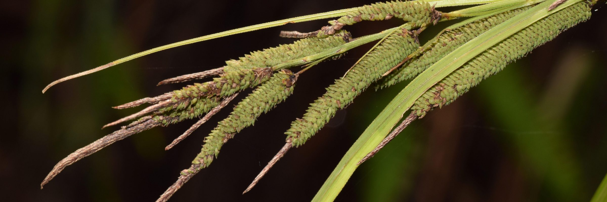

## Cyperaceae

Administers: Cyperaceae

External website: <https://cyperaceae.org/>

Primary TENs contact: [Isabel Larridon](mailto:) from [Royal Botanic Gardens, Kew](https://about.worldfloraonline.org/consortium-members/royal-botanic-gardens-kew)

Pedro Jiménez Mejías from Universidad Pablo de Olavide; José Ignacio Márquez Corro from Universidad Pablo de Olavide.

> The Cyperaceae family, with approximately 5,500 species distributed across around 95 genera, is one of the most ecologically significant plant families, especially in wetland habitats worldwide. Sedges are commonly found in tropical and temperate regions, often ranking among the top families in species richness.
>
> **

Many species of Cyperaceae are highly endemic, making them vulnerable to environmental changes and increasing their risk of extinction. This heightened vulnerability has led to growing conservation concerns for the family, particularly in areas where habitat loss and climate change threaten their existence. In addition to their ecological importance, members of the Cyperaceae family also have economic and cultural value. Some species, such as *Cyperus alternifolius* and *Carex pendula*, are utilized in ornamental gardening, while others have traditional uses in construction or as medicinal plants. Despite their ecological and economic relevance, the full evolutionary history and taxonomy of Cyperaceae are still not fully understood.

[The Global Cyperaceae Database](https://about.worldfloraonline.org/tens/%C2%A0https%3A//cyperaceae.org/)

### Key Contributors

-   Jiménez-Mejías, P.
-   Márquez-Corro, J. I.
-   Larridon, I.
-   Sanz-Arnal, M.
-   Barrett, R. L.
-   Bhandari, P.
-   Bradshaw, C.
-   Browning, J.
-   Bruhl, J. J.
-   Costa, S. M.
-   Elliott, T.
-   Ford, B.
-   Ford, K.
-   García-Moro, P.
-   García-Rodríguez, R.
-   Gebauer, S.
-   Gil, A.
-   Goetghebeur, P.
-   González-Elizondo, M. S.
-   González-Gallego, L.
-   Govaerts, R.
-   Hipp, A.
-   Hoshino, T.
-   Hroudová, Z.
-   Jin, X.-F.
-   Jung, M.
-   Karina, A.
-   Kim, S.
-   Lacroix-Carignan, É.
-   Léveillé-Bourret, É.
-   Licher, M.
-   Lois, R.
-   Lu, Y.-F.
-   Luceño, M.
-   Maciel Silva, J.
-   Marhold, K.
-   Martín-Bravo, S.
-   Masaki, T.
-   Mesterházy, A.
-   Morales-Alonso, A.
-   Morel, J.
-   Míguez, M.
-   Muasya, A. M.
-   Muñoz Schüler, P.
-   Naczi, R. F. C.
-   Nunes, C.
-   Pereira-Silva, L.
-   Poindexter, D.
-   Rasaminirina, F.
-   Reznicek, A. A.
-   Rink, G.
-   Roalson, E. H.
-   Sánchez-Villegas, R.
-   Schneider, L.
-   Silva Filho, P. J. S.
-   Simpson, D. A.
-   Spalink, D.
-   Starr, J.
-   Takahashi, K.
-   Thomas, W. W.
-   Tucker, G. C.
-   Uy, M.
-   Valdés-Florido, A.
-   Verloove, F.
-   Volkova, P.
-   Wilson, K. L.
-   Xanthos, M.
-   Yano, O.
-   Zhang, S.

### Acknowledgements

We thank all the researchers who have contributed valuable taxonomic data on Cyperaceae through sharing information, images, and specimens. We also thank TETTRIs (Transforming European Taxonomy through Training, Research and Innovations)-Horizon 2020 EU [project Grant Agreement Nr 101081903 --- Third Party Project Grant Contract ‑3PP, Contract iSedge 4/T2/3PP], and Ministerio de Ciencia, Innovación y Universidades --- Gobierno de España [RYC2021-031238‑I; project CNS2'23--143665]).

#### Key Literature

-   Ascherson, P.; Graebner, P. (1902-1904). Cyperaceae. In: V.V.W. Engelmann (ed). Synopsis der Mitteleuropaïschen Flora 2: 1-347. Druck der königl. Universitäts-Druckerei von H. Stürtz, Wüzburg.
-   Kükenthal, G. (1909). Cyperaceae - Caricoideae. In: H.G.A. Engler (ed). Das pflanzenreich, Vol. Heft 38. Leipzig, W. Engelmann.
-   Hutchinson, J. (1936). Cyperaceae. In: J. Hutchinson & J.M. Dalziel (eds). Flora of West Tropical Africa 2: 464-495. Crown Agents for Overseas Governments and Administration, London.
-   Maire, R. (1957). Monocotyledonae. Glumiflorae: Cyperaceae. In: P. Lechevalier (ed). Flore de l'Afrique du Nord (Maroc, Algérie, Tunisie, Tripolitaine, Cyrénaïque et Sahara), Vol IV: 5-180. Paris.
-   Goncharov, N.F., & al. (1964). Cyperaceae. In: V.L. Komarov & B.K. Shishkin (eds). Flora of the U.S.S.R, Vol. III: 2-369. Israel Program for Scientific Translations, Jerusalem.
-   Moore, L.B.; Edgar, E. (1970). Indigenous Tracheophyta: Monocotyledones except Gramineae. In: Flora of New Zealand, Vol. II. Botany Division DSIR, Wellington.
-   Kern, J.H. (1974). Cyperaceae. In: C.G.G.J. van Steenis (ed). Flora Malesiana.Series I Spermatophyta. Vol. 7, part 3: 7-435. Djakarta, Noordhoff-Kolff.
-   Tutin, T.G.; Heywood, V.H.; Burges, N.A.; Moore, D.M.; Valentine, D.H.; Walters, S.M.; Webb, D.A. (1980). Cyperales: Cyperaceae. In: Flora Europaea, vol. 5: 276-323. Cambridge University Press, Cambridge.
-   Haines, R.W.; Lye, K.A. (1983). The Sedges and Rushes of East Africa: a flora of the families Juncaceae and Cyperaceae in East Africa - with a particular reference to Uganda. East African Natural History Society, Nairobi.
-   Vanden Berghen, C. (1988). Monocotylédones: Agavacées à Orchidacées. In: J. Berhaut (ed). Flore Illustrée du Sénégal, Vol. 9, Clairafrique, Dakar.
-   Gordon-Gray, K.D. (1995). Cyperaceae in Natal. Strelitzia, vol. 2. National Botanical Institute, Pretoria, South Africa.
-   Kukkonen, I. (1998). Cyperaceae. In: K.H. Rechinger (ed). Flora Iranica, Vol. 173. Akademische Druck-und Verlagsanstalt.
-   Simpson, D.A.; Koyama, T. (1998). Cyperaceae. In: Flora of Thailand, Volume 6, Part 4: 247-485. Forest Herbarium, Royal Forest Department, Thailand.
-   Egorova, T.V. (1999). The sedges (Carex L.) of Russia and adjacent states (within the limits of the former USSR). 772 pp. Missouri Botanical Garden Press & St. Petersburg State Chemical-Pharmaceutical Academy, St. Louis, MO.
-   Noltie, H.J. (2000). The grasses of Bhutan. In: Flora of Bhutan, Vol. 3, part 2, 437 pp. Royal Botanic Garden Edinburgh & Royal Government of Bhutan.
-   Ball, P.W.; Reznicek, A.A.; Murray, D.F. (2002). Magnoliophyta: Commelinidae (in part): Cyperaceae. In: Flora of North America. Vol. 23. Oxford University Press, New York.
-   Jermy, A.C.; Simpson, D.A.; Foley, M.J.Y.; Porter, M.S. (2007). Sedges of the British Isles. 554 pp. Botanical Society of Britain & Ireland, United Kingdom.
-   Castroviejo, S.; Luceño, M.; Galán, A.; Jiménez-Mejías, P.; Cabezas-Fuentes, F.J.; Medina-Domingo, L. (2008). Flora Iberica 18. Real Jardín Botánico, CSIC, Madrid.
-   Dai, L.-K.; Liang S.-Y.; Zhang, S.; Tang, Y.; Koyama, T.; Tucker, G.C.; Simpson D.A.; Noltie, H.J.; Strong, M.T.; Bruhl, J.J.; Wilson, K.L.; Muasya, A.M. (2010). Acoraceae through Cyperaceae. In: Z.Y. Wu, P.H. Raven & D.Y. Hong (eds). Flora of China. Vol. 23: 164-461. Science Press, Beijing & Missouri Botanical Garden Press, St. Louis.
-   Hoenselaar, K.; Verdcourt, B.; Beentje, H.J. (2010). Cyperaceae. In: H.J. Beentje (ed). Flora of Tropical East Africa, 472 pp. Royal Botanic Gardens, Kew.
-   Lye, K.A.; They, P. (2012). Cyperaceae. In: M.S.M. Sosef (ed). Flore du Gabon. Vol. 44, 230 pp. Joseph Margraf Verlag.
-   Cabezas, F.J.; Velayos, M.; Jiménez-Mejías, P. (2014). Cyperaceae. In: M. Velayos, C. Acedo, F. Cabezas, M. de la Estrella, P. Barberá & M. Fero (eds). Flora de Guinea Ecuatorial. Vol XI: 80-145. Real Jardín Botánico de Madric, CSIC, Madrid.
-   Browning, J., Goetghebeur, P. (2017). Sedges (Cyperaceae) Genera of Africa and Madagascar. 1-103. Matador, Market Harborough.
-   Hoshino, T.; Katsuyama T.; Masaki T.; Michikawa M. (2020). Carex L. In: K. Iwatsuki, D.E. Boufford & H. Ohba (eds). Flora of Japan. Vol. IVa. Angiospermae-Monocotyledoneae. Kodansha Ltd., Tokyo.
-   Jin, X.-F.; Zhang, S.-R.; Yano, O.; Katsuyama, T.; Ikeda, H.; Lu, Y.-F.; Jin, S.-H. (2020). Cyperaceae II: Carex. In: H. De-Yuan (ed). Flora of Pan-Himalaya. Vol 12(2), 421 pp. Science Press.
-   Larridon, I.; Reynders, M.; Thery, P. (2020). Cyperaceae, Introduction, Tribu I. Hypolytreae. In: Sosef, M.S.M (ed) Flore d'Afrique centrale (Rep. Dém. Congo-Rwanda-Burrundi), Spermatophyta. Jardin botanique de Meise, Belgique.
-   Multiple authors. (2020). Cyperaceae in Flora e Funga do Brasil. Jardim Botânico do Rio de Janeiro. Available online.
-   Mesterházy, A.; Browning, J.; Verloove, F. (2022). Cyperaceae of tropical West Africa. 532 pp. Meise Botanic Garden, Belgium.
-   Zuloaga, F.O.; Anton, A.M. (continuously updated) Flora Argentina y del Cono Sur. Available online

Morphological and ecological diversity of Cyperaceae. A, Scleria boivinii Steud. B, Microdracoides squamosa Hua. C, Afrotrilepis pilosa (Boeckeler) J.Raynal. D, Carex lechleriana (Steud.) J.R.Starr formerly placed in the segregate genus Uncinia Pers. E, Gahnia tristis Nees. F, Rhynchospora alba (L.) Vahl.  © Photos A by Javier Galán Díaz; B by Charlotte Couch; C by Xander van der Burgt; D by Modesto Luceño; E by Russell Barrett; F by Juan Carlos Zamora.

    
Morphological diversity of the Cyperaceae tribes. A, Bisboeckelereae, Calyptrocarya poeppigiana Kunth. B, Hypolytreae, Mapania floribunda (Nees ex Steud.) T.Koyama. C, Carpheae, Carpha capitellata (Nees) Boeckeler. D, Dulichieae, Blysmus compressus (L.) Panz. ex Link. E, Cariceae, Carex lepidocarpa Tausch. F, Eleocharideae, Eleocharis quinqueflora (Hartmann) O.Schwarz. G, Schoenoplecteae, Actinoscirpus grossus (L.f.) Goetgh. &amp; D.A.Simpson. H, Cypereae: Ficiniinae, Ficinia acuminata (Nees) Nees. © Photos by Modesto Luceño.