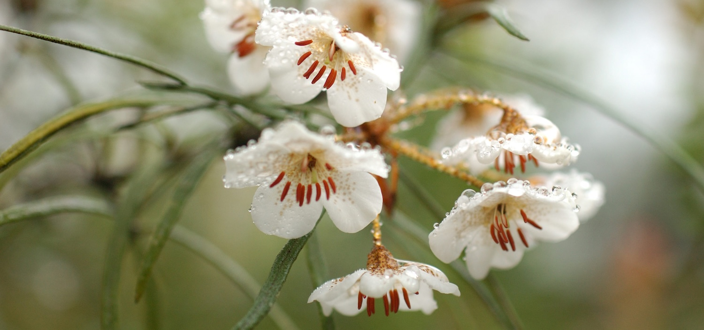
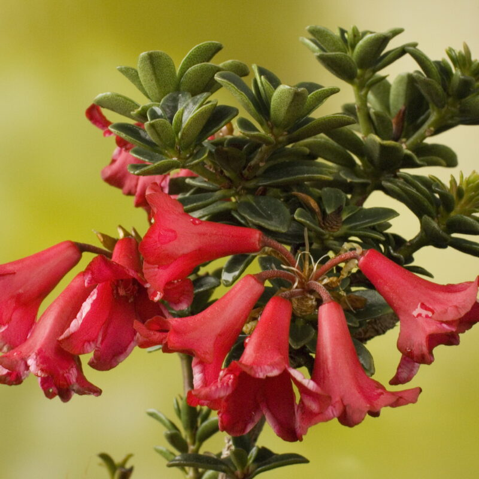
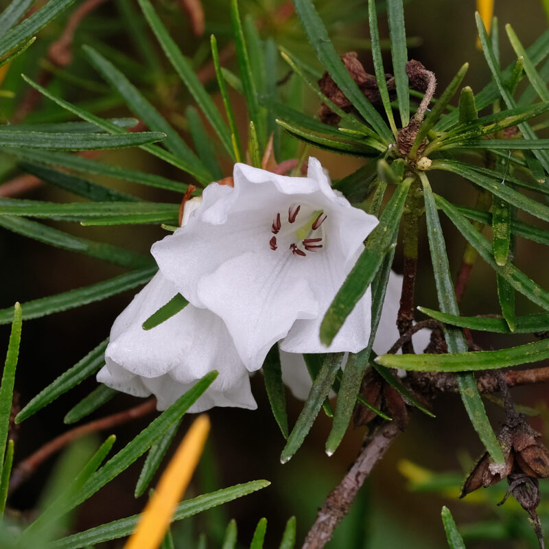
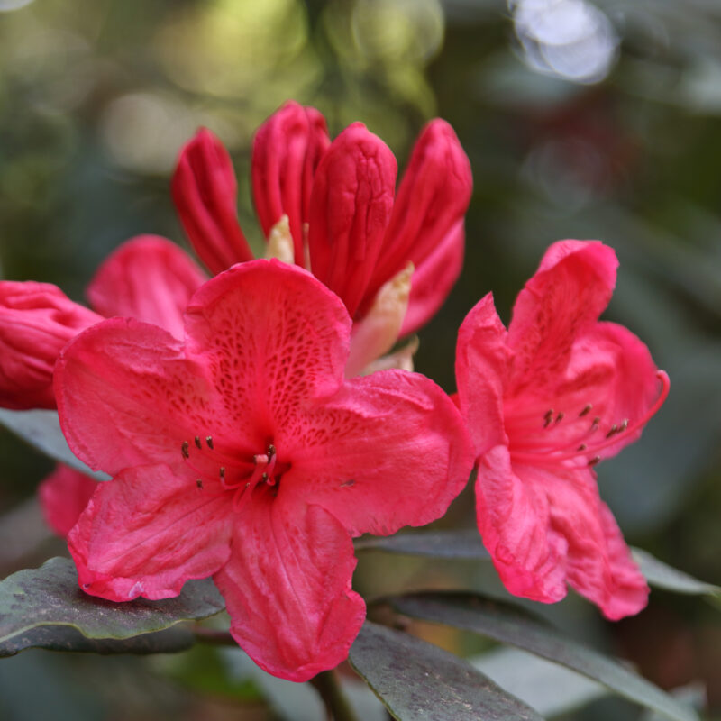
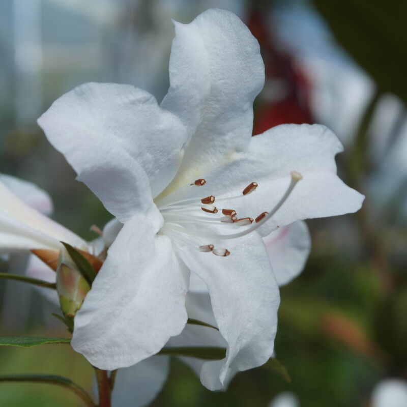
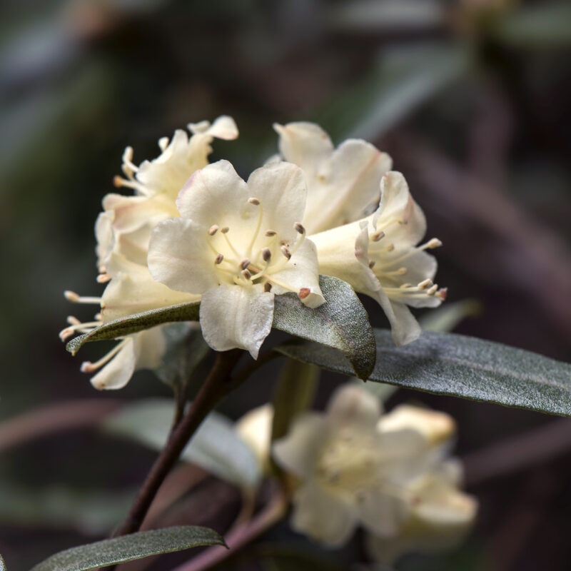
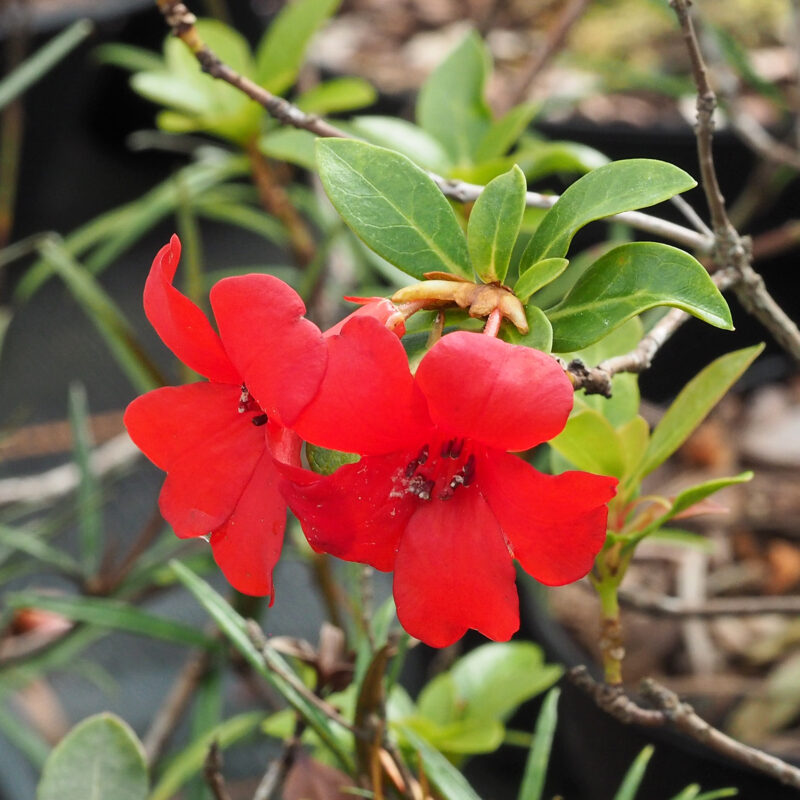

## Ericaceae Taxonomic Expert Network

__Administers:__ [Ericaceae](/wfo-7000000218)

__External website:__ <https://padme.rbge.org.uk/ericaceae/welcome>

Primary TENs contact: [Alan Elliott](mailto:aelliott@rbge.org.uk) from [Royal Botanic Garden Edinburgh](https://about.worldfloraonline.org/consortium-members/royal-botanic-garden-edinburgh)

> Ericaceae, with c. 4250 known species in 124 genera, is the 14th most species-rich family of flowering plants.
>
> **

This Taxonomic Expert Network is being coordinated from Royal Botanic Garden Edinburgh and is utilising direct taxonomic expertise, review by experts and published taxonomic revisions to curate the Family.

We continue to welcome collaborators to help towards the taxonomic curation of the Family and to supply or produce descriptive content to populate the World Flora Online portal. If you would like to know how you can help us please contact the TEN Focal, Alan Elliott.

Acknowledgements
----------------

-   Alan Elliott (Royal Botanic Garden Edinburgh & GCC-Rhododendron) --- Rhododendron
-   David Chamberlain (Royal Botanic Garden Edinburgh) --- Rhododendron
-   David Purvis (Royal Botanic Garden Edinburgh) --- Rhododendron
-   Wendy A Mustaqim(Universitas Samudra) --- Malesian Vaccinioideae
-   Yasper Michael Mambrasar (Herbarium Bogoriense)- Malesian Ericaceaeae
-   Peter Fritch (BRIT) --- Vaccinioidae
-   Paola Pedraza (New York Botanic Garden) --- Neotropical Ericaceae, *Cavendishia*, *Disterigma, Psammisia*
-   James L. Luteyn (New York Botanic Garden) --- Neotropical Ericaceae
-   Ronell Klopper (SANBI) --- *Erica*
-   Michael David Pirie (Bergen Botanic Garden & GCC- Erica) --- *Erica*

### Organisational Members

-   Global Conservation Consortium for Erica (GCC-Erica)
-   Global Conservation Consortium for Rhododendron (GCC-Rhododendron)
-   Rhododendron Research Network (R‑RN)

### Key Literature

-   Argent, G. (2015). *Rhododendrons of the Subgenus Vireya*, 2nd edition, 464 pp. Edinburgh: Royal Botanic Garden Edinburgh.
-   [Argent, G. (2019). Rigiolepis and Vaccinium (Ericaceae) in Borneo. *Edinburgh Journal of Botany*, 76(1), 55--172.](https://doi.org/10.1017/S0960428618000276)
-   [Cámara-Leret, R., Frodin, D.G., Adema, F. *et al.* New Guinea has the world's richest island flora. *Nature* 584, 579--583 (2020).](https://doi.org/10.1038/s41586-020-2549-5)
-   [Argent, G. (2014) A contributions to the study of the genus Diplycosia (Ericaceae) in Sulawesi, Indonesia. *Edinburgh Journal of Botany.* 71(1), pp. 83--115.](https://doi:%2010.1017/S0960428613000309.)
-   [Argent, G. and Wilkie, P. (2020) "Six new species of Vaccinium (Ericaceae) from New Guinea, *Edinburgh Journal of Botany.* pp. 1--15.](doi: 10.1017/S0960428620000104.)

Critically Endangered *Rhododendron* species in the ex-situ collection at Royal Botanic Garden Edinburgh.

### A Global Conservation Consortium for Rhododendron

An output the curation of the Family is supplying species taxonomy for *Rhododendron* to the Global Conservation Consortium for *Rhododendron* (GCCR) the support robust for IUCN conservation assessments. Once published these updated conservation assessments will be shared with the WFO via BGCI's Global Tree Assessment.

The GCCR was established to bring together the world's *Rhododendron* experts, conservationists and the botanic garden community. Established by BGCI in 2018 and led by the Royal Botanic Garden Edinburgh, it comprises experts from 16 institutions across 13 countries, including botanic gardens with diverse *Rhododendron* collections in Europe, the USA, Canada, New Zealand and Australia, along with botanical institutions in the centres of *Rhododendron* diversity in China, India, Nepal, Indonesia and Papua New Guinea. They work together to achieve the following objectives:

-   Establish and foster a network of experts in target groups to participate in Consortium activities
-   Identify and prioritize species of greatest conservation concern (building on the outputs of the Global Tree Assessment) and plan conservation action for target groups
-   Establish and manage coordinated *ex situ* collections of high conservation value to support *in situ* action
-   Undertake and facilitate applied research (e.g. conservation biology, population genetics, taxonomy)
-   Ensure that threatened species are conserved *in situ*
-   Build capacity to empower and mobilize in-country partners in centres of diversity to act for target species in these areas
-   Increase public awareness and engagement in tree conservation
-   Raise funding to scale up conservation action for target groups

### Rhododendron Research Network

The Rhododendron Research Network is a collaborative working group that enhances participation, value & dissemination of scientific discoveries in Rhododendron

https://​www​.rho​do​-research​.net/