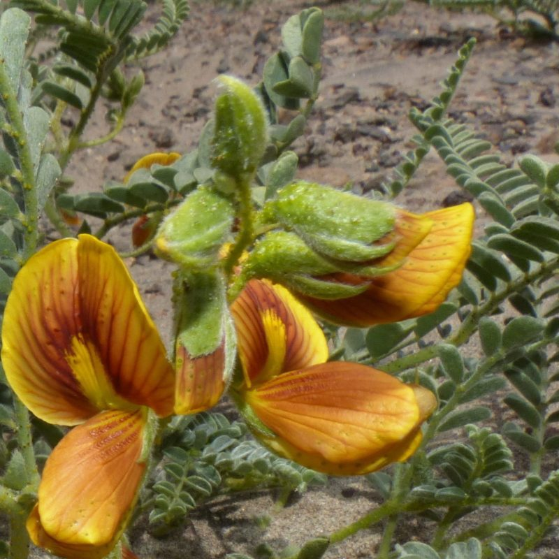
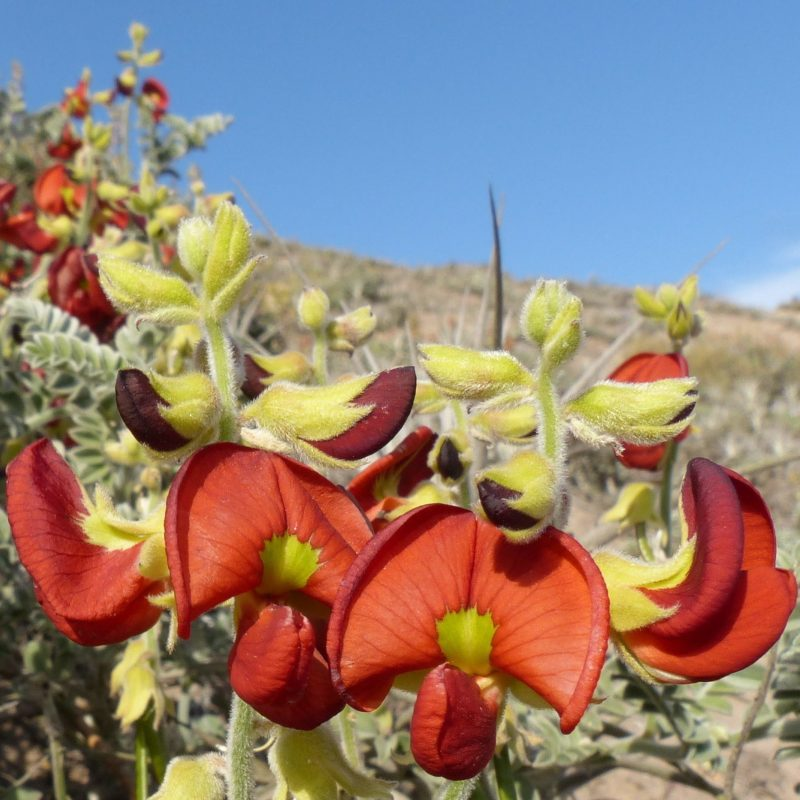
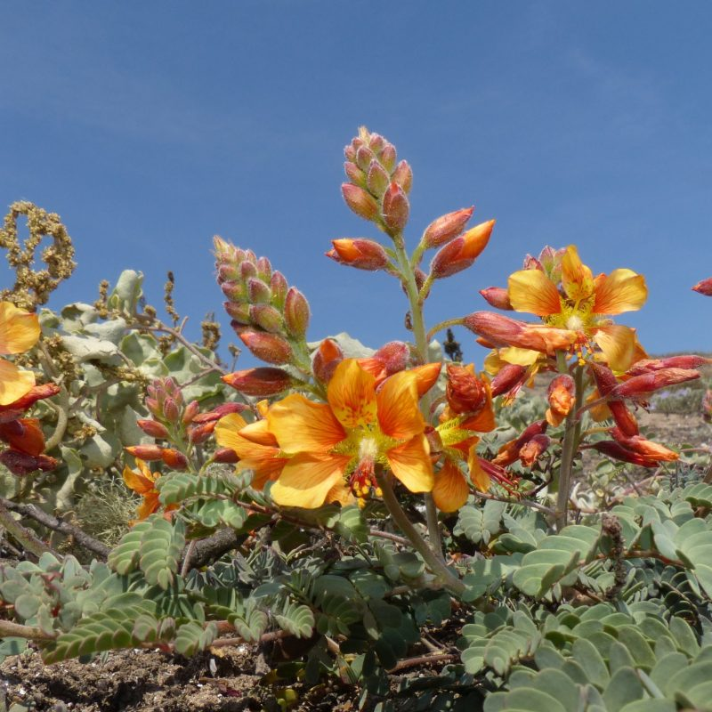

## Fabaceae - Legume Phylogeny Working Group: Taxonomy

__Administers:__ [Fabaceae](/wfo-7000000323)

Primary TENs contact: [Marianne Le Roux](mailto:contact@worldfloraonline.org) from [South African National Biodiversity Institute](https://about.worldfloraonline.org/consortium-members/south-african-national-biodiversity-institute)

Coordinators: Marianne le Roux (South African National Biodiversity Institute, SANBI, South Africa), Juliana Rando (University of Western Bahia, Brazil), and Anne Bruneau (Université de Montréal, Canada).

### Introduction

The Legume Phylogeny Working Group's (LPWG) Taxonomy Working Group has the central goal of putting together a community-endorsed consensus list of legume species names and their synonyms. Because several online sources are now out of date, the legume community considered this initiative critical to underpin ongoing and future research in the family. Our aim is to provide an accurate and up-to-date family classification that can be used for downstream analyses of all kinds for applied and fundamental research questions, including conservation, agronomic and green infrastructure purposes. This up-to-date species list will also provide the critical backbone for other LPWG working groups focusing on assembling occurrence and functional trait data from public databases, literature and collections, for example. Ultimately, we would expect the LPWG-verified and endorsed species list to be adopted and used as the taxonomic backbone for Leguminosae for large international initiatives such as the Global Biodiversity Information Facility (GBIF), Catalogue of Life, World Flora Online, and several ongoing phylogenomic projects. This is important to avoid duplication of efforts by a small pool of taxonomic experts.

### Join the Working Group

If you would like to participate in this endeavour and share your taxonomic expertise, please contact us.

### Acknowledgements

To date, more than 80 legume taxonomists from across the world have contributed towards updating the legume checklist, as part of the World Checklist of Vascular Plants, in collaboration with Rafaël Govaerts at the Royal Botanic Gardens, Kew.

Selection of legumes from the lomas vegetation of Coastal Peru. Photos by Gwilym Lewis. Royal Botanic Gardens, Kew.

Top L-R.\
*Weberbauerella raimondiana, Poissonia weberbaueri*\
Bottom L-R\
*Hoffmannseggia* sp. aff. *miranda, *Lupinus* *aureus**

### Key Literature

-   [Bruneau, A., Borges, L.M., Allkin, R., Egan, A.N., De la Estrella, M., Javadi, F., Klitgaard, B., Miller, J.T., Murphy, D.J., Sinou, C., Vatanparast, M. & Zhang, R. 2019. Towards a new online species-information system for legumes. Australian Systematic Botany 32: 495--518.](https://doi.org/10.1071/SB19025)
