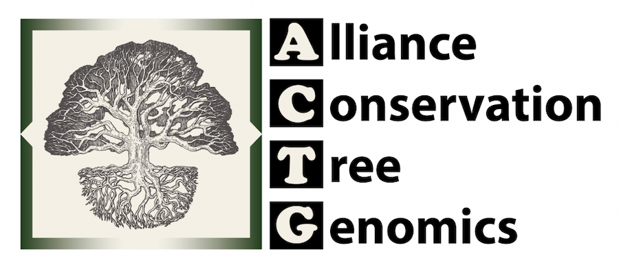
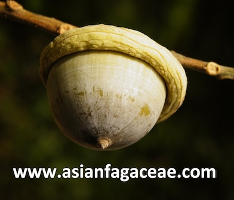
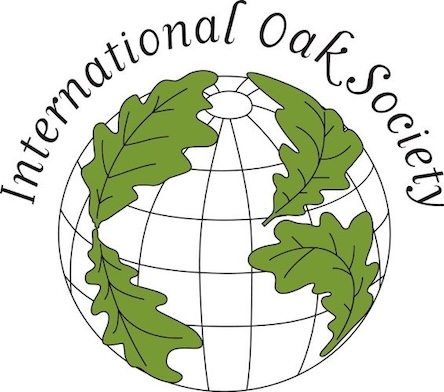
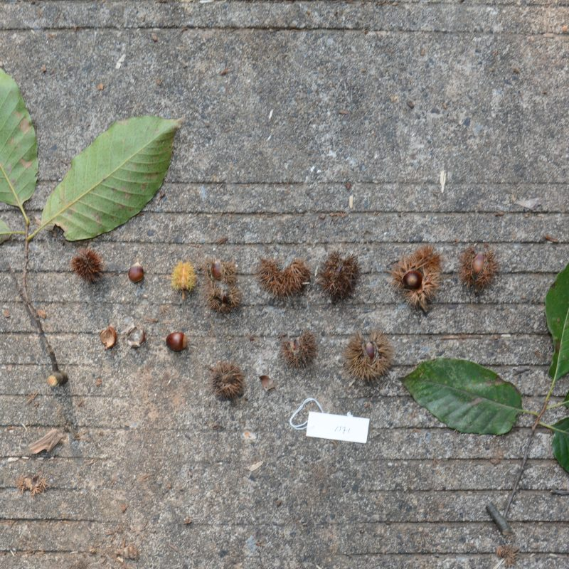
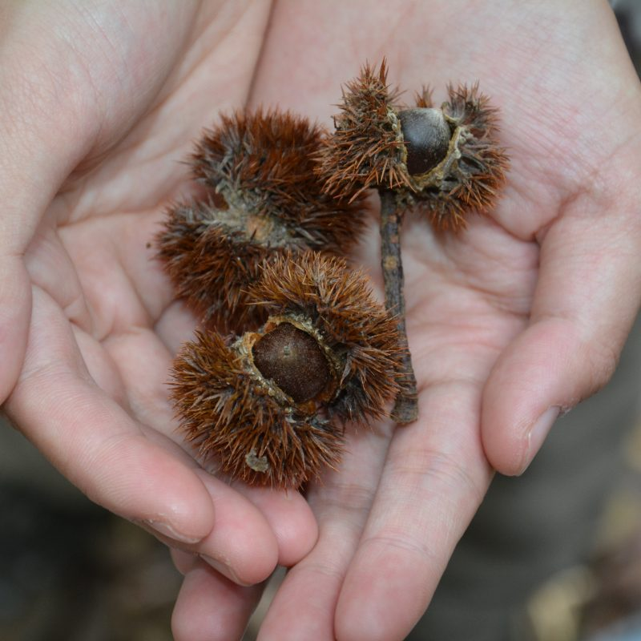
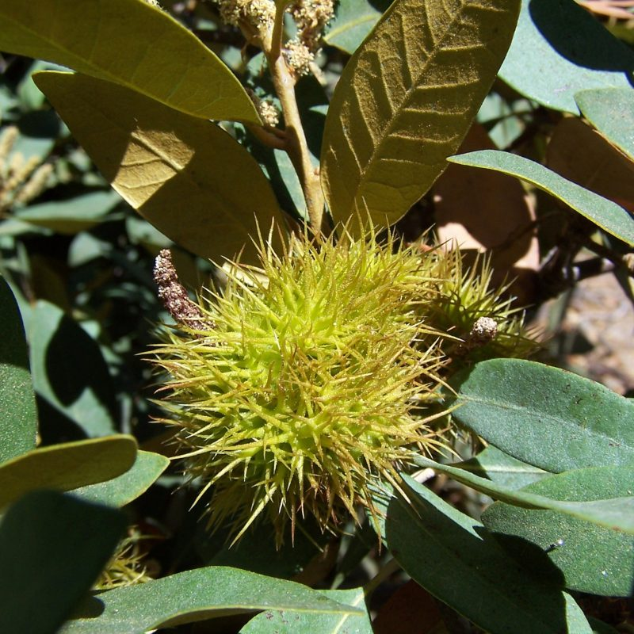
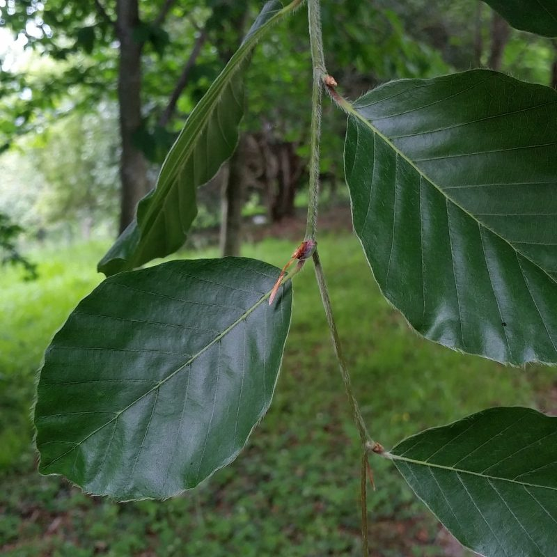
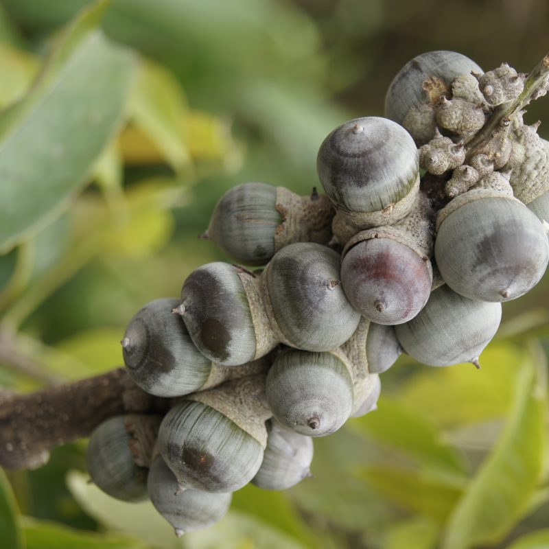
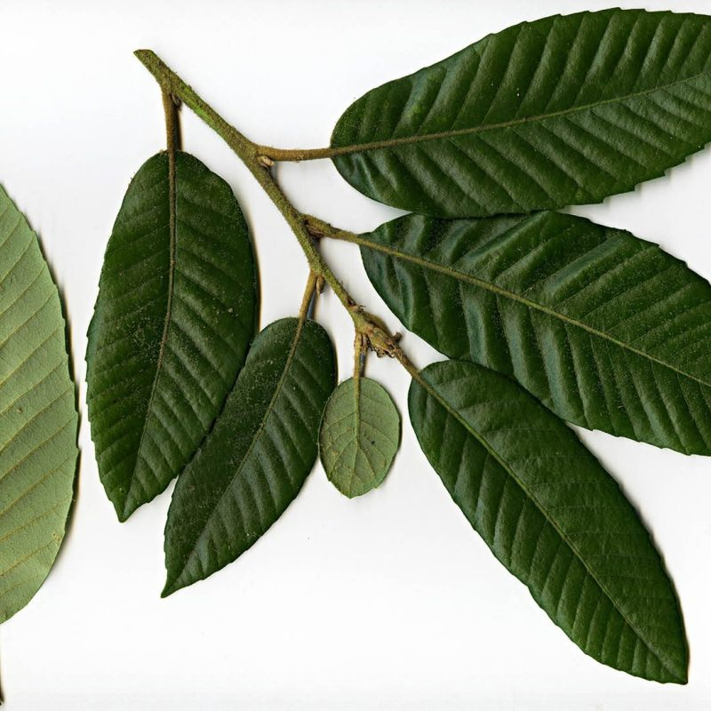
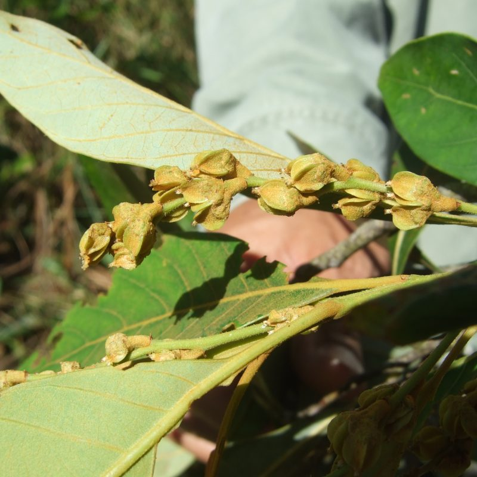

## Fagaceae

__Administers:__ [Fagaceae](/wfo-7000000231)

Primary TENs contact: Joeri S. Strijk

Fagaceae are a family of global importance and are a conspicuous element in major forest ecosystems of both temperate and (sub)tropical ecosystems. Contrary to public perception of Fagaceae being a typical temperate group, most species (and genera) are actually restricted to the (sub)tropics. Two global centers of diversity can be found: one is the range covering the southern USA through Mexico to Central America, and the second is subtropical southern China to Southeast Asia. Smaller numbers occur in Europe and around the Mediterranean Basin.

The family consists of ca.1000 tree (or very rarely large shrub) species in 8 accepted genera. The majority of species are contained in three very large genera: the Asian endemic genera of *Castanopsis* (ca.150 spp) and *Lithocarpus* (ca.350 spp), and the globally distributed genus *Quercus* (ca.470 spp). The remainder of the family is in 5 smaller genera (*Castanea*, *Chrysolepis*, *Fagus*, *Notholithocarpus* and *Trigonobalanus*, numbering between 1--12 spp each) and are often characterized by extreme global disjunct distributions and/​or small isolated populations.

The primary goals of TEN-Fagaceae are first to clear up the current collection of names in use for members of the family as a whole: a whopping +7000 taxonomic entries (for the roughly 1000 species) have been created over time, by the many (past and current) workers in this major tree family --- evidence of a large historical body of work, but also the consequences historic use of the complex and often confusing morphological characters in creating the initial classifications. With the family backbone supported by solid molecular data in place today, unequivocally identifying 8 monophyletic genera, we aim to work towards generating a complete framework and checklist with online resources for all accepted names in Fagaceae. This is especially relevant as it feeds data into species records at the Global Biodiversity Information Facility (GBIF) and the International Union of Conservation of Nature (IUCN), and informs active Conservation Red Listing (incl. publication of Global Reports) for the major genera in the family (*Quercus*, published in 2020; *Castanopsis & Lithocarpus*, expected in 2025). It also directly relates to ongoing taxonomic treatment preparations (Cambodia-Laos-Vietnam; Flora Malesiana; Peninsular Malaysia; and Singapore), as well as online resource/​data portals (Asian species: www​.asianfa​gaceae​.com & all other species: https://​www​.asianfa​gaceae​.com/​f​a​g​a​c​e​a​e​---​o​u​t​s​i​d​e​---​asia/), grant-funded regional conservation actions and ongoing phylogenomic projects. Once a complete name checklist is completed on the WFO and Red Listing for the entire family is completed (expected in 2025), TEN-Fagaceae will then be able to progress on the need for more detailed phylogenomic information and address the growing conservation challenges in the family. As the number of species listed on the IUCN Red List is reaching towards two-thirds of all recognized in the family, there is no time to waste in combining recorded species knowledge. collection data, network resources, and updated assessments of threatened species, and turning these into conservation action plans for critical taxa and regions.

### TEN Partners and their WFO areas under curation:

-   Dr Joeri Sergej Strijk (genera *Castanopsis* & *Lithocarpus*)
-   Taxonomy and Nomenclature Committee of the International Oak Society (genus *Quercus*)

Participant links:

-   [www.actg.science](http://www.actg.science/) (Alliance for Conservation Tree Genomics -- homepage)
-   [www​.asianfa​gaceae​.com](http://www.asianfagaceae.com/) & [https://​www​.asianfa​gaceae​.com/​f​a​g​a​c​e​a​e​-​o​u​t​s​i​d​e​-​asia/](https://www.asianfagaceae.com/fagaceae-outside-asia/)
-   [www​.inter​na​tion​aloak​so​ci​ety​.org](http://www.internationaloaksociety.org/) (International Oak Society -- homepage)
-   [www​.oak​names​.org](http://www.oaknames.org/)

### More information

If you would like to know more about this workgroup, please contact the Fagaceae TEN curator.

### Key monographs & studies

-   Camus, A. 1936-1938. Monographie du genre Quercus. Tome I. Genre Quercus. Sous-genre Cyclobalanopsis et sous-genre Euquercus (Section Cerris et Mesobalanus). Editions Paul Lechevalier (Paris). Encyclopédie économique de sylviculture VI. 695 pages.
-   Camus, A. 1938-1939. Monographie du genre Quercus. Tome II. Genre Quercus. Sous-genre Euquercus (sections Lepidobalanus et Macrobalanus). Editions Paul Lechevalier (Paris). Encyclopédie économique de sylviculture VII. 830 pages.
-   Camus, A. 1952--1954. Monographie du Genre Quercus. Tome III (1ere partie). Genre Quercus. Sous-genre Euquercus (sections Protobalanus et Erythrobalanus). Monographie du genre Lithocarpus et Addenda aux Tomes I, II, III. Editions Paul Lechevalier (Paris). Encyclopédie économique de sylviculture VIII. 830 pages.
-   Camus, A. 1952-1954. Monographie du Genre Quercus. Tome III (2ième partie). Genre Quercus. Sous-genre Euquercus (Sections Protobalanus et Erythrobalanus). Monographie du genre Lithocarpus et Addenda aux Tomes I, II, III. Texte. Editions Paul Lechevalier (Paris). Encyclopédie économique de sylviculture VIII. 830 pages.
-   Camus, A. Les châtaigniers, monographie des genres Castanea et Castanopsis. Atlas. Paris, Lechevalier, 1929.
-   Cornell, CALS (College of Agriculture and Life Sciences) School of Integrative Plant Science. Plant Biology Section. Diversity of Genus Quercus L. Springer International Publishing. 547 pages.
-   Hipp, A.L., D.A.R. Eaton, J. Cavender-Bares, E. Fitzek, R. Nipper, and P.S. Manos. 2014. A framework phylogeny of the American oak clade based on sequenced RAD data. PLoS ONE 9:e93975.
-   Kotschy, T. 1862. Die Eichen Europa's und des Orient's. E. Hölzel, Wien und Olmütz.
-   Manos, P.S., J.J. Doyle., and K.C. Nixon K.C. 1999. Phylogeny, biogeography, and processes of molecular differentiation in Quercus subgenus Quercus (Fagaceae). Molecular Phylogeneticls and Evolution 12(3): 333--349.
-   Manos, P. S., and A.M. Stanford. 2001. The historical biogeography of Fagaceae: tracking the Tertiary history of temperate and subtropical forests of the northern hemisphere. International Journal of Plant Sciences 162 (6 Suppl.): S77--S93.
-   Menitsky, Y. L. 1984. Dubi Asii. Botanical Institute of the USSR Academy of Sciences, Nauka Publishing House, Leningrad. English translation: Oaks of Asia (2005) Science Publishers Inc.
-   Nixon K. C., and J.M. Carpenter. 1996. On simultaneous analysis. Cladistics. 12(3): 221--241.
-   Nixon, K.C. 2006. Global and Neotropical Distribution and Diversity of Oak (genus Quercus) and Oak Forests. In: Kappelle, M. (eds) Ecology and Conservation of Neotropical Montane Oak Forests. Ecological Studies vol 185. Springer, Berlin, Heidelberg.
-   Ørsted, A.S. 1863. L'Amérique Centrale: Recherches sur sa flore et sa géographie physique. Copenhagen, Impr. de B. Luno par F. S. Muhle.
-   Trelease, W.L. 1924. The American Oaks. Memoirs of the National Academy of Sciences. 20: 1-255.

Representatives of the Fagaceae genera. Captions and credits can be found on each image.