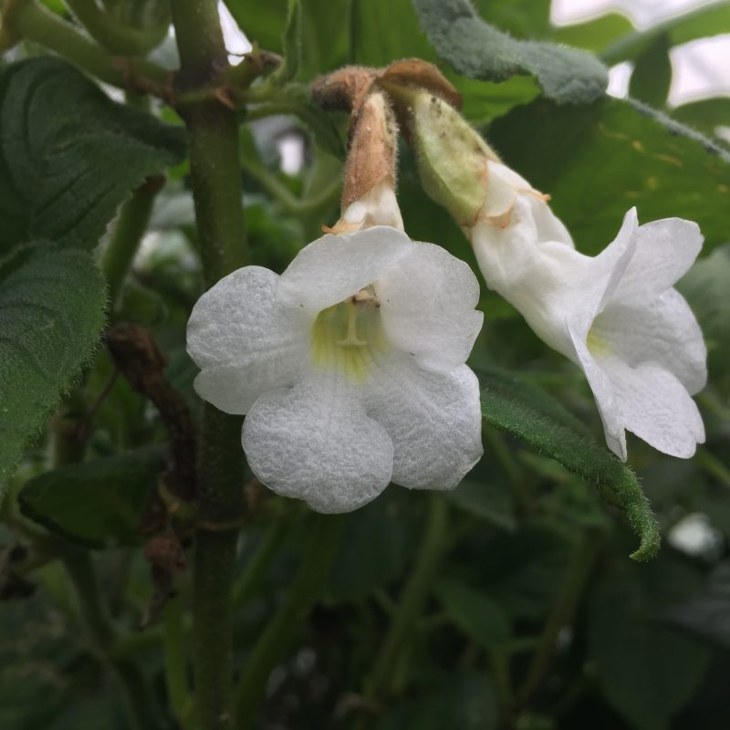
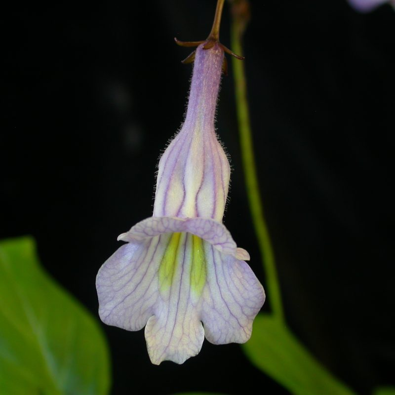
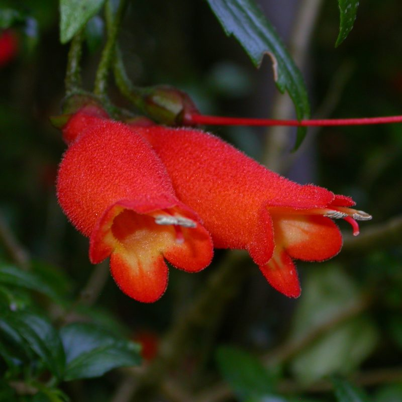
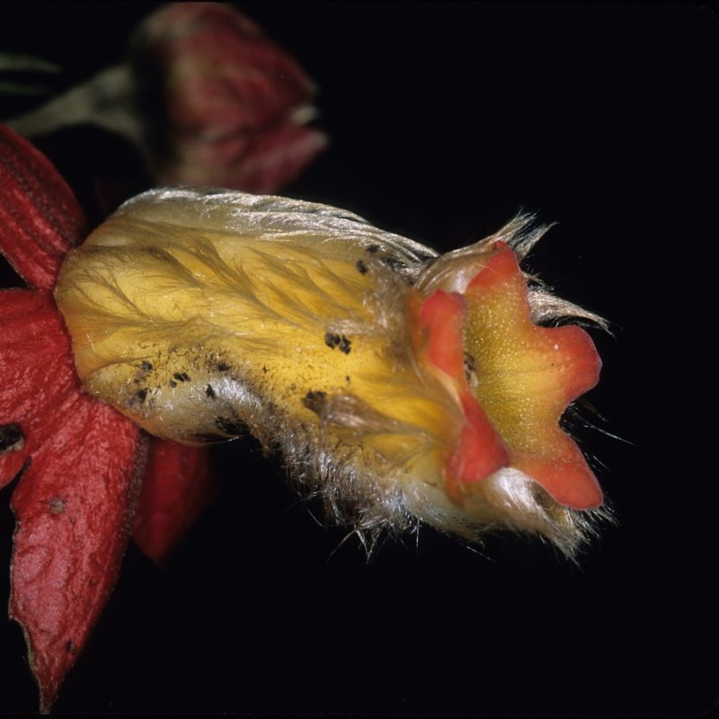
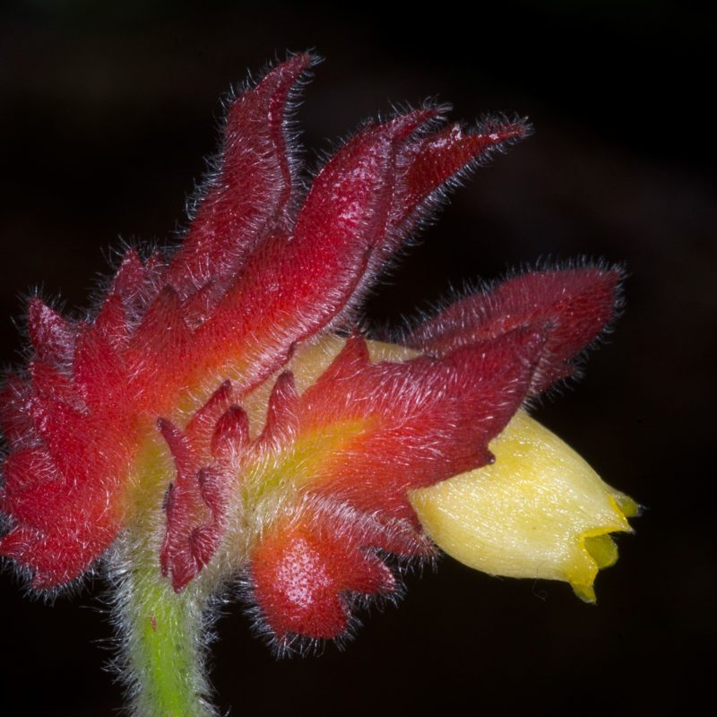
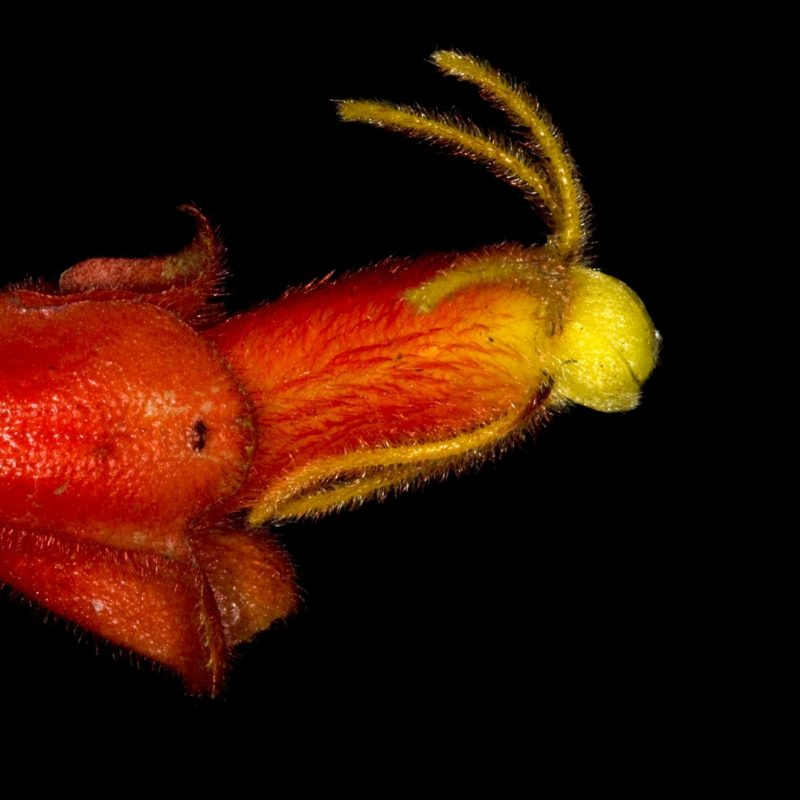
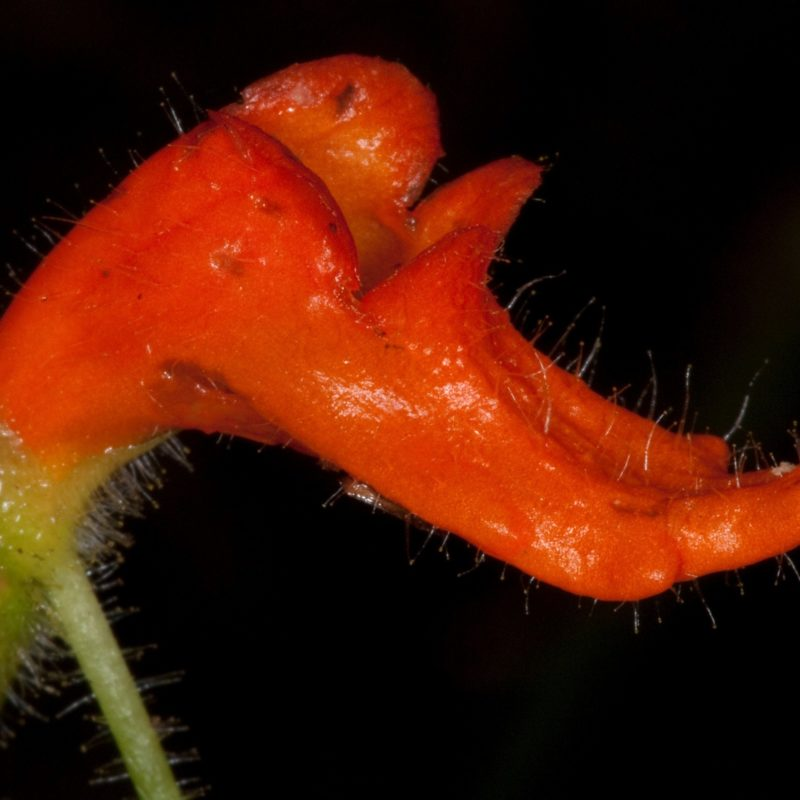

## Gesneriaceae

__Administers:__ [Gesneriaceae](/wfo-7000000247)

__External website:__ <https://padme.rbge.org.uk/grc>

Primary TENs contact: Michael Möller from [Royal Botanic Garden Edinburgh](https://about.worldfloraonline.org/consortium-members/royal-botanic-garden-edinburgh)

> Gesneriaceae: A pan-tropical and species diverse family of ecological importance

The [Gesneriaceae Resource Centre](https://padme.rbge.org.uk/grc) provides information to researchers interested in the plant family Gesneriaceae. It currently includes information on scientific names, infra-family classification, publications and cytology. This is an ongoing project which has grown out of the ​'World Checklist of Gesneriaceae' databases previously hosted at the Smithsonian Institution's National Museum of Natural History (Department of Botany, US), and is constantly being updated and expanded.

### Contributors

-   Michael Möller (Royal Botanic Garden Edinburgh, UK)
-   Hannah Atkins (Royal Botanic Garden Edinburgh, UK)
-   Kanae Nishii (Royal Botanic Garden Edinburgh, UK)
-   John L. Clark (Marie Selby Botanical Gardens, USA)
-   Laurence E. Skog (Smithsonian Institution, USA)
-   Gemma Bramley (Royal Botanic Gardens, Kew, UK)
-   Laura Clavijo (Universidad Nacional de Colombia, Colombia)
-   Hong Xin (Anhui University, China)
-   Wen Fang (Guangxi Institute of Botany, China)
-   Alain Chautems (Conservatoire et Jardin botaniques de la Ville de Genève (G), Switzerland)
-   David J. Middleton (Singapore Botanic Gardens, Singapore)

Flowers of species cultivated in the Research Collection at Royal Botanic Garden Edinburgh. Images: Michael Möller

### Key Literature

-   [Clark, J.L., P.S. Herendeen, L.E. Skog, and E.A. Zimmer. 2006. Phylogenetic relationships and generic boundaries in the Episcieae (Gesneriaceae) inferred from nuclear, chloroplast, and morphological data. Taxon 55: 313-336. https://doi.org/10.2307/25065580](https://doi.org/10.2307/25065580)
-   [Clark, J.L., L.E. Skog, J.K. Boggan and S. Ginzbarg. 2020. Index to names of New World members of the Gesneriaceae (Subfamilies Sanangoideae and Gesnerioideae). Rheedea 30: 190-256. https://dx.doi.org/10.22244/rheedea.2020.30.01.14](https://dx.doi.org/10.22244/rheedea.2020.30.01.14)
-   [Möller M, S Nampy, AP Janeesha, A Weber. 2017. The Gesneriaceae of India: consequences of updated generic concepts and new family classification. Rheedea 27(1): 23--41. https://dx.doi.org/10.22244/rheedea.2017.27.1.5](https://dx.doi.org/10.22244/rheedea.2017.27.1.5)
-   [Möller M, YG Wei, F Wen, JL Clark, A Weber. 2016. You win some you lose some: updated generic delineations and classification of Gesneriaceae -- implications for the family in China. Guihaia 36(1): 44--60. https://doi.org/10.11931/guihaia.gxzw201512015](https://doi.org/10.11931/guihaia.gxzw201512015)
-   [Mora, M.M., and J.L. Clark. 2016. Molecular phylogeny of the neotropical genus Paradrymonia (Gesneriaceae), reexamination of generic concepts and the resurrection of Trichodrymonia and Centrosolenia. Systematic Botany 41(1): 82-104. https://doi.org/10.1600/036364416X690561](https://doi.org/10.1600/036364416X690561)
-   [Nishii K, M Hughes, M Briggs, E Haston, F Christie, MJ deVilliers, T Hanekom, WG Roos, DU Bellstedt, M Möller. 2015. Streptocarpus redefined to include all Afro-Malagasy Gesneriaceae: molecular phylogenies prove congruent with geography and cytology and uncovers remarkable morphological homoplasies. Taxon 64(6): 1243--1274. https://doi.org/10.12705/646.8](https://doi.org/10.12705/646.8)
-   [Puglisi C, TL Yao, R Milne, M Möller, DJ Middleton. 2016. Generic recircumscription in the Loxocarpinae (Gesneriaceae), as inferred by phylogenetic and morphological data. TAXON 65(2): 277--292. https://doi.org/10.12705/652.5](https://doi.org/10.12705/652.5)
-   [Weber A, DJ Middleton, JL Clark, M Möller. 2020. Keys to the infrafamilial taxa and genera of Gesneriaceae. Rheedea - Special Gesneriaceae Issue 30(1): 5--47. https://dx.doi.org/10.22244/rheedea.2020.30.01.02](https://dx.doi.org/10.22244/rheedea.2020.30.01.02)
-   [Weber A, JL Clark, M Möller. 2013. A new formal classification of Gesneriaceae. Selbyana 31(2): 68--94. https://www.jstor.org/stable/24894283](https://www.jstor.org/stable/24894283)

### Acknowledgements:

We thank the Royal Botanic Garden Edinburgh (RBGE) for supporting and hosting GRC. The RBGE Sibbald Trust and the RBGE Friends' Small Projects Fund are greatly acknowledged for funding the GRC. The Gesneriad Society, Inc. is acknowledged for their ongoing support and feedback.

Flower details of some neotropical Gesneriaceae. Images: John L. Clark.