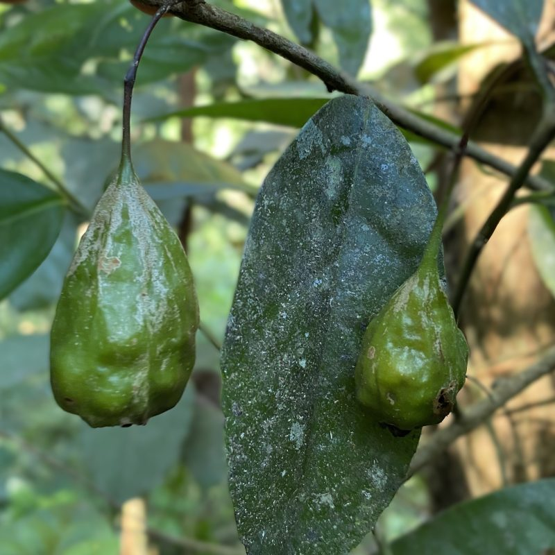
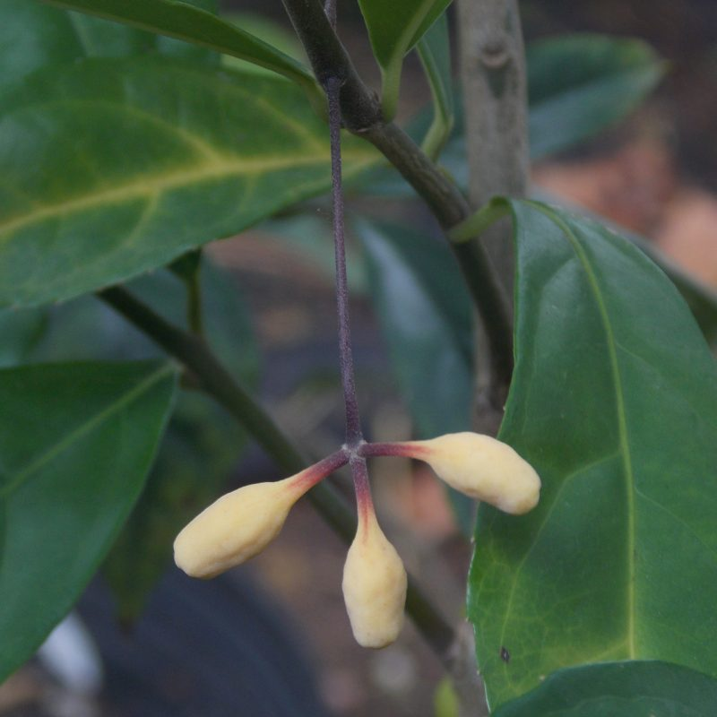
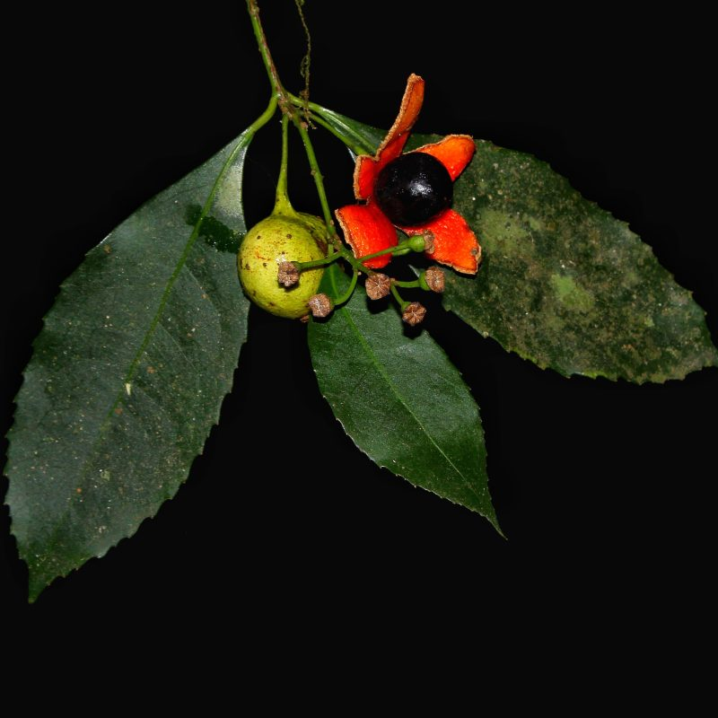
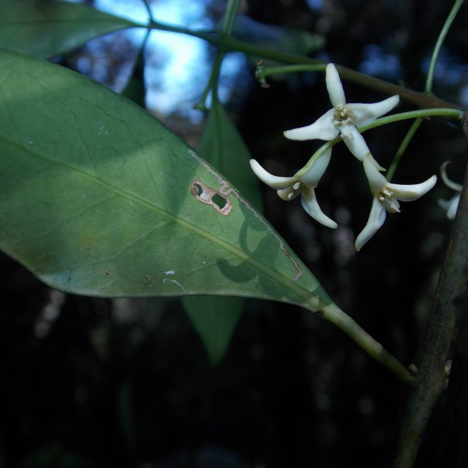
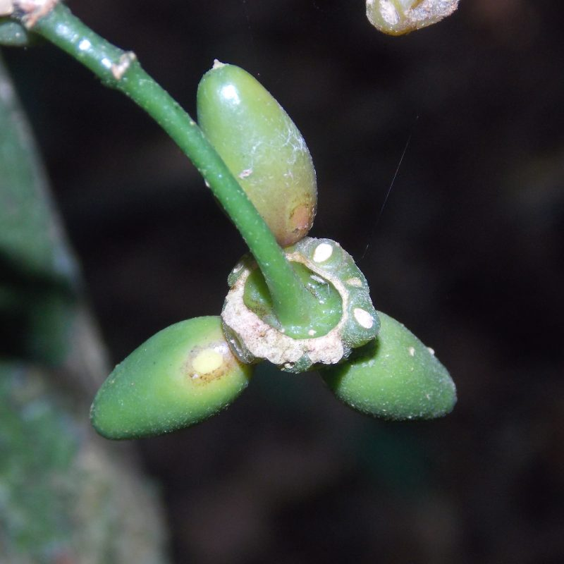
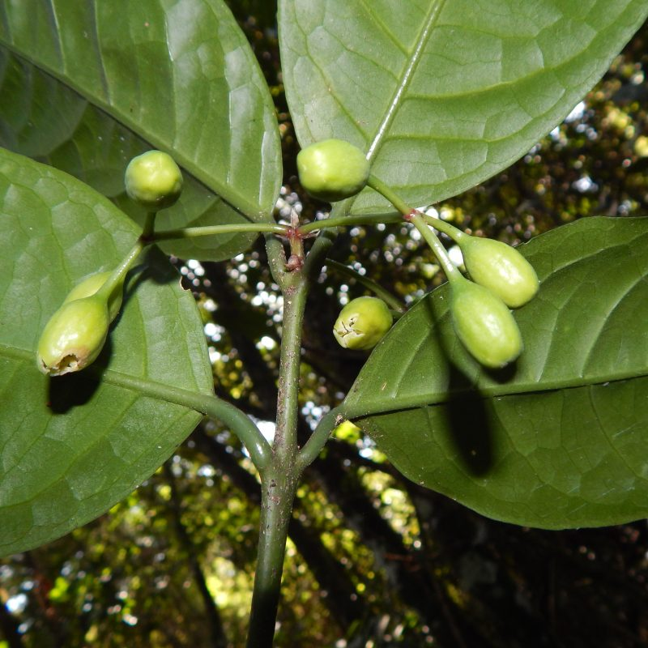
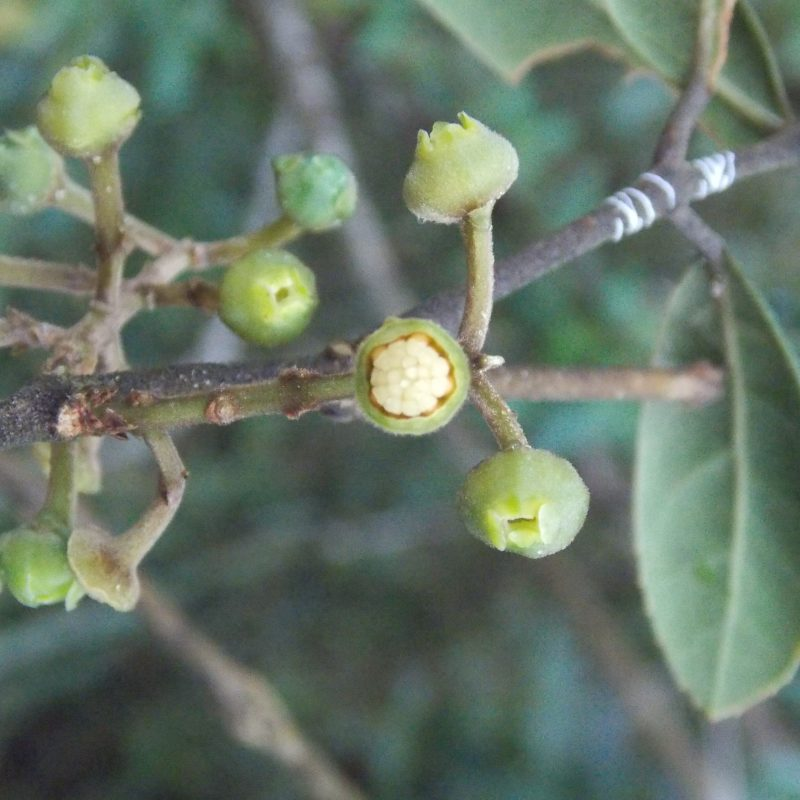
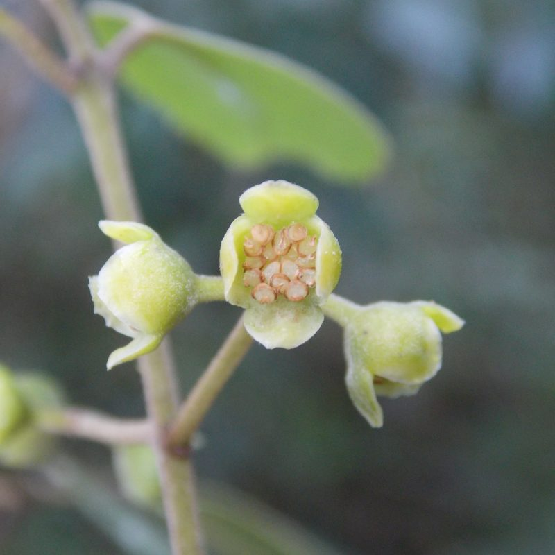

## The Monimiaceae TEN

Administers: Monimiaceae

Primary TENs contact: [Elton John de Lírio](mailto:)

Monimiaceae (Laurales) comprises a group predominantly of trees and shrubs and occasionally lianas, monocious or dioecious. It thrives in tropical and subtropical regions worldwide (Latin America, tropical Africa, Madagascar, Southeast Asia, Sri Lanka, Australasia, and Pacific Islands) and is an important component of humid forest flora in these regions, with particularly rich diversity in the southern hemisphere.

Over time, the circumscription of Monimiaceae has undergone significant changes. Many genera and groups historically included in this family have been segregated into other families based on morphological and, more recently, phylogenetic evidence. Notable examples include *Amborella* (currently Amborellaceae), *Trimenia* (Trimeniaceae), and the former subfamily Siparunoideae with genera that now constitute Siparunaceae (such as *Siparuna*) and those from the former subfamily Atherospermatoideae, which now form the family Atherospermataceae. 

With its current delimitation, Monimiaceae exhibits a pantropical distribution, but with greater diversity and occurrence in the Southern Hemisphere, including 26 genera and approximately 200 to 250 species. Morphologically, the leaves are opposite (rare verticillate or subopposite), simple, usually fragrant, stipules absent, toothed or entire, and with a peculiar floral structure, unisexual or bisexual (only *Hortonia*), often with a cup-shaped hypanthium enclosing the carpels. The Chielan boldo (*Peumus boldus* Molina) is largely used and sold in South America for digestive and hepatic issues and cultivated in many botanic gardens worldwide. Also, the pigeonwood (*Hedycarya arborea* J.R.Forst. & G.Forst.) from New Zealand is cultivated and sold on a small scale.

## Contributors

- Andrew Ford
- Ariane Luna Peixoto --- Instituto de Pesquisas Jardim Botânico do Rio de Janeiro, Brazil.
- David Lorence, National Tropical Botanical Garden, United States of America.
- Elton John de Lírio, Instituto Nacional da Mata Atlântica, Brazil.
- Joël Jérémie, Muséum national d'Histoire naturelle, France.
- Marc Pignal, Muséum national d'Histoire naturelle, France.
- Trevor Whiffin

### Key Literature

-   Jérémie, J. 1978. Étude des Monimiaceae: Révision du genre Hedycarya. Adansonia 18(1): 25--43.
-   [Lírio, E. J. de; Peixoto, A. L.; Zavatin, D. A.; Pignal, M. 2025. Monimiaceae in Flora e Funga do Brasil. Jardim Botânico do Rio de Janeiro. Available at: https://floradobrasil.jbrj.gov.br/FB166 (20 Sep. 2025).](https://floradobrasil.jbrj.gov.br/FB166)
-   Lorence, D. H. 1985. A monograph of the Monimiaceae (Laurales) in the Malagasy region (Southwest Indian Ocean). Annals of the Missouri Botanical Garden 1--165.
-   Philipson, W. R. 1993. Monimiaceae. In: Flowering Plants- Dicotyledons: Magnoliid, Hamamelid and Caryophyllid Families (pp. 426--437). Berlin, Heidelberg: Springer Berlin Heidelberg.
-   Renner, S. S., Strijk, J. S., Strasberg, D., & Thébaud, C. 2010. Biogeography of the Monimiaceae (Laurales): A role for East Gondwana and long‐distance dispersal, but not West Gondwana. Journal of Biogeography 37(7): 1227--1238.
-   Whiffin, T., Foreman, D. B. 2007. Monimiaceae. Flora of Australia. Vol. 2, Winteraceae to Platanaceae. pp. 65--91. Australian Government Publishing Service, Canberra.

