## Myrtaceae

Administers: Myrtaceae

Primary TENs contacts: Andrew Thornhill (University of New England, Australia), Eve Lucas (Royal Botanic Gardens Kew, UK) and Fiorella Mazine (Universidade Federal de São Carlos, Brazil)

> Myrtaceae is a species-rich family with ca. 6,500 species and 130 genera, predominantly occurring across the southern Hemisphere in tropical and temperate regions and underpinning worldwide ecological and economic endeavours. Myrtaceae includes globally significant crops and forest trees such as clove (Syzygium aromaticum), guava (Psidium guajava), eucalypts (Eucalyptus spp.), and jabuticaba (Plinia spp.).

Despite its prominence, Myrtaceae presents enduring systematic challenges. Rapid diversification, large species-rich genera, and historical reliance on morphological classifications have resulted in incongruences between traditional taxonomy and molecular phylogenetic evidence. Recent advances in molecular systematics, phylogenomics, palynology, wood anatomy, and phytochemistry have begun reshaping our understanding of the evolutionary relationships within the family. Major tribes such as Chamelaucieae, Eucalypteae, Myrteae and Syzygieae, require continued integrative study to stabilise generic boundaries, refine infrageneric classifications, and resolve species complexes. Strengthening robust and globally consistent species-level frameworks in Myrtaceae is now both feasible and urgently needed.

This initiative is collaborative by design. We actively seek contributions from taxonomists, herbarium curators, ecologists, systematists and regional experts who can assist with nomenclatural verification, image curation, specimen data validation, and curation of data within the World Flora Online portal. Whether through sharing datasets, contributing photographs, reviewing taxa, or leading regional treatments, there are multiple ways to engage. Those interested in supporting the Myrtaceae TEN are warmly encouraged to connect with the designated TEN foci to explore how they can participate.

Current TEN members

-   Adriano Maruyama (Universidade Federal de São Carlos: Sorocaba, São Paulo, Brazil) --- *Eugenia*.
-   Aline Stadnik (IICA --- Instituto Interamericano de Cooperação para Agricultura) --- Pliniinae.
-   Amélia Tuler (Universidade Federal de Roraima (UFRR), Brazil) --- *Psidium*.
-   Andrew Thornhill (N.C.W. Beadle Herbarium, University of New England, Armidale NSW 2351, Australia) --- Eucalypteae.
-   Augusto Giaretta (Universidade Federal da Grande Dourados, Mato Grosso do Sul, Brazil) --- *Eugenia*.
-   Barbara Rye (Western Australian Herbarium, Australia) --- Chamelaucieae.
-   Bruce Holst (Marie Selby Botanical Gardens, Florida, USA) --- Myrciinae & neotropical Eugeniinae.
-   Carolyn Proenca (University of Brasilia, Brazil) --- Standing by.
-   Daniel Villarroel Segarra (Museo de Historia Natural Noel Kempff Mercado, Bolivia) --- Myrteae (Bolivia and Andes focus).
-   Duane Lima (Federal University of Santa Catarina, Brazil) --- *Myrcia*, Curitiba, *Feijoa*, *Accara*, *Myrrhinium*.
-   Eve Lucas (Royal Botanic Gardens, Kew, UK) --- *Myrcia*, *Eugenia*, *Syzygium*.
-   Everton Correa (Universidade Federal de São Carlos: Sorocaba, São Paulo, Brazil) --- *Eugenia*.
-   Fabio Speck (University of São Paulo, Brazil) --- *Myrceugenia*.
-   Fiorella Mazine (Universidade Federal de São Carlos: Sorocaba, São Paulo, Brazil) --- *Eugenia*.
-   Francis Nge (Botanic Gardens of Sydney, Australia) --- Chamelaucieae.
-   Janine Oliveira (State University of Feira de Santana, Brazil) --- *Eugenia*.
-   João Victor Dias da Silva (Universidade Federal de São Carlos: Sorocaba, São Paulo, Brazil) --- *Eugenia*.
-   John Parnell (Trinity College Dublin, Ireland) --- *Syzygium*.
-   Karinne Valdemarin (Escola Superior de Agricultura Luiz de Queiroz, Universidade de São Paulo, Piracicaba, Brazil) --- *Eugenia*.
-   Lazaro Conceicao (University of Brasilia, Brazil) --- *Psidium*.
-   Leidiana Lima (Federal Institute of Roraima (IFRR), Brazil) --- *Myrcia*.
-   Leslie Landrum (Arizona State University, USA) --- *Psidium*, *Calycolpus*.
-   Mariana Bunger (Universidade Federal do Ceará, Fortaleza, Brazil) --- *Eugenia*.
-   Marla Ibrahim (Universidade Federal de Sergipe, Brazil) --- *Campomanesia*.
-   Matheus Fortes Santos (Universidade Federal do ABC, São Paulo, Brazil) --- *Myrcia*.
-   Matt Barrett (James Cook University, Australia) --- Chamelaucieae.
-   Paulo Henrique Gaem (University of Michigan--Ann Arbor, Ann Arbor, Michigan, United States) --- *Myrcia*.
-   Pedro Bigue (Federal University of São Carlos campus Sorocaba, São Paulo, Brazil) --- *Eugenia*.
-   Peter de Lange (UNITEC Institute of Technology, New Zealand) --- *Leptospermum*, *Kunzea*.
-   Peter Wilson (Botanic Gardens of Sydney, Australia) --- Chamelaucieae, Xanthostemoneae, *Tristaniopsis*, Kanieae, Metrosidereae.
-   Priscila Rosa (University of Brasilia, Brazil) --- *Myrcia*.
-   Thais Vasconcelos (University of Michigan--Ann Arbor, Ann Arbor, Michigan, United States) --- Blepharocalycinae, Ugninae, Pimentinae, Myrtinae.
-   Thiago Fernandes (Instituto de Pesquisas Jardim Botânico do Rio de Janeiro, Brazil) --- *Myrcia*.
-   Vanessa Staggemeier (Universidade Federal do Rio Grande do Norte, Natal, Brazil) --- *Myrcia*.
-   Vinicius Luvizotto (Universidade Federal de São Carlos: Sorocaba, São Paulo, Brazil) --- *Eugenia*.
-   Wu Kuang Soh (National Botanic Garden of Ireland) --- *Syzygium*.
-   Yee Wen Low (Singapore Botanic Gardens, Singapore) --- *Syzygium*.
-   Zenia Acosta (Centro de Investigaciones y Servicios Ambientales ECOVIDA: Pinar del Río, Cuba) --- *Pimenta*, *Mosiera*.

[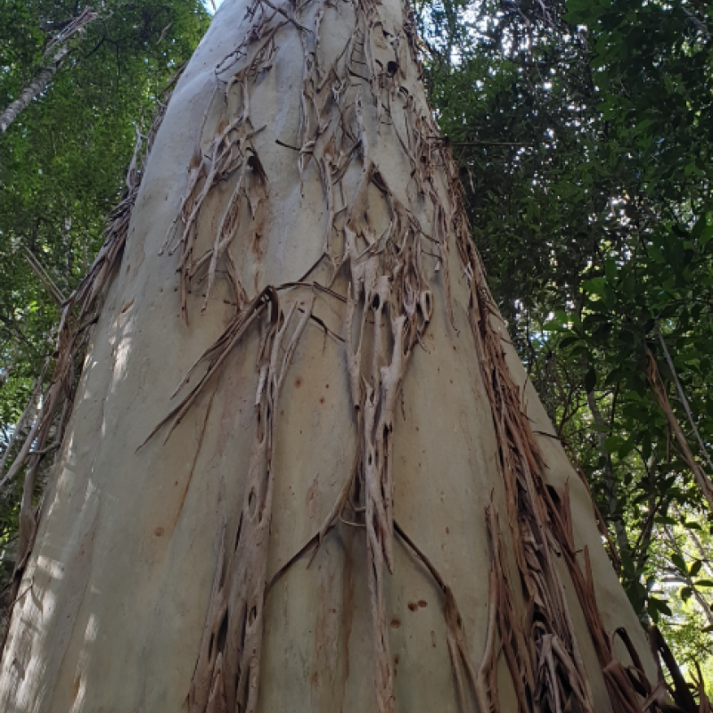](./_Myrtaceae/Eucalyptus-saligna.png)
[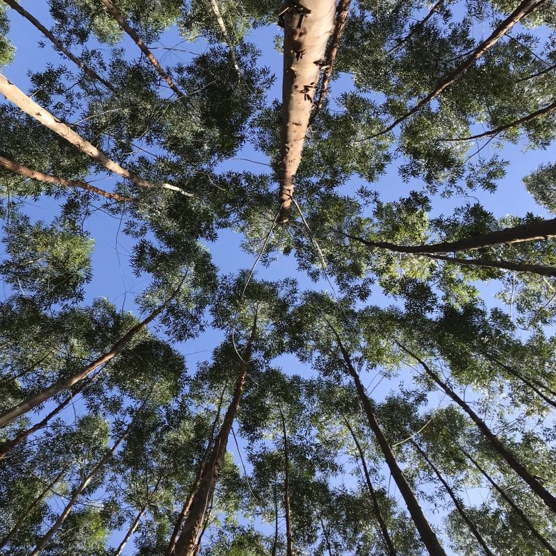](./_Myrtaceae/Eucalyptus-urophylla-X-grandis.jpg)
[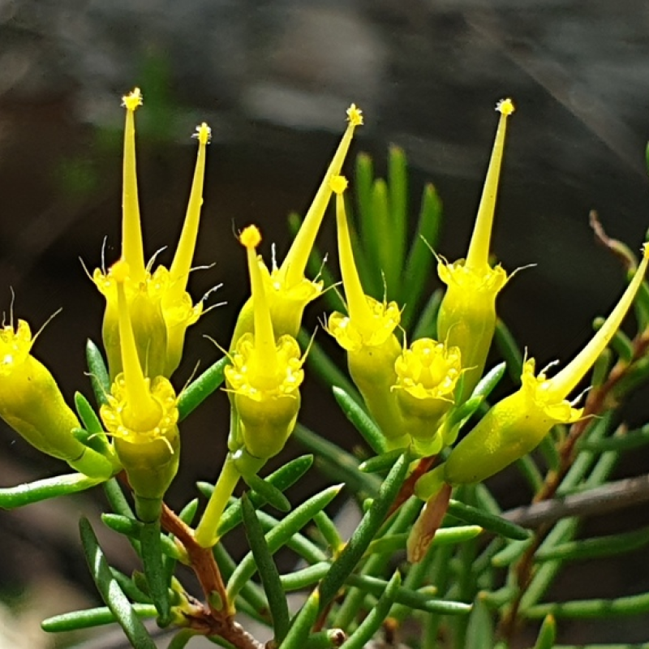](./_Myrtaceae/Homoranthus-flavescens.png)

[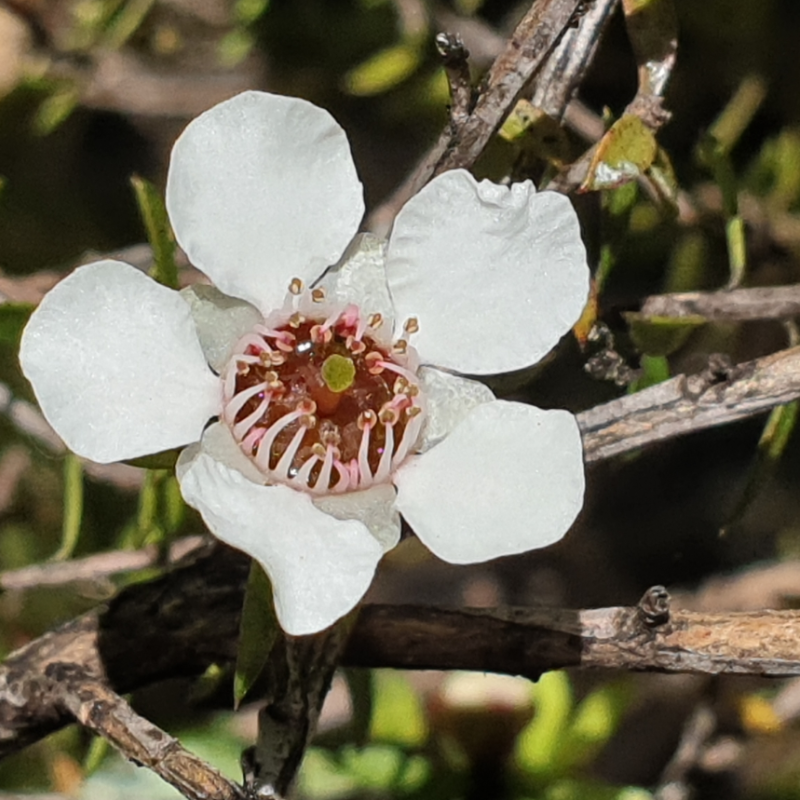](./_Myrtaceae/Leptospermum.png)
[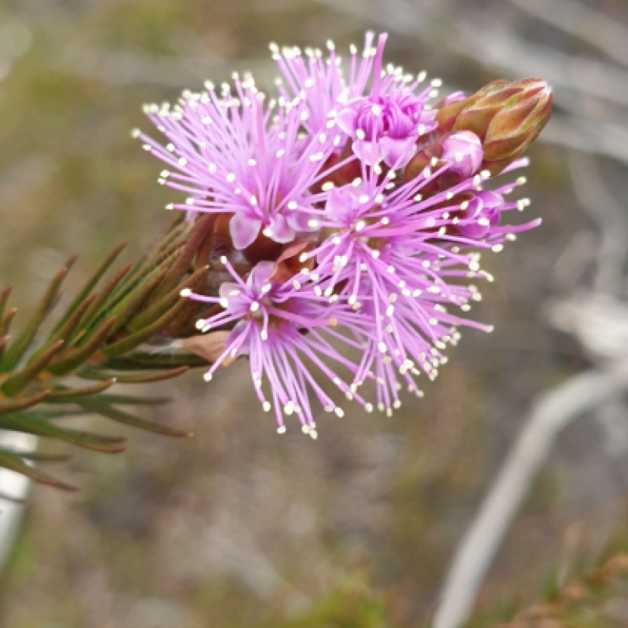](./_Myrtaceae/Melaleuca-squamea.png)
[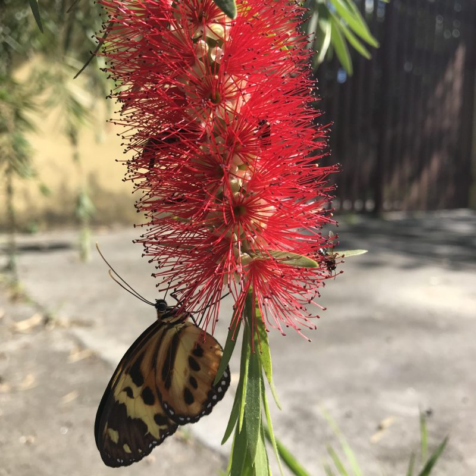](./_Myrtaceae/Melaleuca-viminalis.jpg)
[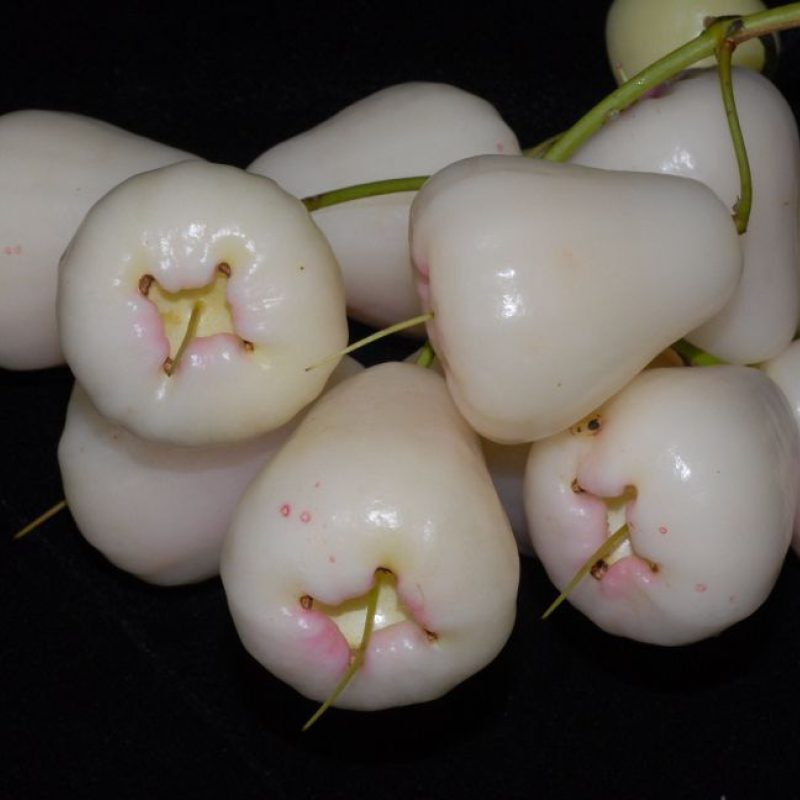](./_Myrtaceae/Syzygium-sp.1.jpg)

[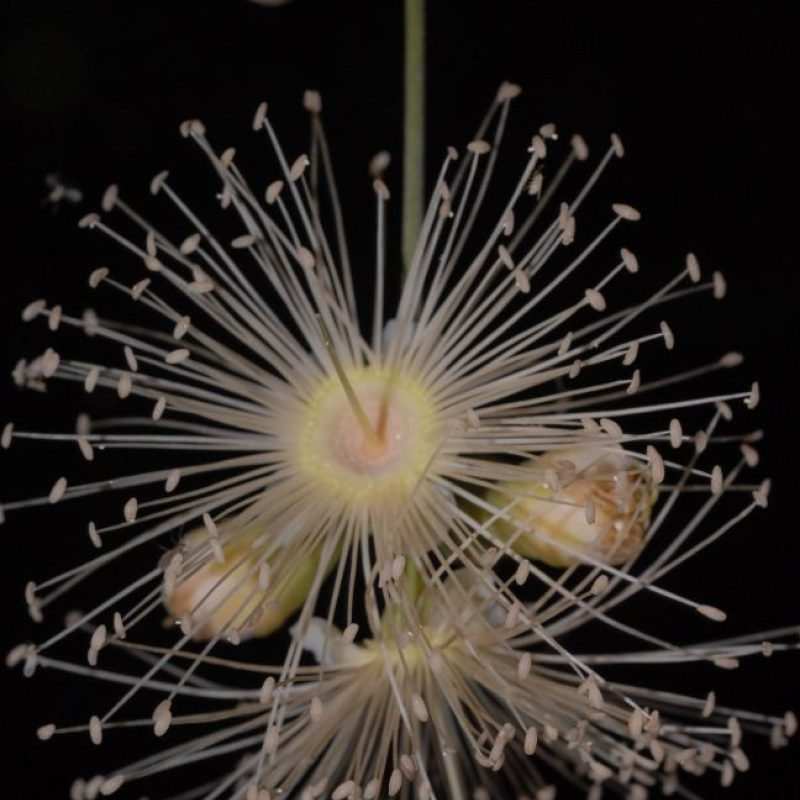](./_Myrtaceae/Syzygium-sp.jpg)
[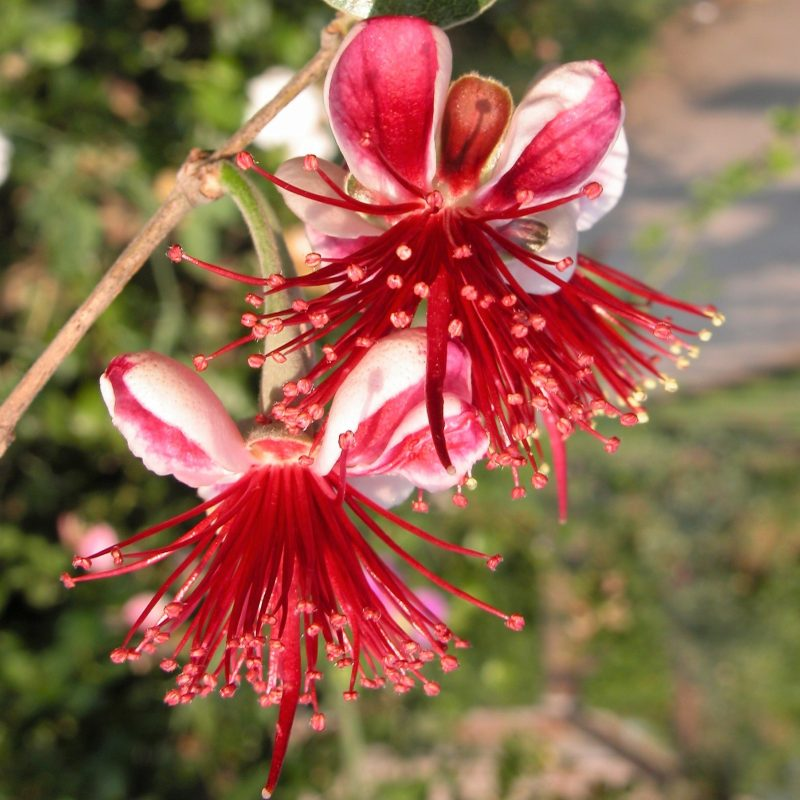](./_Myrtaceae/Acca-sp.jpg)
[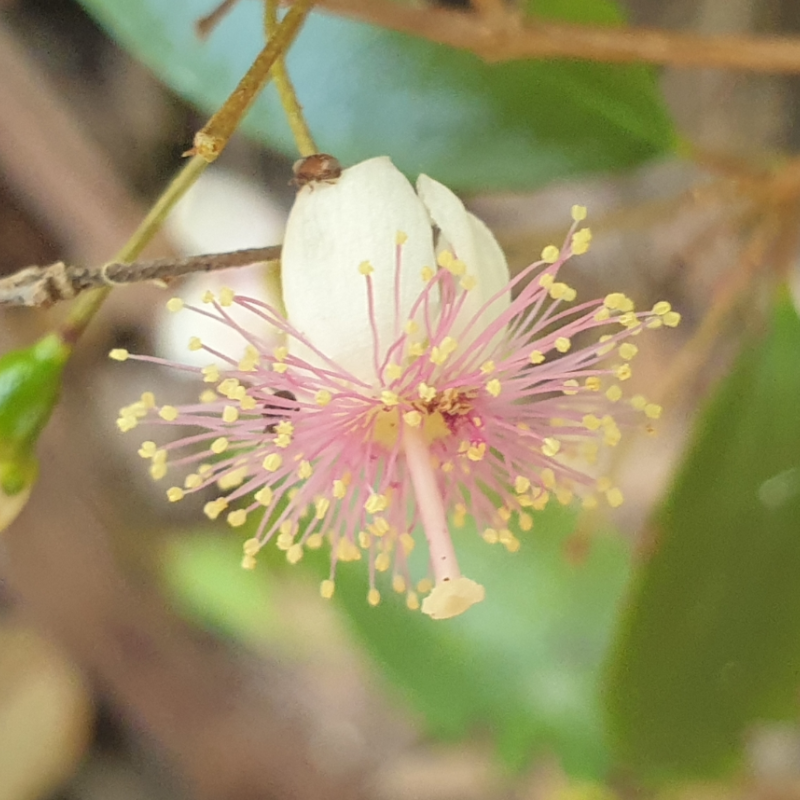](./_Myrtaceae/Archirhodomyrtus.png)
[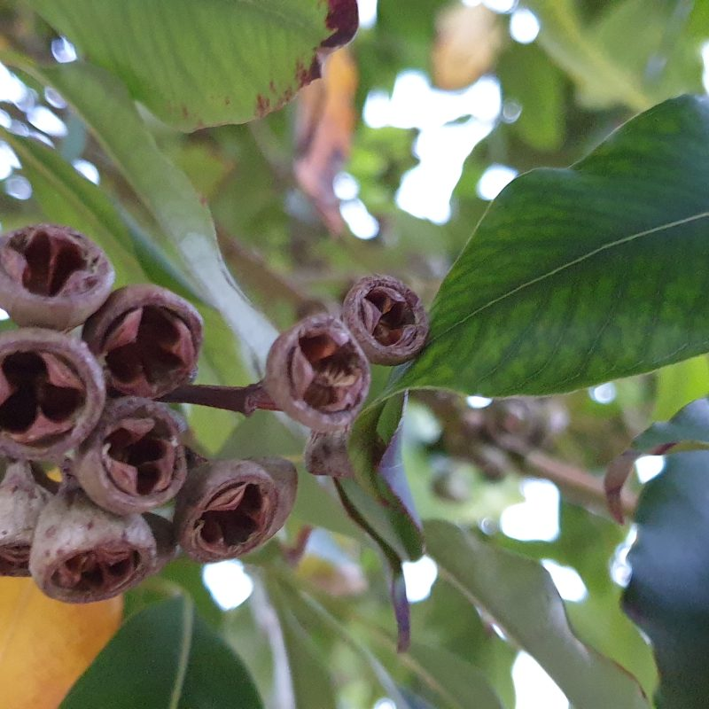](./_Myrtaceae/Backhousia-sp.jpg)

[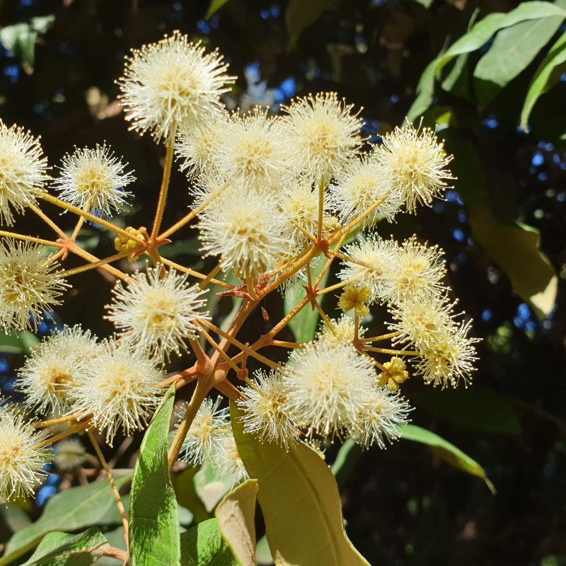](./_Myrtaceae/Bhakousia-sp.jpg)
[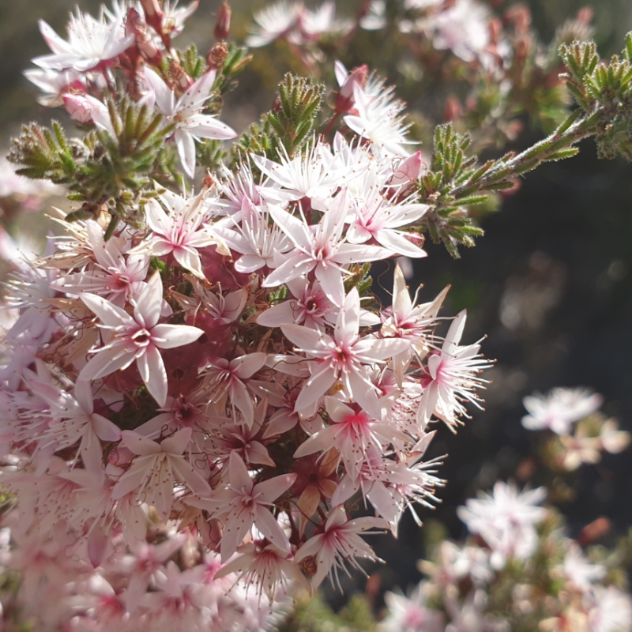](./_Myrtaceae/Calytrix-tetragona.png)
[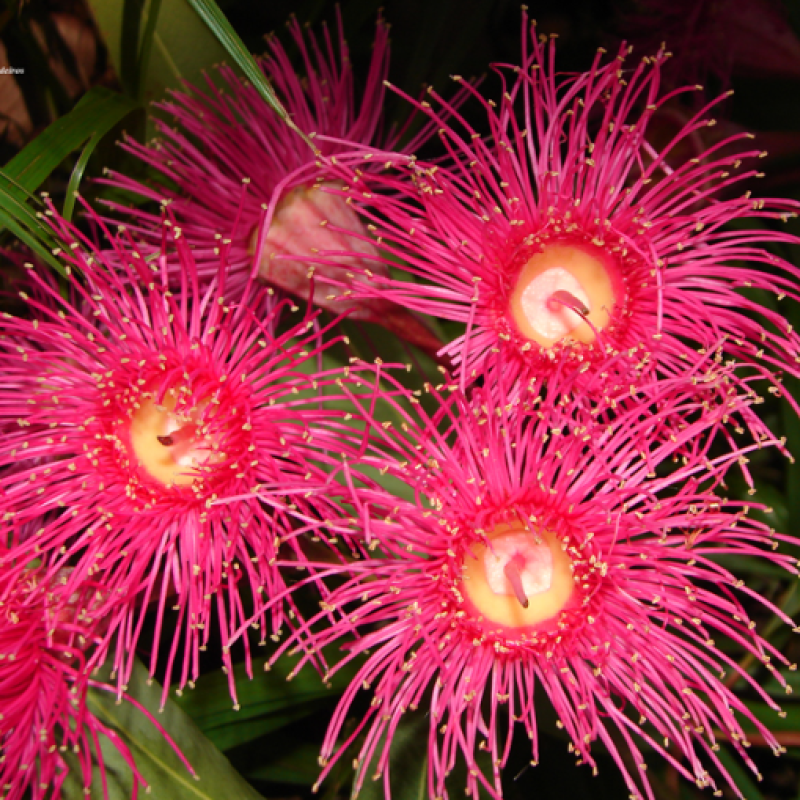](./_Myrtaceae/Corymbia-sp.png)
[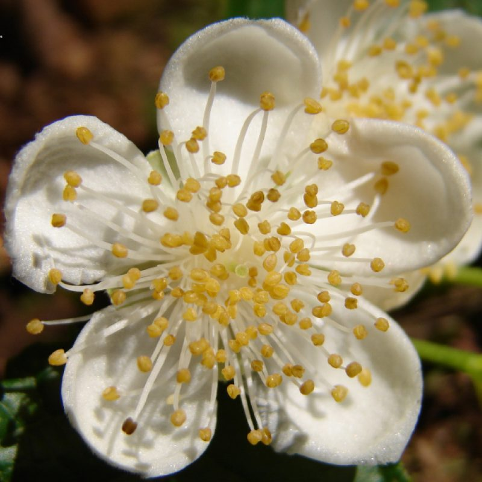](./_Myrtaceae/Myrtaceae-Campomanesia-reitziana-D.Legrand-9-9-2019-I.jpg)

A selection of Myrtaceae images. Captions and credits are attached to each image.

### Key Literature

-   Amorim, B. S., Vasconcelos, T. N., Souza, G., Alves, M., Antonelli, A., & Lucas, E. 2019. Advanced understanding of phylogenetic relationships, morphological evolution and biogeographic history of the mega-diverse plant genus Myrcia and its relatives (Myrtaceae: Myrteae). Molecular phylogenetics and evolution 138: 65-88.
-   Bünger, M., Fernanda Mazine, F., Forest, F., Leandro Bueno, M., Renato Stehmann, J., & Lucas, E.J. 2016. The evolutionary history of Eugenia sect. Phyllocalyx (Myrtaceae) corroborates historically stable areas in the southern Atlantic forests. Annals of Botany 118:1209-1223.
-   [Crisp, M.D., Minh, B.Q., Choi, B., Edwards, R.D., Hereward, J., Kulheim, C., Lin, Y.P., Meusemann, K., Thornhill, A.H., Toon, A. and Cook, L.G. 2024, Perianth evolution and implications for generic delimitation in the eucalypts (Myrtaceae), including the description of the new genus, Blakella. J. Syst. Evol. https://doi.org/10.1111/jse.13047](https://doi.org/10.1111/jse.13047)
-   Fernandes, T., Lima, D.F., Lucas, E., & Braga, J.M.A. 2020. Typifications, synonymizations and nomenclatural notes in Myrcia sect. Reticulosae (Myrtaceae). Phytotaxa 437:245-278.
-   Gaem, P.H., Lucas, E., Andrade, A., Vicentini, A., & Mazine, F.F. 2022. A taxonomic account of Myrcia (Myrtaceae) at the sites of the Biological Dynamics of Forest Fragments Project, Amazonas, Brazil. Rodriguésia 73:e00712020.
-   Gaem, P.H., Lucas, E., Mazine, F.F., & do Carmo Estanislau do Amaral, M. 2024. A new species of the Marlierea group (Myrcia sect. Aulomyrcia, Myrtaceae) from the cacao region of Bahia, Brazil. Kew Bulletin:1-7.
-   Gaem, P.H., Andrella, G.C., Maurin, O., Bittrich, V., Mazine, F.F., Lucas, E. & Amaral, M.C.A. 2024. Integrating datasets from herbarium specimens and images to treat a Neotropical myrtle species complex. Annals of Botany 135(6): 1075--1092.
-   Gaem, P.H., Mazine, F.F., Bittrich, V., Amaral, M.C.E., Lucas, E. 2024. A taxonomic revision of the Marlierea clade (Myrcia sect. Aulomyrcia, Myrtaceae). Ann. Missouri Bot. Gard. 110: 309--334.
-   Gala, V., Valdemarin, K., Lucas, E., Negrão, R. & Mazine, F. F. 2023. Eugenia (Myrtaceae) from Mexico: checklist, distribution, and conservation assessments. Phytotaxa, 583 (2): 099--140.
-   Giaretta, A., Lucas, E., Souza, M. D. C., Mazine, F. F., & Sano, P. T. 2018. Nomenclatural notes on Eugenia with closed calyces: Calycorectes O. Berg and Mitranthes O. Berg (Myrtaceae). Phytotaxa, 362(3), 282-286.
-   Giaretta, A., Amorim, B. S., Sano, P. T., Souza, G., & Lucas, E. 2019. Phylogenetic placement of new species with fused calyx reveals homoplastic character in Eugenia (Myrtaceae). Systematic Botany, 44(1), 66-73.
-   Giaretta, A., Lucas, E., & Sano, P. T. 2021. Taxonomic monograph of Eugenia sect. Schizocalomyrtus (Myrtaceae: Myrteae), a group within Eugenia with unusual flowers. Phytotaxa, 524(3), 135-177.
-   Giaretta, A., Murphy, B., Maurin, O., Mazine, F.F., Sano, P., & Lucas, E. 2022. Phylogenetic relationships within the hyper-diverse genus Eugenia (Myrtaceae: Myrteae) based on target enrichment sequencing. Frontiers in Plant Science:3058.
-   Govaerts, R., Sobral, M., Ashton, P., Barrie, F., Holst, B., Landrum, L., Matsumoto, K., Fernanda Mazine, F., Nic Lughadha, E., & Proenca, C. 2010. World checklist of Myrtaceae. The board of trustees of the Royal Botanic Gardens, Kew. In.
-   Holst, B.K., Landrum, L. & Grifo, F. 2003. Myrtaceae. In: Steyermark, J.A., Berry, P.E., Yatskievych, K. & Holst, B.K. (Eds.) Flora of the Venezuelan Guayana. vol. 7. Missouri Botanical Garden Press, St. Louis. Pp. 1--99.
-   Kubo, M.T., Sano, P.T. & Lucas, E. 2025. A review of Inflorescences in Myrteae (Myrtaceae): Concepts, Terminology and Usage. Heringeriana Special Issue Myrtaceae: e918069.
-   Landrum, L.R. 1981. A Monograph of the Genus Myrceugenia (Myrtaceae). New York Botanical Garden.
-   Landrum, L.R. 1986. Campomanesia, Pimenta, Blepharocalyx, Legrandia, Acca, Myrrhinium, and Luma (Myrtaceae). Flora Neotropica 45:1-178.
-   Landrum, L.R., & Kawasaki, M.L. 1997. The Genera of Myrtaceae in Brazil: An Illustrated Synoptic Treatment and Identification Keys. Brittonia 49:508.
-   Landrum, L. R. 2010. A Revision of Calycolpus (Myrtaceae). Systematic Botany 35(2): 368--389.
-   Landrum, L. R. 2017. The Genus Psidium (Myrtaceae) in the State of Bahia, Brazil. Canotia 13: 1-101.
-   Landrum, L. R. 2022. The Genus Psidium (Myrtaceae) in Bolivia and Paraguay. Canotia 18: 1--88.
-   Landrum, L. R., Z. Acosta Ramos, F. Jiménez-Rodríguez & K. C. St. E. Campbell. 2024. The Genus Psidium (Myrtaceae) in the Greater Antilles. Canotia 20: 1--55.
-   Landrum, L. R. 2025. A Monograph of the genus Psidium (Myrtaceae). Canotia 21:1--280.
-   Lannoy, L. C., A. I. Oliveira, R. Goldenberg & D. F. Lima. 2021. Myrcia (Myrtaceae) in the state of Paraná, Brazil. Phytotaxa 486 (1): 001--105.
-   Parra-O., C. & L. Landrum. 2023. Flora de Colombia No. 33. Psidium (Myrtaceae). Universidad de Colombia, Bogotá. 105 p.
-   Lima, D.F.; Goldenberg, R. & Sobral, M. 2011. O gênero Campomanesia (Myrtaceae) no estado do Paraná. Rodriguésia 62: 683--693.
-   [Lima, D.F., Caddah, M.K. & Goldenberg, R. 2015. A família Myrtaceae na Ilha do Mel, Paranaguá, Estado do Paraná, Brasil. Hoehnea 42(3): 497--519. https://doi.org/10.1590/2236-8906-68/2014](https://doi.org/10.1590/2236-8906-68/2014)
-   Lima, D.F., Goldenberg, R., Forest, F., Cowan, R.S., & Lucas, E.J. 2021. Phylogeny and biogeography of Myrcia sect. Aguava (Myrtaceae, Myrteae) based on phylogenomic and Sanger data provide evidence for a Cerrado origin and geographically structured clades. Molecular Phylogenetics and Evolution 157:107043.
-   Low, Y.W., Rajaraman, S., Tomlin, C.M., Ahmad, J.A., Ardi, W.H., Armstrong, K., Athen, P., Berhaman, A., Bone, R.E., & Cheek, M. 2022. Genomic insights into rapid speciation within the world's largest tree genus Syzygium. Nature Communications 13:1-15.
-   Lucas, E.J., Harris, S.A., Mazine, F.F., Belsham, S.R., Nic Lughadha, E.M., Telford, A., Gasson, P.E., & Chase, M.W. 2007. Suprageneric phylogenetics of Myrteae, the generically richest tribe in Myrtaceae (Myrtales). Taxon 56:1105-1128.
-   Lucas, E.J., Matsumoto, K., Harris, S.a., Nic Lughadha, E.M., Bernardini, B., & Chase, M.W. 2011. Phylogenetics, morphology, and evolution of the large genus Myrcia s.l. (Myrtaceae). International Journal of Plant Sciences 172:915-934.
-   Lucas, E., Wilson, C.E., Lima, D.F., Sobral, M., & Matsumoto, K. 2016. A Conspectus of Myrcia sect. Aulomyrcia (Myrtaceae). Annals of the Missouri Botanical Garden 101:648-698.
-   Lucas, E. J., Holst, B., Sobral, M., Mazine, F. F., Nic Lughadha, E. M., Proença, C. E.B., Costa, I.R. & Vasconcelos, T. N. 2019. A new subtribal classification of tribe Myrteae (Myrtaceae). Systematic Botany, 44(3), 560-569.
-   Mazine, F.F., Souza, V.C., Sobral, M., Forest, F., & Lucas, E. 2014. A preliminary phylogenetic analysis of Eugenia (Myrtaceae: Myrteae), with a focus on Neotropical species. Kew Bulletin 69.
-   Mazine, F. F., Bünger, M. O., Faria, J. E. Q., Lucas, E., & Souza, V. C. 2016. Sections in Eugenia (Myrteae, Myrtaceae): nomenclatural notes and a key. Phytotaxa, 289(3), 225-236.
-   Mazine, F.F., Faria, J.E.Q., Giaretta, A., Vasconcelos, T., Forest, F., & Lucas, E. 2018. Phylogeny and biogeography of the hyper-diverse genus Eugenia (Myrtaceae: Myrteae), with emphasis on E. sect. Umbellatae, the most unmanageable clade. Taxon 67:752-769.
-   Myrtaceae in Flora e Funga do Brasil. Jardim Botânico do Rio de Janeiro. Available at:.
-   Oliveira, M.I.U.; Funch, L.S.; Landrum, L.R. 2012. Flora da Bahia: Campomanesia (Myrtaceae). Sitientibus Serie Ciências Biológicas 12(1): 91--107.
-   Proença, C. E., Nic Lughadha, E. M., Lucas, E. J., & Woodgyer, E. M. 2006. Algrizea (Myrteae, Myrtaceae): a new genus from the Highlands of Brazil. Systematic Botany, 31(2), 320-326.
-   Proença, C.E.B., Landim, M.F. & Oliveira, M.I.U. 2013. Myrtaceae. In: Prata, A.P.N., Amaral, M.C.E., Farias, M.C.V. & Alves, M. (Eds.) Flora de Sergipe. vol. 1. Aracaju: Gráfica e Editora Triunfo Ltda. Pp. 326--430.
-   Proença, C.E.B., Faria, J.E.Q., Giaretta, A., Lucas, E.J., Staggemeier, V.G., Tuler, A.C., & Vasconcelos, T.N.C. 2020. Nomenclatural and taxonomic changes in tribe Myrteae (Myrtaceae) spurred by molecular phylogenies. Heringeriana 14:49-61.
-   Proença, C.E.B., Tuler, A.C., Lucas, E.J., Vasconcelos, T.N.C., de Faria, J.E.Q., Staggemeier, V.G., De-Carvalho, P.S., Forni-Martins, E.R., Inglis, P.W., & da Mata, L.R. 2022. Diversity, phylogeny and evolution of the rapidly evolving genus Psidium L.(Myrtaceae, Myrteae). Annals of Botany 129:367-388.
-   Proença, C. E., & Lucas, E. J. 2023. Psidium or Myrcia?---The problematic lectotypification of Mitranthes O. Berg (Myrteae, Myrtaceae). Kew Bulletin, 78(2), 171-174.
-   Proença, C. E. B., De Faria, J. E. Q., Oliveira, M. I. U., Staggemeier, V. G., Farias-Castro, A. S., & Sonsin-Oliveira, J. 2023. Myrcianthes (Myrtaceae) revisited: a new species, a new synonym, a lectotypification and an overview of its wood anatomy. Phytotaxa, 625(1), 88-97.
-   Proença, C. E. B., Faria, J. E. Q., Oliveira, M. I. U., Sonsin-Oliveira, J., Shimizu, G.H. & Staggemeier, V. G. 2025. And the twain shall meet at the end: a phylogeny of Myrcianthes (Myrtaceae, Myrteae) with phytogeographic and morphological insights. Plant Ecology and Evolution 158 (3): 457--475.
-   Rye, B.L., Wilson, P.G., Heslewood, M.M., Perkins, A.J., & Thiele, K.R. 2020. A new subtribal classification of Myrtaceae tribe Chamelaucieae. Australian Systematic Botany 33:191-206.
-   Santos, L.L., Forest, F., Lima, D.F., Sales, M.F., Vasconcelos, T.N., Staggemeier, V.G., & Lucas, E. 2021. Phylogenetic and Biogeographic Analysis in Myrcia Sect. Myrcia (Myrcia sl, Myrtaceae) with Focus on Highly Polyphyletic Myrcia splendens. International Journal of Plant Sciences 182:778-792.
-   Santos, M.F., Lucas, E., & Sano, P.T. 2018. A taxonomic monograph of Myrcia sect. Sympodiomyrcia (Myrteae, Myrtaceae). Phytotaxa 380:1-114.
-   Santos, M. F., Stadnik, A., Proenca, C. E., & Sobral, M. 2020. The near demise of Marlierea: moving last species to correct genera and notes on three incertae saedis taxa (Myrtaceae, Myrteae, Myrciinae). Phytotaxa, 447(3), 195-202.
-   [Santos, M.F., Amorim, B.S., Burton, g.P., Faria, J.E.Q., Fernandes, T., Flickinger, J.A., gaem, P.H., Landrum, L.R., Lima, D.F., Proença, C.E.B., Rosa, P.O., Lima-Dos-Santos, L., Setubal, R.B., Stadnik, A.M.S., Staggemeier, V.g., Vasconcelos, T.N.C. & Lucas, E.J. 2024. A taxonomic account of Myrciinae (Myrteae, Myrtaceae): generic and sectional placement of forgotten species and a list of all accepted species. Phytotaxa 674 (2): 129--170. https://doi.org/10.11646/phytotaxa.674.2.1](https://doi.org/10.11646/phytotaxa.674.2.1)
-   Santos, M.F. 2025. Taxonomic monograph of Myrcia sect. Eugeniopsis (Myrciinae, Myrteae, Myrtaceae), an endemic clade of Eastern South America. Phytotaxa 703 (1): 001--100.
-   Scaravelli, F.S., Gaem, P.H., Valdemarin, K.S., Lucas, E., & Mazine, F.F. 2022. Myrcia (Myrtaceae) in the Vale Natural Reserve, Linhares, Espírito Santo, Brazil. Rodriguésia 73.
-   [Stadnik, A., Oliveira, M.I.U. & Roque, N. 2016. Levantamento florístico de Myrtaceae no município de Jacobina, Chapada Diamantina, Estado da Bahia, Brasil. Hoehnea. 43(1): 87--97. http://dx.doi.org/10.1590/2236-8906-46/2015](http://dx.doi.org/10.1590/2236-8906-46/2015)
-   [Stadnik, A., Oliveira, M.I.U. & Roque, N. 2018. Myrtaceae na Serra Geral de Licínio de Almeida, Bahia, Brasil. Rodriguésia 69(2): 515--552. http://dx.doi.org/10.1590/2175-7860201869220.](http://dx.doi.org/10.1590/2175-7860201869220)
-   Staggemeier, V. G., & Lucas, E. 2014. Morphological diagnosis of a new species in Myrcia sensu lato (Myrtaceae) from Bahia, Brazil, with molecular highlights. Phytotaxa, 181(4), 229-237.
-   Staggemeier, V. G., Diniz-Filho, J. A. F., Forest, F., & Lucas, E. 2015. Phylogenetic analysis in Myrcia section Aulomyrcia and inferences on plant diversity in the Atlantic rainforest. Annals of Botany, 115(5), 747-761.
-   Snow, N. 2000. Systematic Conspectus of Australasian Myrtinae (Myrtaceae). Kew Bulletin 55:647.
-   Snow, N., Callmander, M., & Phillipson, P.B. 2015. Studies of Malagasy Eugenia--IV: Seventeen new endemic species, a new combination, and three lectotypifications; with comments on distribution, ecological and evolutionary patterns. PhytoKeys:59.
-   [Neotropical Myrtaceae Working Group, B. Amorim, M. Bünger, I. R. Costa, J. E. Q. de Faria, J. Flickinger, A. Giaretta, M. T. Kubo, D. F. Lima, E. Lucas, A. R. Lourenço, F. F. Mazine, J. Murillo‐A, M. I. U. de Oliveira, C. Parra‐O, C. E. B. Proença, M. Reginato, P. O. Rosa, M. F. Santos, L. L. dos Santos, A. Stadnik, V. G. Staggemeier, A. C. Tuler, K. S. Valdemarin, and T. Vasconcelos. 2024. Towards a species‐level phylogeny for Neotropical Myrtaceae: Notes on topology and resources for future studies. American Journal of Botany. e16330. https://doi.org/10.1002/ajb2.16330](https://doi.org/10.1002/ajb2.16330)
-   Thornhill, A.H., & Crisp, M.D. 2012. Phylogenetic assessment of pollen characters in Myrtaceae. Australian Systematic Botany 25:171-187.
-   Thornhill, A.H., Crisp, M.D., Külheim, C., Lam, K.E., Nelson, L.A., Yeates, D.K., & Miller, J.T. 2019. A dated molecular perspective of eucalypt taxonomy, evolution and diversification. Australian Systematic Botany 32:29-48.
-   [Valdemarin, K.S., Mazine, F.F. & Souza, V.C. 2024. Eugenia (Myrtaceae) from Reserva Natural Vale, Espírito Santo, a center of plant endemism in the Brazilian Atlantic Rainforest. Phytotaxa 651 (1): 1--79. https://doi.org/10.11646/phytotaxa.651.1.1](https://doi.org/10.11646/phytotaxa.651.1.1)
-   Vasconcelos, T. N. C., G. Prenner, M. O. Bünger, P. S. De-Carvalho, A. Wingler, and E. J. Lucas. 2015. Systematic and evolutionary implications of stamen position in Myrteae (Myrtaceae). Botanical Journal of the Linnean Society 179: 388--402.
-   [Vasconcelos, T.N.C. Proença, C.E.B., Ahmad, B., Aguilar, D.S., Aguilar, R., Amorim, B.S., Campbell, K., Costa, I.R., De-Carvalho, P.S., Faria, J.E.Q., Giaretta, A., Kooij, P.W., Lima, D.F., Mazine, F.F., Peguero, B., Prenner, G., Santos, M.F., Soewarto, J., Wingler, A. & Lucas, E.J. 2017. Myrteae phylogeny, calibration, biogeography and diversification patterns: Increased understanding in the most species rich tribe of Myrtaceae. Molecular Phylogenetics and Evolution 109: 113--137. https://doi.org/10.1016/j.ympev.2017.01.002](https://doi.org/10.1016/j.ympev.2017.01.002)
-   [Vasconcelos, T.N.C., Prenner, G. & Lucas, E.J. 2019. A Systematic Overview of the Floral Diversity in Myrteae (Myrtaceae). Systematic Botany 44(3): 570--591. https://doi.org/10.1600/036364419X15620113920617](https://doi.org/10.1600/036364419X15620113920617)
-   Wilson, P.G., O'Brien, M.M., Gadek, P.A., & Quinn, C.J. 2001. Myrtaceae revisited: a reassesment of infrafamilial groups. American Journal of Botany 88:2013-2025.
-   Wilson, P.G., O'brien, M., Heslewood, M., & Quinn, C. 2005. Relationships within Myrtaceae sensu lato based on a matK phylogeny. Plant Systematics and evolution 251:3-19.

