## Oxalidales

Administers: Brunelliaceae, Cephalotaceae, Connaraceae, Cunoniaceae, Elaeocarpaceae, Huaceae & Oxalidaceae

Primary TENs contact: [Yohan Pillon](mailto:)

> The order Oxalidales comprises six families whose affinities were largely unknown before the advent of molecular systematics: Brunelliaceae, Cephalotaceae, Connaraceae, Cunoniaceae and Oxalidaceae. Together, these families encompass around 60 genera and approximately 2,100 species of herbs, vines, shrubs, large trees and carnivorous plants, which are mostly found in tropical regions and the southern hemisphere. The group includes several edible species, such as starfruit, Davidson's plum and oca.

Joining The Oxalidales TEN

If you want to contribute to this global effort, please contact the Oxalidales TEN curator.

### Contributors

- Brunelliaceae
  - Clara Inés Orzoco (Universidad Nacional de Colombia, Colombia)
- Connaraceae
  - Cassio Toledo (Universidade Federal da Grande Dourados, Brazil)\
  - Jurriaan M. de Vos (University of Basel, Switzerland)\
  - Serafin Streiff (IRD Montpellier, France)
- Cunoniaceae
  - Francisco Fajardo Gutiérrez (Freie Universität Berlin, Germany / Universidad Nacional de Colombia, Colombia)\
  - Yohan Pillon (IRD Montpellier, France)\
  - Zachary Rogers (Zacchary Rogers (New Mexico State University, USA)
- Elaeocarpaceae
  - Darren Crayn (James Cook University, Australia)\
  - Juan Ernesto Guevara-Andino (Universidad de Las Américas, Ecuador)
- Oxalidaceae
  - Alicia López (Universidad Nacional de Mar del Plata, Argentina)\
  - Léanne Dreyer (Stellenbosch University, South Africa)\
  - Pedro Fiaschi (Universidade Federal de Santa Catarina, Brazil)\
  - Kenneth Oberlander (University of Pretoria, South Africa)

### Key literature

-   [Streiff, S.J.R. & De Vos, J.M. (2026) Dispersal and delimitation: Phylogenomics of Connaraceae prompts revised generic delimitation in Cnestideae and reveals global biogeographic patterns. Taxon, 75 (2), e70101.](https://doi.org/10.1002/tax.70101)
-   [Pillon, Y., Crayn, D., Streiff, S.J.R. & de Vos, J.M. (2024) A suprageneric classification of Oxalidales. Swainsona, 38, 153--160. https://know.ourplants.org/wp-content/uploads/2024/09/JABG38P153_Pillon.pdf](https://know.ourplants.org/wp-content/uploads/2024/09/JABG38P153_Pillon.pdf)
-   [de Vos, J.M., Streiff, S.J.R., Bachelier, J.B., Epitawalage, N., Maurin, O., Forest, F. & Baker, W.J. (2024) Phylogenomics of the pantropical Connaraceae: revised infrafamilial classification and the evolution of heterostyly. Plant Systematics and Evolution, 310 (4), 29. https://doi.org/10.1007/s00606-024-01909-y](https://doi.org/10.1007/s00606-024-01909-y)
-   [Pillon, Y., Hopkins, H.C.F., Maurin, O., Epitawalage, N., Bradford, J., Rogers, Z.S., Baker, W.J. & Forest, F. (2021) Phylogenomics and biogeography of Cunoniaceae (Oxalidales) with complete generic sampling and taxonomic realignments. American Journal of Botany, 108 (7), 1181--1200. https://doi.org/10.1002/ajb2.1688](https://doi.org/10.1002/ajb2.1688)
-   [Crayn, D.M., Rossetto, M. & Maynard, D.J. (2006) Molecular phylogeny and dating reveals an oligo-miocene radiation of dry-adapted shrubs (former Tremandraceae) from rainforest tree progenitors (Elaeocarpaceae) in Australia. American Journal of Botany, 93 (9), 1328--1342.](https://doi.org/10.3732/ajb.93.9.1328)

[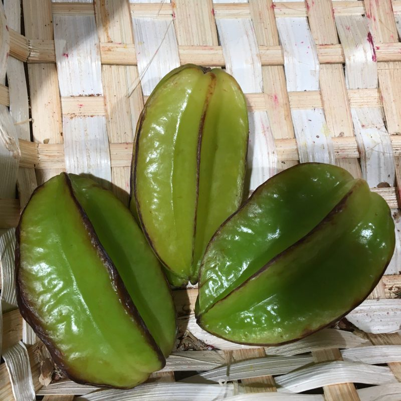](./_Oxalidales/Averrhoa-carambola.jpeg)
[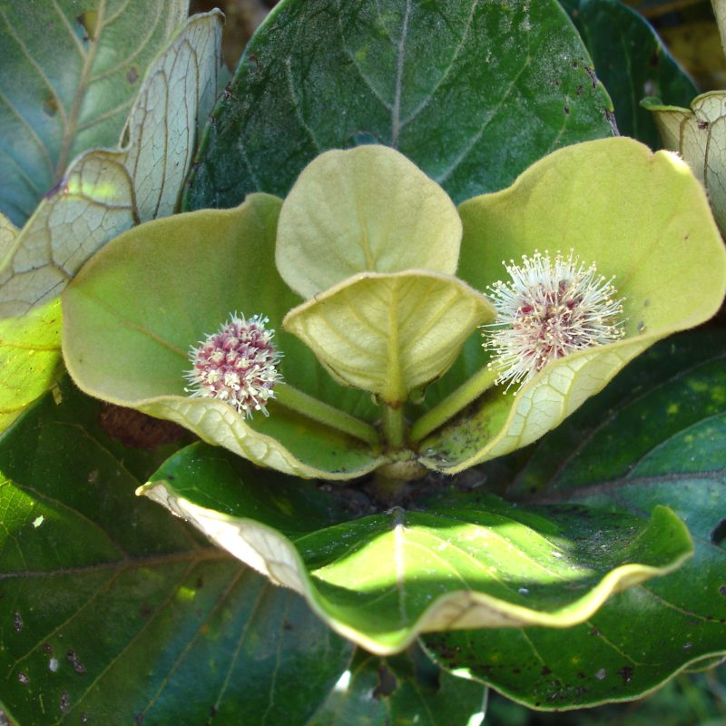](./_Oxalidales/Codia-incrasata.jpg)
[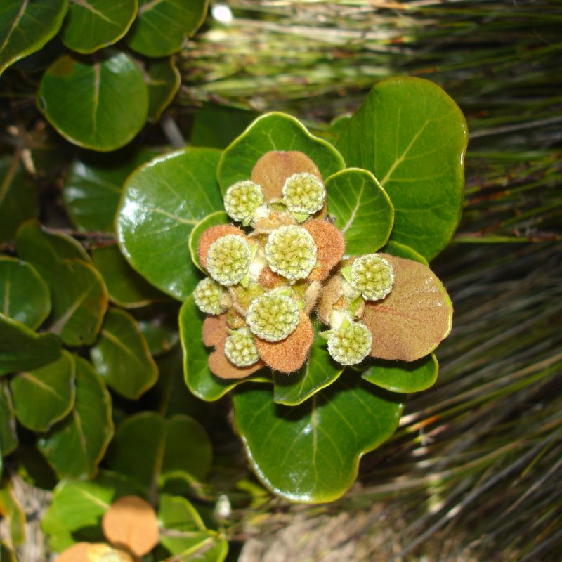](./_Oxalidales/Codia-triverticillata.jpg)

[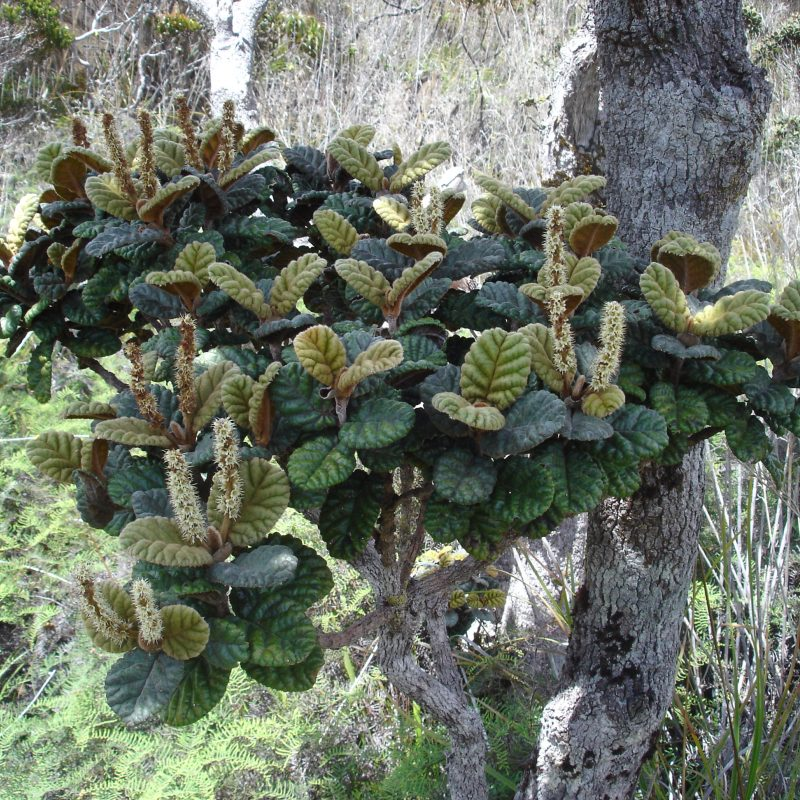](./_Oxalidales/Cunonia-bullata.jpg)
[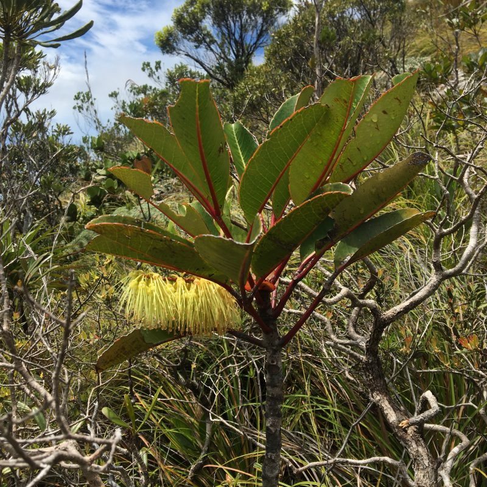](./_Oxalidales/Cunonia-macrophylla.jpeg)
[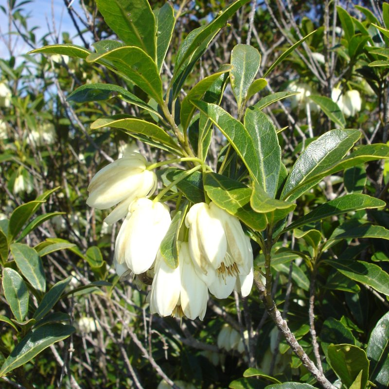](./_Oxalidales/Dubouzetia-elegans.jpg)
[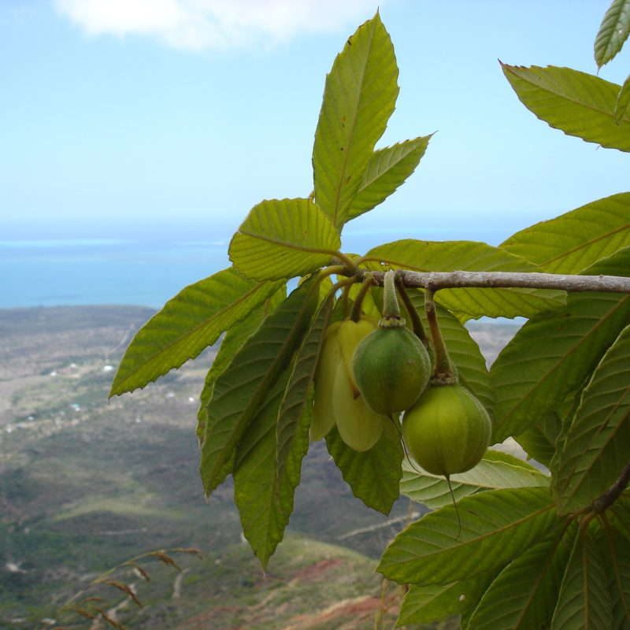](./_Oxalidales/Dubouzetia-sp.jpg)

[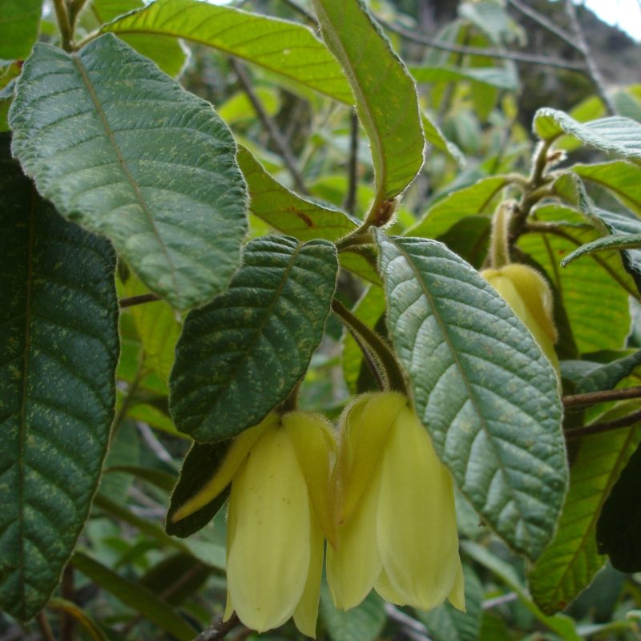](./_Oxalidales/Dubouzetia-sp2.jpg)
[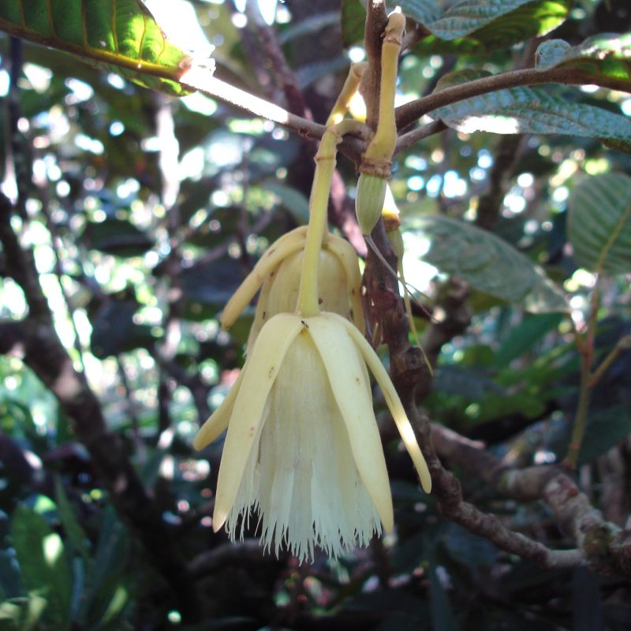](./_Oxalidales/Elaecarpus-sp.jpg)
[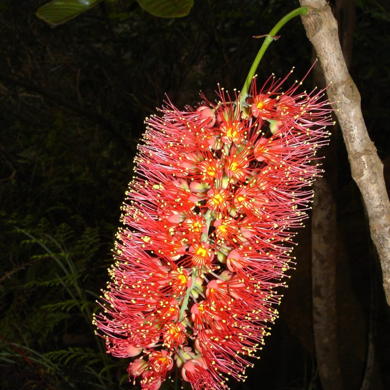](./_Oxalidales/Geissois-magnifica.jpg)
[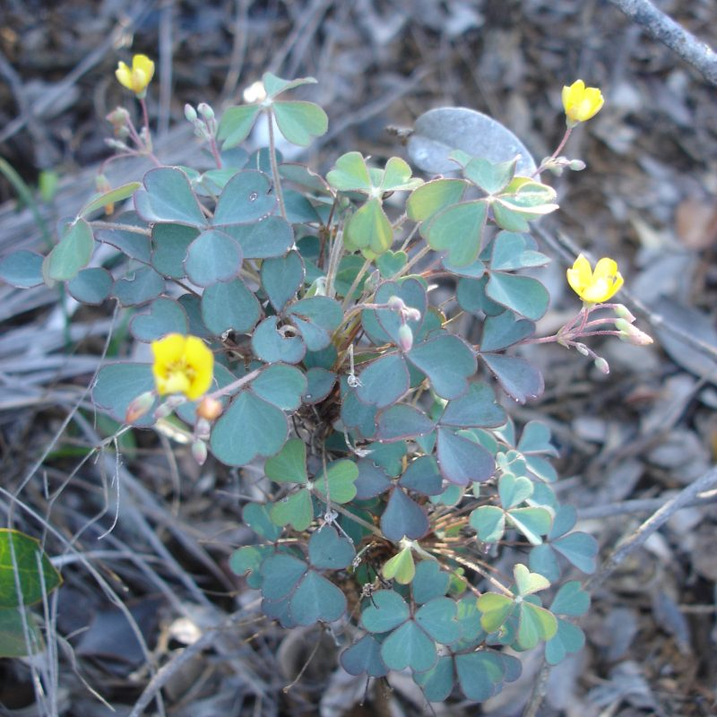](./_Oxalidales/Oxalis-novaecaledoniae.jpg)

[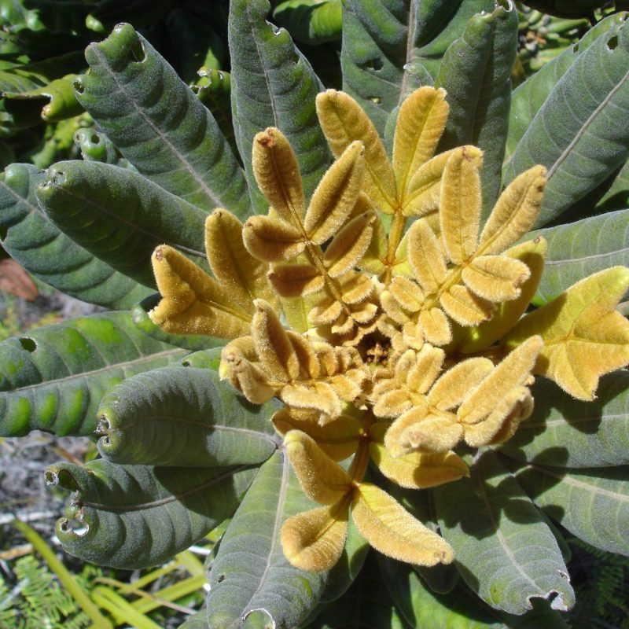](./_Oxalidales/Pancheria-hirsuta.jpg)
[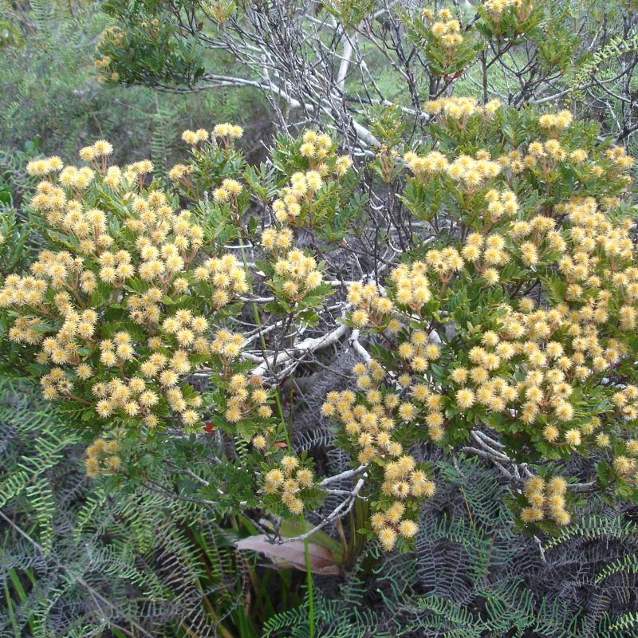](./_Oxalidales/Pancheria-multijuga.jpg)
[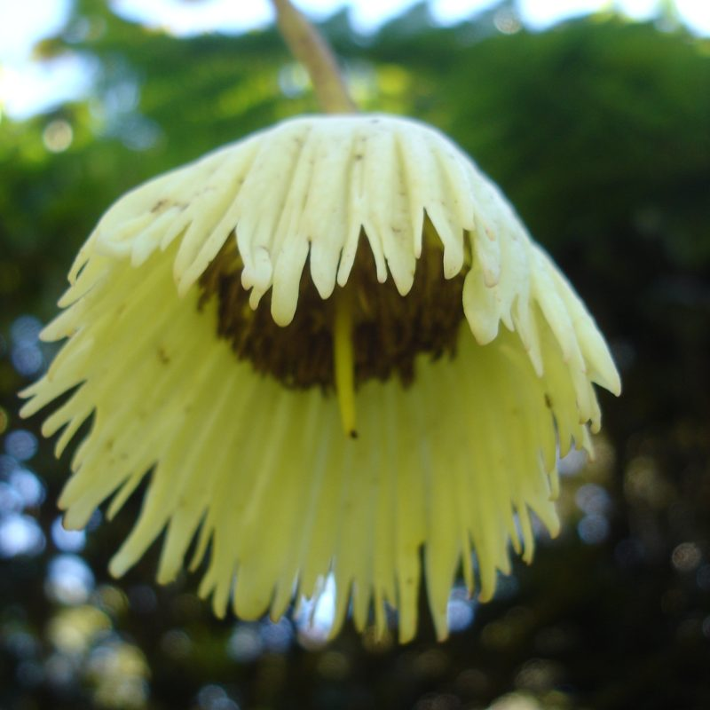](./_Oxalidales/Sloanea-magnifolia.jpg)
[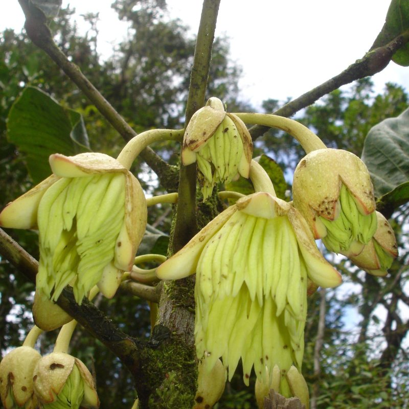](./_Oxalidales/Sloanea-raynaliana.jpg)

Selection of Oxalidales images