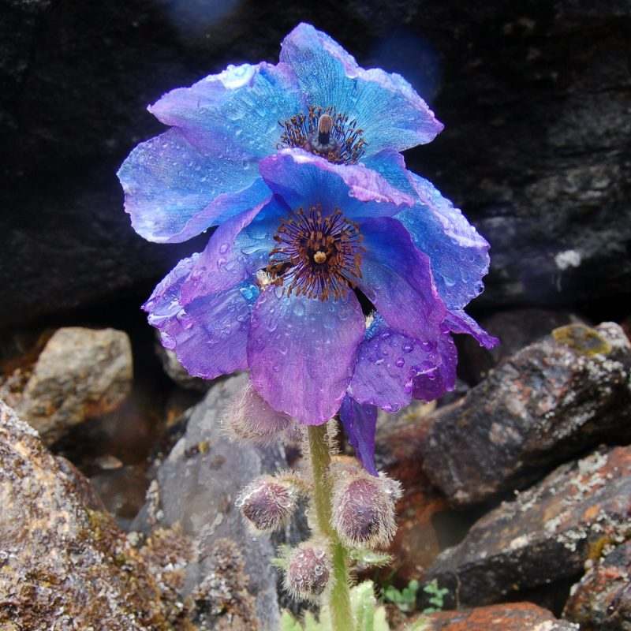
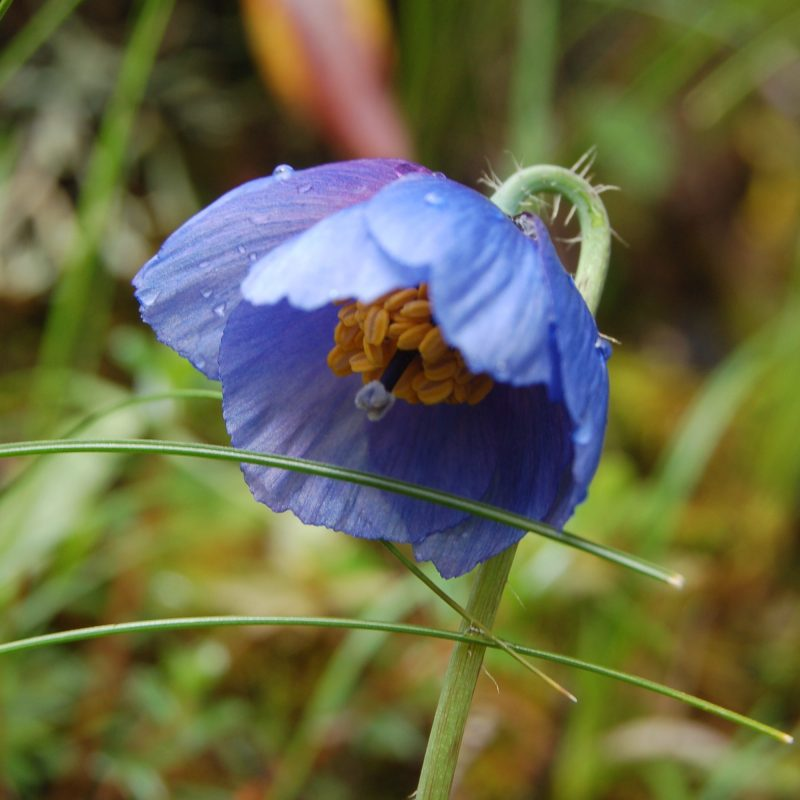
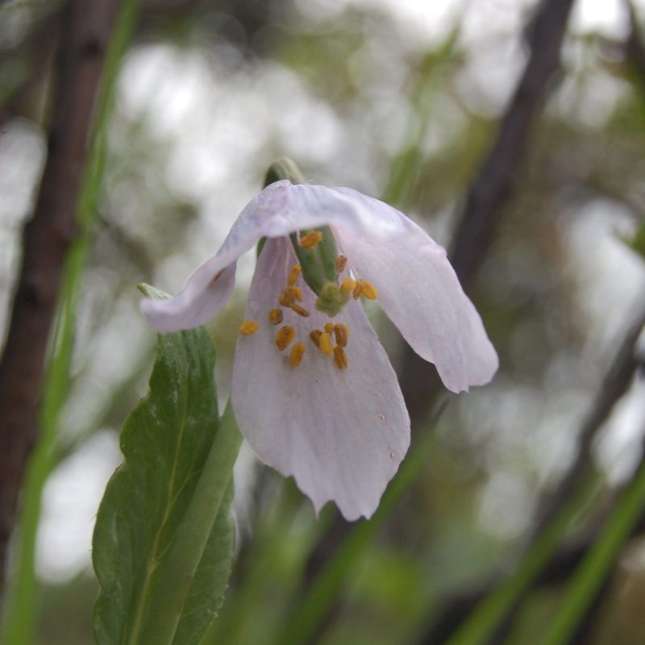
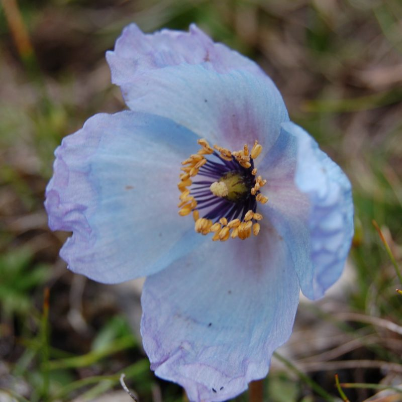
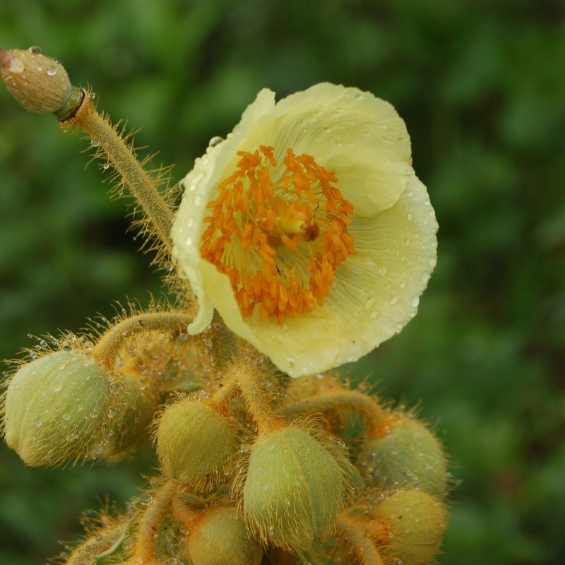

## Papaveraceae - Tribe Papaverae

Administers: Papaveraceae - Tribe Papavereae

External website: [https://themeconopsisgroup.org](https://themeconopsisgroup.org/)

Primary TENs contact: [Alan Elliott](mailto:aelliott@rbge.org.uk) from [Royal Botanic Garden Edinburgh](https://www.rbge.org.uk)

The TEN formed around the known issues caused by *Papaver* being paraphyletic. To maintain the genera *Meconopsis*, *Cathcartia* & *Roemeria* we are following the treatments for Grey-Wilson (2014) and Banfi et al. (2022) that goes most of the way to create a monophyletic *Papaver* and maintains ​"generic diversity" within Tribe Papaverae. 

Curation includes the transfer of species from *Papaver* Section *Argemonidium* to *Roemeria* and new generic name *Oreomecon* for the placement of the species of *Papaver S*ection *Meconella*.

Taxonomic data curation for the TEN utilises Rhakhis --- the WFO's taxonomic curation tool.

### Key Contributors

-   [Alan Elliott](https://orcid.org/0000-0002-8677-5688)
-   [Paul Egan](https://www.slu.se/en/ew-cv/paul-egan/)
-   [Wei Xiao](https://www.uog.edu/directory/xiao-wei.php)
-   Christopher Grey-Wilson
-   David Rankin
-   [Fabrizio Bartolucci](https://orcid.org/0000-0001-8199-6003)
-   [Gabriele Galasso](https://orcid.org/0000-0002-2501-456X)

### Key Literature

-   Christopher Grey-Wilson (2014). The Genus Meconopsis, the Royal Botanic Gardens, Kew.
-   [Wei Xiao and Beryl B. Simpson, (2017). A New Infrageneric Classification of Meconopsis (Papaveraceae) Based on a Well-Supported Molecular Phylogeny, Systematic Biology, 42, 226-233.](https://doi.org/10.1600/036364417X695466)
-   [Toshio Yoshida and Hang Sun "Meconopsis lepida and M. psilonomma (Papaveraceae) Rediscovered and Revised," Harvard Papers in Botany 22(2), 157-192, (31 December 2017).](https://doi.org/10.3100/hpib.v22iss2.2017.n11)
-   [Toshio Yoshida and Hang Sun "Plants Related to Meconopsis psilonomma (Papaveraceae) in Northern Sichuan and Southeastern Qinghai, China," Harvard Papers in Botany 23(2), 313-331, (31 December 2018).](https://doi.org/10.3100/hpib.v23iss2.2018.n16)
-   [Toshio Yoshida "New Taxa of Meconopsis (Papaveraceae) from Wanba, Southwestern Sichuan, China," Harvard Papers in Botany 24(1), 31-39, (30 June 2019).](https://doi.org/10.3100/hpib.v24iss1.2019.n6)
-   [Toshio Yoshida, Bo Xu, and David E. Boufford "Revision of Meconopsis integrifolia var. Uniflora (Papaveraceae)," Harvard Papers in Botany 24(1), 41-46, (30 June 2019).](https://doi.org/10.3100/hpib.v24iss1.2019.n7)
-   [Toshio Yoshida and Hang Sun "Revision of Meconopsis castanea (Papaveraceae) and Its Allies," Harvard Papers in Botany 24(2), 359-378, (31 December 2019).](https://doi.org/10.3100/hpib.v24iss2.2019.n19)
-   [Toshio Yoshida and Hang sun "Revision of Meconopsis Section Forrestianae (Papaveraceae)," Harvard Papers in Botany 24(2), 379-421, (31 December 2019).](https://doi.org/10.3100/hpib.v24iss2.2019.n20)
-   [Banfi, E., Bartolucci, F., Tison, J.-M. and Galasso, G. (2022) "A new genus for *Papaver* sect. *Meconella* and new combinations in *Roemeria*; (Papaveraceae) in Europe and the Mediterranean area", Natural History Sciences, 9(1), pp. 67-72.](https://doi.org/10.4081/nhs.2022.556)
-   [Krivenko D. A. 2023. New combinations in the genus Oreomecon (Papaveraceae) //Novitates Syst. Pl. Vasc. Vol. 54. P. 97--100 (online: e06: 1--4).](https://doi.org/10.31111/novitates/2023.54.06)
-   [Grey-Wilson, C. 2023. Saving Meconopsis. Pl. Rev. 5(4) 54-58. (2023)](https://about.worldfloraonline.org/tens/[Not%20available%20online])

The Meconopsis Group was set up in 1998 to study the genus and to promote its cultivation and conservation. Membership is worldwide and open to anyone interested in *Meconopsis*.

The Group initially set out to clarify the identities and names of the many big blue perennial *Meconopsis* cultivars being grown in Scottish gardens and further afield. Some of these are probably hybrids, which arose when species from different parts of the Himalaya and China were grown together in close proximity. Now that this task has largely been achieved, the Group is turning its attention to other projects. These include [DNA analysis](http://themeconopsisgroup.org/dna) of *Meconopsis*, the creation of a [Species Gallery](https://www.themecgroupadmin.org/gallery.asp) and a [Cultivar Gallery](http://themeconopsisgroup.org/cultivars), and this newly updated website to make information more easily accessible.

A selection of *Meconopsis* from West Bhutan.