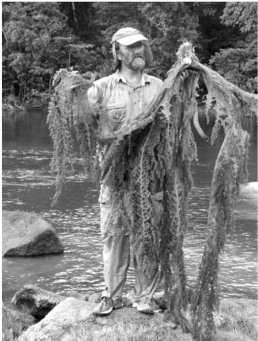
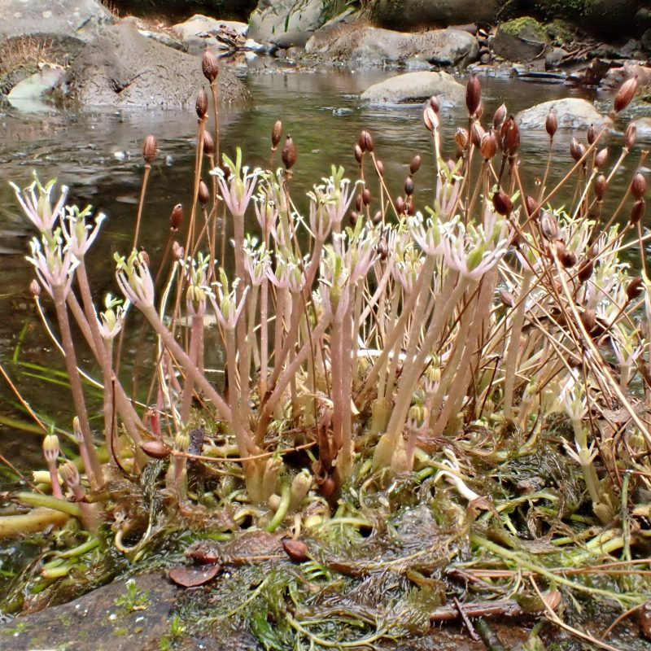
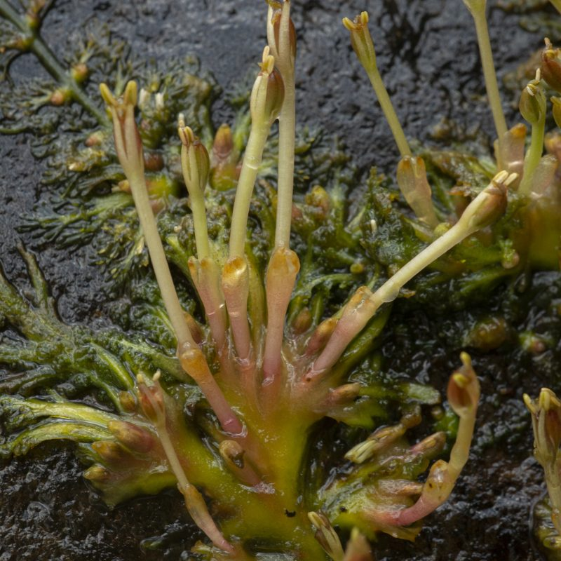
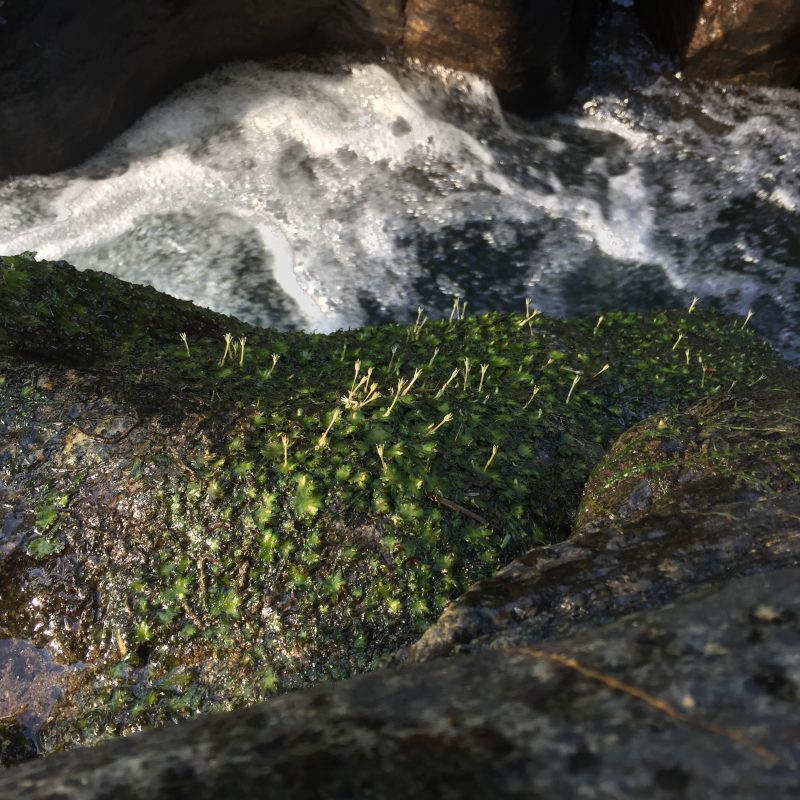
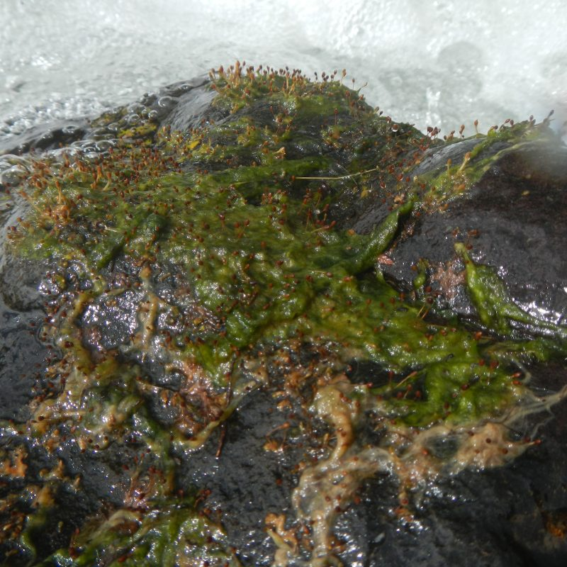
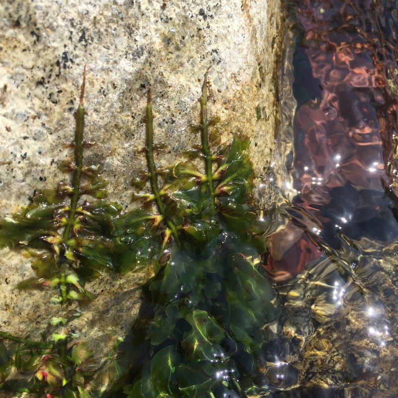
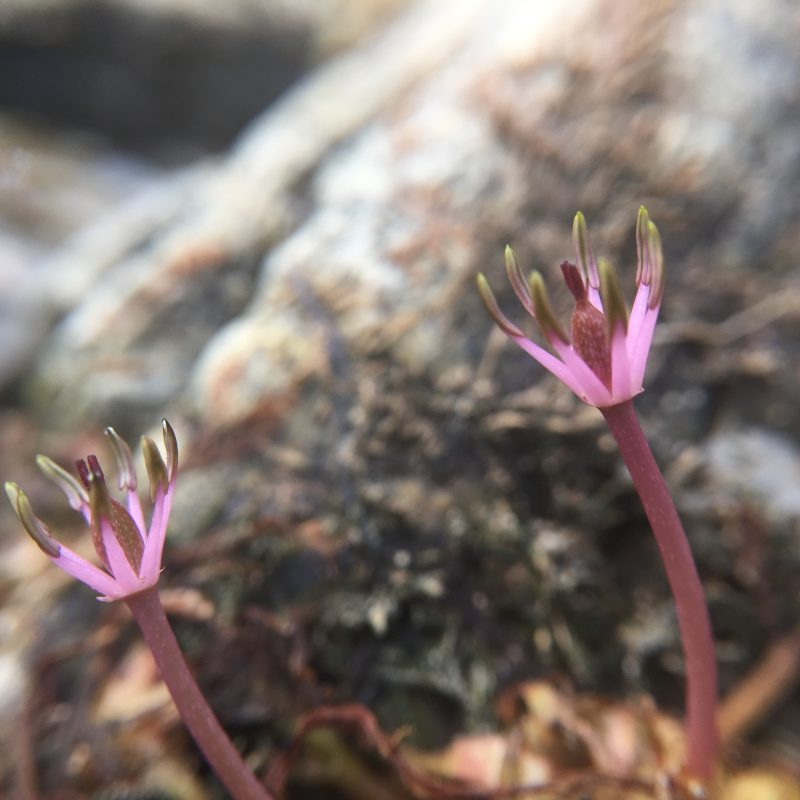
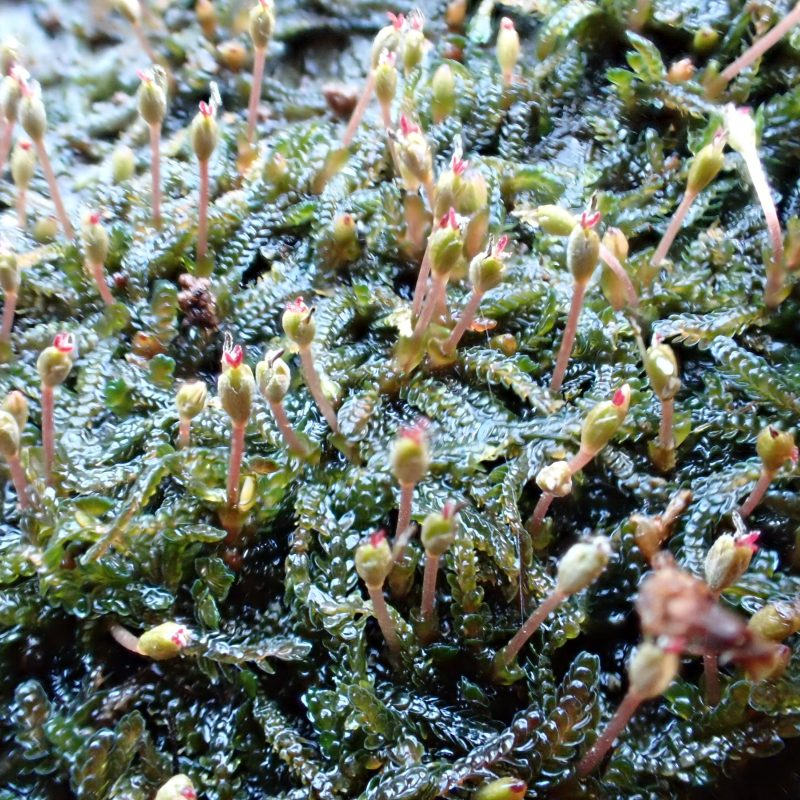
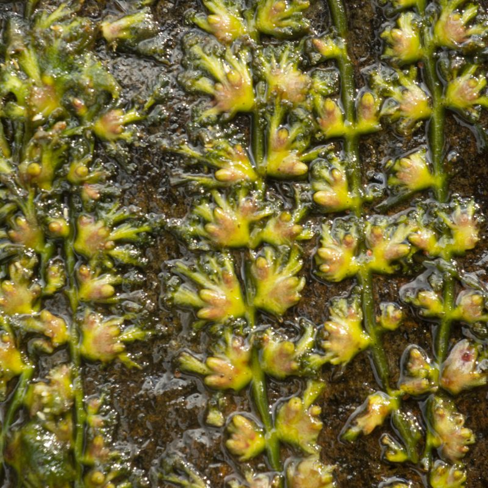
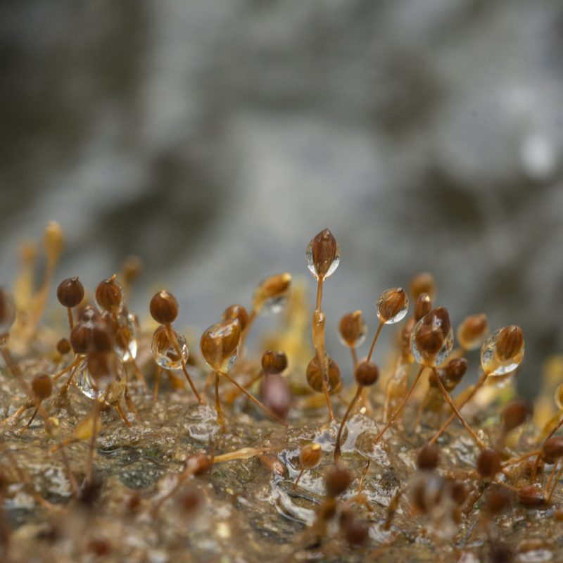

## Podostemaceae - Riverweed Network

__Administers:__ [Podostemaceae](/wfo-7000000485)

Primary TENs contact: Marco Octávio de Oliveira Pellegrini

> *Podostemaceae are the largest group of strictly aquatic angiosperms and live attached to rocks in lotic habitats like river rapids and waterfalls*

This TEN was formed around the need to integrate and coordinate the taxonomic, systematic, and nomenclatural studies of Podostemaceae. Phylogenetic inference based on molecular data has challenged the monophyly of several genera and species. The fuzzy morphology of Podostemaceae is greatly responsible for taxonomic confusion in the group. This and the conflict between molecular and morphological data call for an integration of these sources of data to properly characterize the phenotypic and genetic diversity of Podostemaceae and to update the classification system of the family to reflect the distribution of this diversity.

This is an ongoing project, and we continue to welcome collaborators to help with the taxonomic curation of the order, contribute photos and illustrations for species, and supply or produce descriptive content to populate the World Flora Online portal. If you would like to know how you can help us, please get in touch with Marco Pellegrini, the TEN Focal.

*Charles Thomas Philbrick (1953--2023) was an expert taxonomist of Neotropical Podostemaceae. His work was broad and frequently collaborative. In the spirit of Tom's devotion for the Podostemaceae and conviction that there is always room for more people to work on the family, this TEN honors Tom's legacy. *

### Key Contributors

-   Ana Maria Bedoya (New York Botanical Garden) --- Neotropical Podostemaceae
-   Marco Pellegrini (University of Witwatersrand, Johannesburg, South Africa) --- Neotropical and African Podostemaceae
-   Rafaël Govaerts (Royal Botanic Gardens, Kew) --- Nomenclature and systematics
-   Brad Ruhfel (University of Michigan) --- Podostemaceae systematics
-   Ehoarn Bidault (Missouri Botanical Garden) --- African Podostemaceae
-   Martin Cheek (Royal Botanic Gardens, Kew) --- African Podostemaceae
-   Masahiro Kato (National Museum of Nature and Science, Japan) --- Asian and Oceanic Podostemaceae
-   Satoshi Koi (Botanical Gardens, Osaka) --- Asian and Oceanic Podostemaceae

### Key Literature

-   Key Literature
-   Alejandro Novelo R, Philbrick CT. 1997. Taxonomy of Mexican Podostemaceae. Aquatic Botany 57: 275--303.
-   Bove CP, Philbrick CT, Costa WJEM. 2011. Taxonomy, distribution and emended description of the neotropical genus Lophogyne (Podostemaceae). Brittonia 63: 156--160.
-   Bove CP, Pellegrini MOO, Philbrick CT. 2024. Podostemaceae In: Flora e Funga do Brasil. Jardim Botânico do Rio de Janeiro. Available at: .
-   Cheek M, Feika A, Lebbie A, Goyder D, Tchiengue B, Sene O, Tchouto P, Van Der Burgt X. 2017. A synoptic revision of Inversodicraea (Podostemaceae). Blumea - Biodiversity, Evolution and Biogeography of Plants 62: 125--156.
-   Cheek M, Molmou D, Magassouba S, Ghogue J-P. 2022. Taxonomic revision of Saxicolella (Podostemaceae), African waterfall plants highly threatened by Hydro-Electric projects. Kew Bulletin 77: 403--433.
-   Cook CDK, Rutishauser R. 2001. Name changes in Podostemaceae. TAXON 50: 1163--1167.
-   Costa FGCMD, Bove CP, Arruda RDCO, Philbrick CT. 2011. Silica bodies and their systematic implications at the subfamily level in Podostemaceae. Rodriguésia 62: 937--942.
-   Jäger-Zürn I. 2011. Neglected features of probable taxonomic value in Podostemaceae: The case of Polypleurum. Flora - Morphology, Distribution, Functional Ecology of Plants 206: 38--46.
-   Kato M, Koi S, Werukamkul P, Katayama N. 2022. Characterization of the early evolution of the amphibious Podostemaceae. Aquatic Botany 183: 103558.
-   Koi S, Kita Y, Hirayama Y, Rutishauser R, Huber KA, Kato M. 2012. Molecular phylogenetic analysis of Podostemaceae: implications for taxonomy of major groups: Molecular Phylogenetic Analysis of Podostemaceae. Botanical Journal of the Linnean Society 169: 461--492.
-   Koi S, Rutishauser R, Kato M. 2009. Phylogenetic Relationship and Morphology of Dalzellia gracilis (Podostemaceae, Subfamily Tristichoideae) with Proposal of a New Genus. International Journal of Plant Sciences 170: 237--246.
-   Koi S, Uniyal PL, Kato M. 2022. A classification of the aquatic Podostemaceae subfamily Tristichoideae, with a new genus based on ITS and matK phylogeny and morphological characters. TAXON 71: 307--320.
-   Mathew CJ, Satheesh VK. 1997. Taxonomy and distribution of the Podostemaceae in Kerala, India. Aquatic Botany 57: 243--274.
-   Moline P, Thiv M, Ameka GK, Ghogue J ‐P., Pfeifer E, Rutishauser R. 2007. Comparative Morphology and Molecular Systematics of African Podostemaceae‐Podostemoideae, with Emphasis on Dicraeanthus and Ledermanniella from Cameroon. International Journal of Plant Sciences 168: 159--180.
-   Philbrick CT, Bove CP, Edson Jr. TC. 2009. Monograph of Castelnavia (Podostemaceae). Systematic Botany 34: 715--729.
-   Philbrick CT, Philbrick PKB, Bove CP. 2016. Nomenclatural Changes in Neotropical Riverweeds (Podostemaceae). Novon: A Journal for Botanical Nomenclature 25: 51--56.
-   Philbrick CT, Alejandro Novelo R. 1995. New World Podostemaceae: Ecological and Evolutionary Enigmas. Brittonia 47: 210.
-   Philbrick CT, Alejandro Novelo R. 2004. Monograph of Podostemum (Podostemaceae). Systematic Botany Monographs 70: 1.
-   Philbrick CT, Ruhfel BR, Bove CP. 2018. Contributions to the taxonomy of Rhyncholacis (Podostemaceae): Evidence of monophyly, description of a new species, and transfer of the monotypic Macarenia. Phytotaxa 357: 107.
-   Rutishauser R. 1997. Structural and developmental diversity in Podostemaceae (river-weeds). Aquatic Botany 57: 29--70.
-   Schenk JJ, Herschlag R, Thomas DW. 2015. Describing a New Species into a Polyphyletic Genus: Taxonomic Novelty in Ledermanniella s.l. (Podostemaceae) from Cameroon. Systematic Botany 40: 539--552.
-   Silva-Batista ICD, Koschnitzke C, Bove CP. 2020. Reproductive assurance in three Neotropical species of Podostemaceae: strategies of self-pollination and the first report of apomixis. Hoehnea 47: e212019.
-   Thiv M, Ghogue J-P, Grob V, Huber K, Pfeifer E, Rutishauser R. 2009. How to get off the mismatch at the generic rank in African Podostemaceae? Plant Systematics and Evolution 283: 57--77.
-   Tippery NP, Philbrick CT, Bove CP, Les DH. 2011. Systematics and Phylogeny of Neotropical Riverweeds (Podostemaceae: Podostemoideae). Systematic Botany 36: 105--118.
-   Tur NM. 1997. Taxonomy of Podostemaceae in Argentina. Aquatic Botany 57: 213--241.
-   Tulasne LR. 1849. Podostemacearum sinopsis monographica. Annales des Sciences Naturelles, Botanique sèrie 3, 11: 87--114.
-   Van Royen P. 1951. The Podostemaceae of the New World I. Meded. Bot. Mus. Herb. Rijks. Univ. Utrecht 107: 1--151.
-   Van Royen P. 1953. The Podostemaceae of The New World II. Acta Botanica Neerlandica 2: 1--20.
-   Van Royen P. 1954. The Podostemaceae of The New World III. Acta Botanica Neerlandica 3: 215--260.
