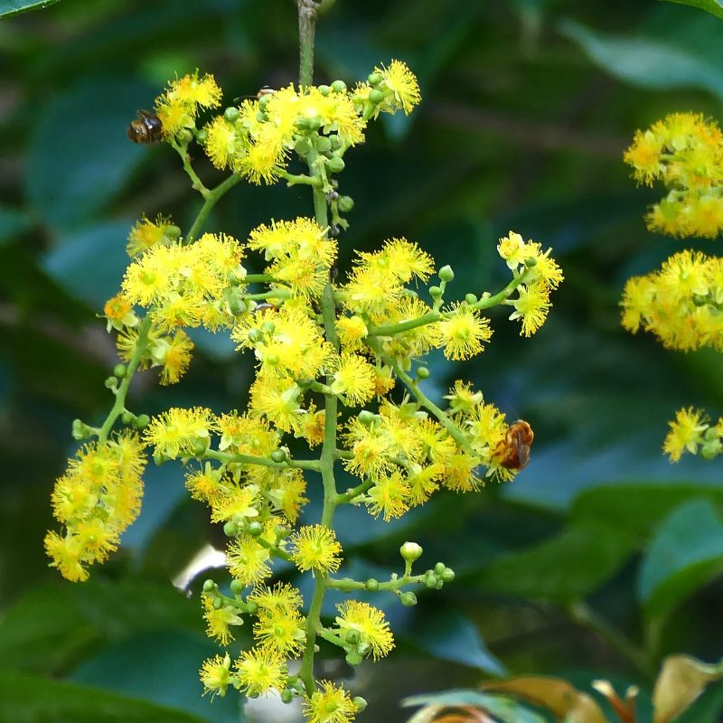
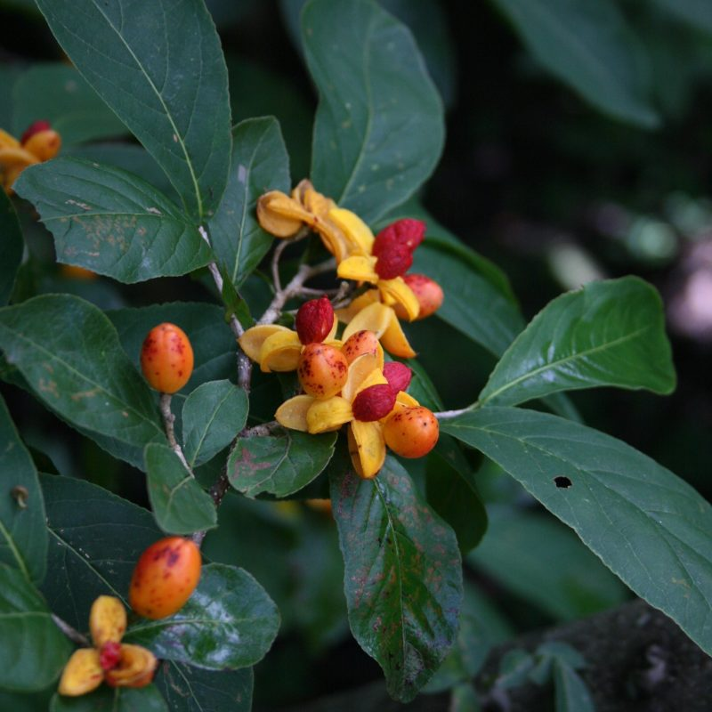
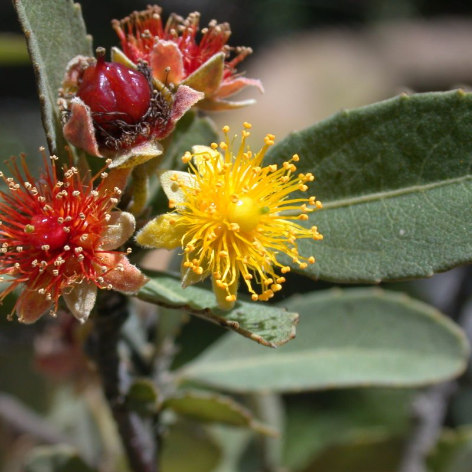

## Salicaceae and Lacistemataceae

__Administers:__ [Salicaceae](/wfo-7000000540) and [Lacistemataceae](/wfo-7000000316)

> *Salicaceae: A large pan-tropical, temperate and boreal woody family of considerable ecological importance*

The traditional definition of the family only included the temperate genera *Salix* and *Populus*. Molecular analysis has shown these are nested within what was once called Flacourtiaceae. The family is now expanded to cover the majority of the ​"old" Flacourtiaceae. The sister family is generally considered to be the sister family is generally considered to be the Lacistemataceae (2 genera: *Lacistema*, *Lozania*). The genus *Salix* (willows) is an important component of the Arctic and boreal biomes.

### Contributors

-   Mac Alford (University of Southern Mississippi)
-   Wendy Applequist (Missouri Botanical Garden)
-   Quentin Cronk (UBC, Vancouver)
-   Li He (Shanghai Chenshan Botanical Garden)
-   Ronaldo Marquete (Instituto de Pesquisas Jardim Botânico do Rio de Janeiro)
-   Astrid de Mestier (Botanischer Garten, Berlin)
-   Tommi Nyman (NIBIO, Norway)
-   Radim J. Vašut (Palacky University in Olomouc)
-   Natascha Wagner (Georg-August-Universität Göttingen)
-   Campbell O. Webb (Museum of the North, Univ. Alaska, Fairbanks)

### Key Literature

-   Alford, M. H. (2003). Claves para los géneros de Flacourtiaceae de Perú y del Nuevo Mundo. Arnaldoa, 10(2), 19-38.
-   Argus, G. W. (1997). Infra-generic classification of Salix (Salicaceae) in the New World. Systematic Botany Monographs, 52, 1-121.
-   [Argus, G. W. (2010) Salix. In Magnoliophyta: Salicaceae to Brassicaceae (edited by Flora of North America Editorial Committee), Volume 7 of Flora of North America North of Mexico, pp. 23-162. Oxford University Press.](https://floranorthamerica.org/Salix.)
-   Bernhard, A., and P. K. Endress. 1999. Androecial development and systematics in Flacourtiaceae s.l. Plant Systematics and Evolution 215: 141-155.
-   Boucher, L. D., S. R. Manchester, and W. S. Judd. 2003. An extinct genus of Salicaceae based on twigs with attached flowers, fruits, and foliage from the Eocene Green River Formation of Utah and Colorado, USA. American Journal of Botany 90(9): 1389-1399.
-   Chase, M. W., Zmarzty, S., Lledó, M. D., Wurdack, K. J., Swensen, S. M., & Fay, M. F. (2002). When in doubt, put it in Flacourtiaceae: a molecular phylogenetic analysis based on plastid rbcL DNA sequences. Kew Bulletin, 57, 141--181.
-   de Mestier, A., G. Brokamp, M. Celis, B. Falcón-Hidalgo, J. Gutiérrez, and T. Borsch. 2022. Character evolution and biogeography of Casearia (Salicaceae): Evidence for the South American origin of a pantropical genus and for multiple migrations to the Caribbean islands. Taxon 71(2): 321-347.
-   Eckenwalder, J. E. 1996. Systematics and evolution of Populus. Pp. 7-32 in Biology of Populus and its implications for management and conservation (R. F. Stettler, ed.). NRC Research Press, Ottawa.
-   Keating, R. C. 1973. Pollen morphology and relationships of the Flacourtiaceae. Annals of the Missouri Botanical Garden 60(2): 273-305.
-   Killick, D. J. B. (1976). Flacourtiaceae. In J. H. Ross (Ed.), Flora of Southern Africa, 22, 53--92.
-   Lemke, D. E. (1988). A synopsis of Flacourtiaceae. Aliso, 12, 29-43.
-   Meeuse, A. D. J. 1975. Taxonomic relationships of Salicaceae and Flacourtiaceae: their bearing on interpretative floral morphology and Dilleniid phylogeny. Acta Botanica Neerlandica 24: 437-457.
-   Miller, R. B. 1975. Systematic anatomy of the xylem and comments on the relationships of Flacourtiaceae. Journal of the Arnold Arboretum 56(1): 20-102.
-   Schneider, C. K. (1918). A conspectus of Mexican, West Indian, Central, and South American varieties of Salix. Botanical Gazette, 65, 1-41.
-   Skvortsov, A. K. (1999) Willows of Russia and Adjacent Countries; Taxonomical and Geographical Revision. University of Joensuu, Joensuu. Originally published as: Skvortsov, A. K. 1968. Willows of the USSR; A Taxonomic and Geographic Revision. Proceedings of the Study of the Fauna and Flora of the USSR, New Series: Section of Botany, 15 (XXIII), chief ed. V. N. Tikhomirov. Moscow Society of Naturalists, Moscow.
-   Sleumer, H. O. (1955). Flacourtiaceae. Flora Malesiana, Series I, 5, 1--106. National Herbarium of the Netherlands, Leiden.
-   Sleumer, H. O. (1975). Flacourtiaceae. In R. M. Polhill (Ed.), Flora of Tropical East Africa. Crown Agents, London.
-   Sleumer, H. O. (1980). Flacourtiaceae. Flora Neotropica, Monograph 22. New York Botanical Garden, New York.
-   Spencer, K. C., and D. S. Seigler. 1985. Cyanogenic glycosides and the systematics of the Flacourtiaceae. Biochemical Systematics and Ecology 13(4): 421-431.
-   van Heel, W. A. 1967. Anatomical and ontogenetic investigations on the morphology of the flowers and the fruit of Scyphostegia borneensis Stapf (Scyphostegiaceae). Blumea 15(1): 107-125.
-   Yang, Q., & Zmarzty, S. (2007). Flacourtiaceae. In Z. Y. Wu, P. H. Raven, & D. Y. Hong (Eds.), Flora of China, 13, 112--137. Science Press, Beijing; Missouri Botanical Garden Press, St. Louis.

### Acknowledgements:

We thank the staff of the Royal Botanic Garden Edinburgh (RBGE) for advice and support in setting up this TEN.

