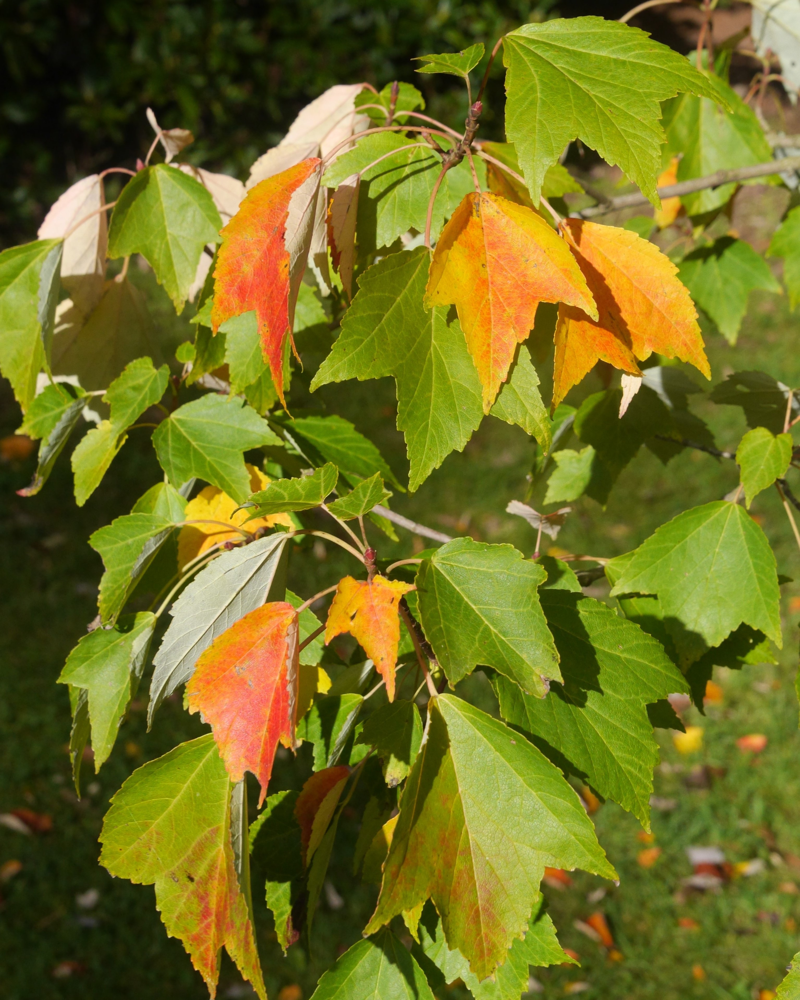

## Sapindaceae - (Subfamily Hippocastanoideae) Global Conservation Consortium for Acer

Administers: Sapindaceae subfamily Hippocastanoideae

Primary TENs contact: [Dan Crowley](mailto:)

This Taxonomic Expert Network is being coordinated by the Global Conservation Consortium for *Acer*, working in collaboration with the Maple Society.

Acknowledgements:

-   Anthony. S. Aiello (Longwood Gardens) -- *Acer*
-   Piotr Banaszczak (Rogow Arboretum) --- *Acer*
-   Koen Camelbeke (Arboretum Wespelaar) -- *Acer*
-   Dan Crowley (BGCI) -- *Acer*; *Dipteronia*; *Handeliodendron*
-   Alan Elliott (RBGE) -- *Dipteronia*; *Handeliodendron*
-   AJ Harris (South China Botanical Garden) -- *Aesculus*; *Acer*; *Billia*
-   Douglas Justice (University of British Columbia Botanical Garden) -- *Acer*

Acer pycnanthum. © Dan Crowley