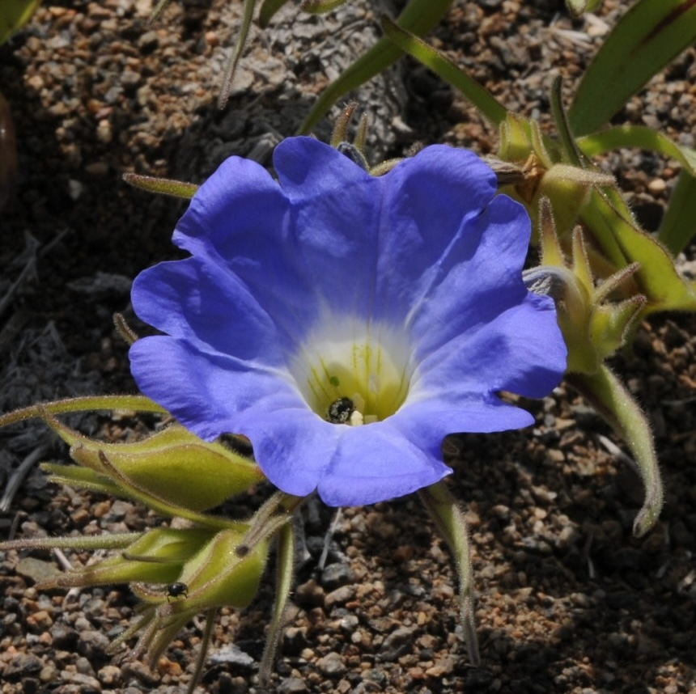

## Solanaceae - SolanaceaeSource.org

__Administers:__ [Solanaceae](/wfo-7000000654)

__External website:__ <http://www.solanaceaesource.org/>

Primary TENs contact: [Tiina Särkinen](mailto:t.sarkinen@rbge.org.uk) from [Royal Botanic Garden Edinburgh](https://about.worldfloraonline.org/consortium-members/royal-botanic-garden-edinburgh)

> SolanaceaeSource is a worldwide online taxonomic monograph of the nightshade family and represents the combined research efforts of c. 22 taxonomists across the world.

SolanaceaeSource contains all names in *Solanaceae* (Accepted species 2,789; Accepted genera 107; Updated: 1 Jun 2026). The database contains the most updated synonymy and >233,000 taxonomically verified specimens for the family. The SolanaceaeSource website has summary information about the family, and images of live plants for most genera. For the largest and most economically important genus in the family, *Solanum*, there are currently 1,243 accepted species and >181,000 specimens included in the resource. The SolanaceaeSource website serves 1,505 species descriptions for the family with photos of live plants and habitats where these are available. [Major keys](https://eur01.safelinks.protection.outlook.com/?url=http%3A%2F%2Fsolanaceaesource.org%2Fcontent%2Fidentification-keys&data=05%7C02%7CAElliott%40rbge.org.uk%7C0be8aa58ea864ba3d1b808debfe9d034%7Cbb63bb00175e46b7b7b3bc74158e4fd4%7C0%7C0%7C639159208121577920%7CUnknown%7CTWFpbGZsb3d8eyJFbXB0eU1hcGkiOnRydWUsIlYiOiIwLjAuMDAwMCIsIlAiOiJXaW4zMiIsIkFOIjoiTWFpbCIsIldUIjoyfQ%3D%3D%7C0%7C%7C%7C&sdata=2IiCKSqbV%2B468U821dmhdEZ0fBfQ25%2FiYBtRAVxcBHQ%3D&reserved=0), including the global online [multi-access key to *Solanum* groups](https://eur01.safelinks.protection.outlook.com/?url=https%3A%2F%2Fsolanum-groups.identificationkey.org%2Fmkey.html&data=05%7C02%7CAElliott%40rbge.org.uk%7C0be8aa58ea864ba3d1b808debfe9d034%7Cbb63bb00175e46b7b7b3bc74158e4fd4%7C0%7C0%7C639159208121617521%7CUnknown%7CTWFpbGZsb3d8eyJFbXB0eU1hcGkiOnRydWUsIlYiOiIwLjAuMDAwMCIsIlAiOiJXaW4zMiIsIkFOIjoiTWFpbCIsIldUIjoyfQ%3D%3D%7C0%7C%7C%7C&sdata=eorlaSD8tI1NdSR4U09q2QrBc7gh8WynYyL44QYr1As%3D&reserved=0) and [all *Solanum *species (excl. spiny Solanum ](https://eur01.safelinks.protection.outlook.com/?url=https%3A%2F%2Fsolanum-species.identificationkey.org%2Fmkey.html&data=05%7C02%7CAElliott%40rbge.org.uk%7C0be8aa58ea864ba3d1b808debfe9d034%7Cbb63bb00175e46b7b7b3bc74158e4fd4%7C0%7C0%7C639159208121644227%7CUnknown%7CTWFpbGZsb3d8eyJFbXB0eU1hcGkiOnRydWUsIlYiOiIwLjAuMDAwMCIsIlAiOiJXaW4zMiIsIkFOIjoiTWFpbCIsIldUIjoyfQ%3D%3D%7C0%7C%7C%7C&sdata=x0W%2Beq7ikxpmZFHwaH1Dvbj1Oo2u2i7lgZCSfodAWQc%3D&reserved=0)from[ Australia and Oceania)](https://eur01.safelinks.protection.outlook.com/?url=https%3A%2F%2Fsolanum-species.identificationkey.org%2Fmkey.html&data=05%7C02%7CAElliott%40rbge.org.uk%7C0be8aa58ea864ba3d1b808debfe9d034%7Cbb63bb00175e46b7b7b3bc74158e4fd4%7C0%7C0%7C639159208121665839%7CUnknown%7CTWFpbGZsb3d8eyJFbXB0eU1hcGkiOnRydWUsIlYiOiIwLjAuMDAwMCIsIlAiOiJXaW4zMiIsIkFOIjoiTWFpbCIsIldUIjoyfQ%3D%3D%7C0%7C%7C%7C&sdata=9uUpkirHyTlfT%2BStlbLxRqazLmsEPDnwrV8OcX8xZ%2F8%3D&reserved=0) including all wild relatives of potato, tomato, and pepino.

SolanaceaeSource is an ongoing project and is continually updated. All names from the International Plant Names Index (IPNI) are included as well as many others, which means our list of names is often more complete than IPNI, particularly at the infraspecific level. We share data regularly with IPNI in a reciprocal arrangement. Synonymy is actively worked on as part of taxonomic revision so changes will occur time to time.

If you would like to contribute any data, including field photos, please contact us.

### How to cite

Solanaceae Source. Current year. [item accessed]. Date downloaded. [http://​www​.solanaceae​source​.org/](http://www.solanaceaesource.org/)

### Solanaceae genus summary map

-   [An interactive map to the genera of the Solanaceae, created using r packages expowo and plot_ly can be viewed here.](https://haglad.github.io/Solanaceae_map.github.io/solgenmap_smaller.html)

### Acknowledgements

SolanaceaeSource contains specimen data from 485 herbaria, We thank all staff from the following herbaria for access to material and permission to include data: A, AA, AAU, AD, AGUAT, AK, ALCB, AMAZ, AMES, ANDES, ANG, ANSM, APSC, ARIZ, AS, ASC, ASE, ASU, AZ, AZU, B, BA, BAA, BAB, BACP, BAF, BAH, BAL, BART, BBB, BBLM, BBLM-OWY, BCRU, BG, BH, BHCB, BHSC, BHZB, BI, BIGU, BISH, BK, BKF, BKL, BLAT, BLMVL, BM, BO, BOIS, BOLV, BONN, BOTU, BP, BR, BREM, BRI, BRIT, BRLU, BRU, BRY, BSB, BSD, BSHC, BSI, BSN, BUT, B‑W, C, CAL, CANB, CANU, CAS, CAUP, CAY, CBG, CCNL, CDS, CEN, CEPEC, CESJ, CGE, CGG, CHAP, CHAPA, CHR, CHSC, CIC, CICY, CIIDIR, CIP, CIQ, CIQR, CLEMS, CM, CN, CNS, CO, COAH, COI, COL, COLO, CONC, CONN, CORD, CPUN, CR, CRI, CRMO, CS, CTES, CU, CUVC, CUW, CUZ, CVRD, DBG, DBN, DD, DES, DH, DNA, DR, DS, DSC, DSM, DUKE, DVPR, E, EA, EAC, EAP, ECON, EIU, EKY, EMC, ENCB, ENLC, ESA, ETH, EWU, F, FCQ, FHO, FI, FLAS, FLOR, FM, FMB, FR, FSU, FT, FUEL, FURB, G, GA, GAS, GAT, GB, G‑BOIS, G‑DC, GH, GL, GMUF, GOET, GUAY, GZU, H, HA, HAJB, HAL, HAMAB, HAO, HAS, HAST, HB, HBG, HBR, HCF, HECASA, HF, HFSL, HIB, HIFP, HITBC, HO, HOH, HOXA, HPSU, HSP, HST, HSTM, HUA, HUAZ, HUCS, HUEFS, HUEM, HUFSJ, HUFU, HURB, HUSA, HUT, HUVA, HVASF, IAC, IAGB, IBE, IBK, IBSC, IBUG, ICA, ICN, ID, IDS, IEB, IFP, ILL, ILLS, INB, IND, INIAP, INIF, INPA, IPA, IRVC, ISC, IZAC, JAUM, JBGP, JBSD, JE, JEPS, JOI, JPB, JUA, K, KESC, KFTA, KHD, KIEL, KIRI, KUFS, KUN, K‑W, L, LAE, LAGU, LD, LE, LEA, LECB, LG, LIL, LINN, LISC, LL, LOJA, LP, LPB, LSCR, LSU, LU, LWI, LY, M, MA, MAC, MAINE, MARY, MASS, MB, MBK, MBM, MBML, MCNS, MEDEL, MEL, MEN, MER, MERF, MERL, MESA, MEX, MEXU, MG, MH, MHES, MHU, MI, MICH, MIN, MIRR, MISS, MISSA, MJG, MMNS, MO, MOD, MOL, MONT, MONTU, MOR, MPU, MPUC, MSB, MSC, MT, MU, MVFA, MVJB, MVM, MY, N, NA, NCBS, NCU, NDG, NE, NEB, NEBC, NHA, NHT, NIJ, NOU, NS, NSW, NT, NU, NY, O, OBI, OKL, OS, OSC, OTA, OUPR, OXF, P, PACA, PAL, PBL, PDA, PE, PERTH, PEUFR, PGM, PH, P‑LA, PMA, PMSP, PNNL, POM, PRC, PRE, PSM, PSO, PTBG, PTIS, PY, Q, QAP, QCA, QCNE, QPLS, QRS, R, RAB, RB, REG, RENO, RIOC, RM, RON, RPSC, RSA, S, SASK, SBBG, SCA, SCZ, SD, SEL, SF, SGO, SI, SING, SJRP, SL, SMDB, SMU, SOC, SP, SPF, SPSF, SRFA, SRGH, SRP, SRSC, STU, SUNIV, SZ, TAES, TAN, TCD, TCF, TEF, TEX, TI, TO, TTRS, TUB, U, UAMIZ, UB, UBC, UC, UCD, UCR, UCS, UDBC, UEC, UFACPZ, UFP, UFRN, UFRR, UIS, UMO, UNA, UNCC, UNM, UNOP, UNSL, UOS, UPCB, UPR, UPS, UPTC, URV, US, USF, USFS, USJ, USM, USMS, USZ, UT, UTC, UTMC, UV, V, VALD, VALLE, VDB, VEN, VIC, VIES, VMSL, VPI, VSC, VT, W, WA, WAG, WCSU, WCW, WELT, WGCH, WI, WIR, WIS, WOLL, WRSL, WS, WSTC, WTU, WU, WUK, WWB, XAL, YA, YU, Z, ZEA.

The National Science Foundation (NSF) funded the original PBI *Solanum* project as part of the Planetary Biodiversity Inventories (PBI) mission (DEB-0316614).

Solanaceae Source is maintained by the Natural History Museum London and Royal Botanic Garden Edinburgh. These institutions are supported by the UK Government's Department for Digital, Culture, Media and Sport (DCMS) and the Scottish Government's Rural and Environment Science and Analytical Services Division (*RESAS*), respectively.

### Key Contributions

-   [Sandra Knapp -- Natural History Museum London](https://orcid.org/0000-0002-2168-0514), UK (TEN Focal)
-   [Tiina Särkinen -- Royal Botanic Garden Edinburgh](https://orcid.org/0000-0003-4342-2089), UK (TEN Focal
-   Alex Monro --- Royal Botanic Gardens, Kew, UK
-   Andor Vente
-   Andres Orejuela -- Royal Botanic Garden Edinburgh, UK & Jardin Botanico de Bogota, Colombia
-   Andrés Moreira-Muñoz
-   Billie Turner
-   Briggitthe Melchor-Castro --- Royal Botanic Garden Edinburgh
-   Carmen Benitez
-   Carmen Fernandez
-   Chris Martine --- USA
-   Clara Ines Orozoco --- Colombia
-   David Spooner --- US Department of Agriculture, USA
-   Donald McClelland
-   Duban Canal
-   Ellen Dean
-   Eric Tepe -- University of Cincinnati, USA
-   Erwin Pereyra
-   Fatima Agra
-   Federico Luebert
-   Flor Tantalean
-   Franco Chiarini -- National University of Cordoba, Argentina
-   Frank Farruggia --- USA
-   Gloria Barboza --- National University of Cordoba, Argentina
-   Greg Anderson
-   Iris Edith Peralta -- National University of Cuyo, Mendoza, Argentina
-   James Henrickson
-   João Stehmann -- Federal University of Minas Gerais, Belo Horizonte (UFMG), Brazil
-   Juan Tovar
-   Laurence Haegi
-   [Leandro Giacomin -- Universidade Federal do Oeste do Pará, Brazil](https://orcid.org/0000-0002-5231-3987)
-   Lucovica Santilli
-   [Lynn Bohs -- University of Utah](https://www.calu.edu/inside/faculty-staff/profiles/mark-tebbitt.aspx), USA
-   Marcia Vignoli-Silva
-   Maria del Pilas Zamora-Tavares
-   Mahinda Martinez
-   Maria Vorontsova --- Royal Botanic Gardens, Kew, UK
-   Marco Cueva
-   Mark Chase --- Royal Botanic Gardens, Kew, UK
-   Maarten Christenhusz
-   Michael Dillon
-   Michael Nee -- retired from New York Botanical Garden, USA
-   Nicolas Lavandero
-   Ofelia Vargas-Ponce
-   Paul Gonzales
-   Rafael Costa-Silva
-   Robin Fernandez-Hilario
-   Rocio Deanna
-   Segundo Leiva
-   Stacey Smith
-   Stephen Stern -- Colorado Mesa University, USA
-   Thomas Mione
-   Tony Bean
-   Valéria Sampaio
-   Vanessa Moreles-Fierro
-   Victor Quipuscoa
-   Xavier Aubriot -- University Paris-Sud, France
-   Yuri Gouvêa --- Federal University of Minas Gerais, Belo Horizonte (UFMG), Brazil
-   Jacob Bryant -- University of Cincinnati, USA
-   Richard Balvin -- Universidad Nacional Mayor de San Marcos, Lima, Peru

And many others, including collectors and curators of collections

### Key Literature

-   [Huang, J. et al. (2023) Nuclear phylogeny and insights into whole-genome duplications and reproductive development of Solanaceae plants. Plant Commun. 4(4) 100595.](https://doi.org/10.1016/j.xplc.2023.100595)
-   [Hilgenhof, R. et al. (2023) Morphological trait evolution in Solanum (Solanaceae): Evolutionary lability of key taxonomic characters. Taxon 72: 811.847. https://onlinelibrary.wiley.com/doi/full/10.1002/tax.12990](https://onlinelibrary.wiley.com/doi/full/10.1002/tax.12990)
-   [Gagnon, E. et al. (2022) Phylogenomic discordance suggests polytomies along the backbone of the large genus Solanum. American Journal of Botany 109: 580-601. https://bsapubs.onlinelibrary.wiley.com/doi/10.1002/ajb2.1827](https://bsapubs.onlinelibrary.wiley.com/doi/10.1002/ajb2.1827)
-   [Tepe, E. J. et al. (2016) Relationships among wild relatives of the tomato, potato, and pepino. Taxon 65: 262--276. doi: 10.12705/652.4.](https://doi.org/10.12705/652.4)
-   [Särkinen, T. et al. (2013) A phylogenetic framework for evolutionary study of the nightshades (Solanaceae): A dated 1000-tip tree. BMC Evolutionary Biology 13 doi: 10.1186/1471-2148-13-214.](https://doi.org/10.1186/1471-2148-13-214)