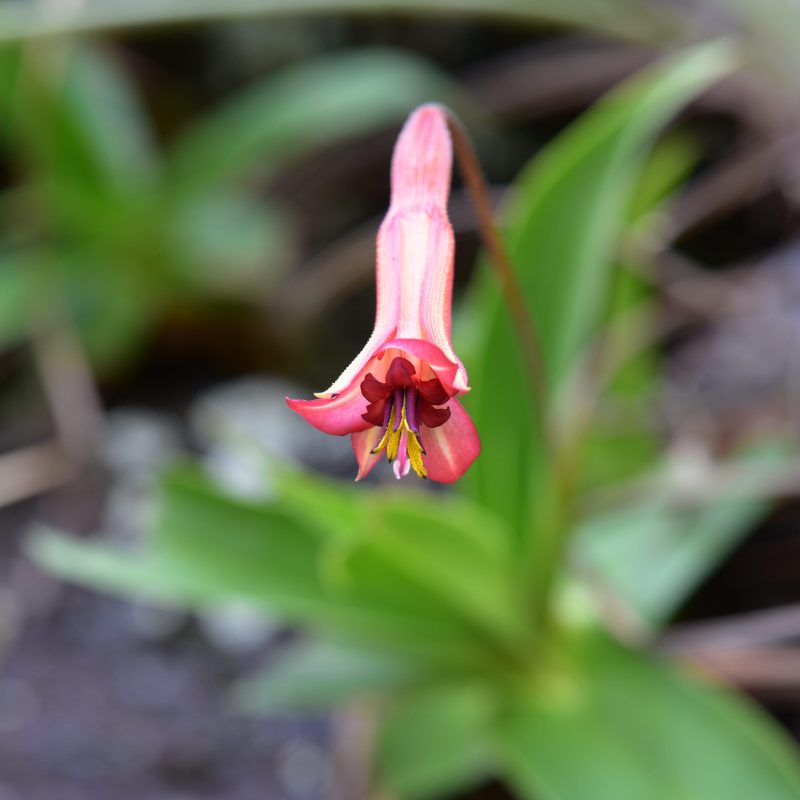
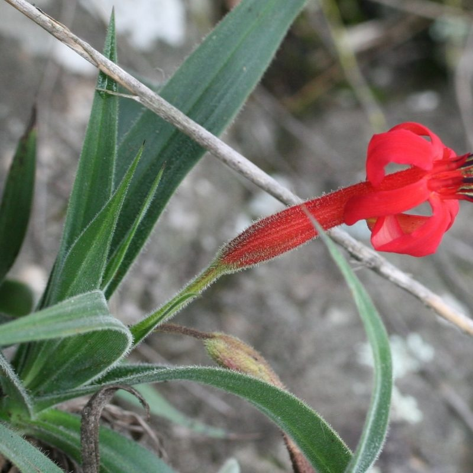
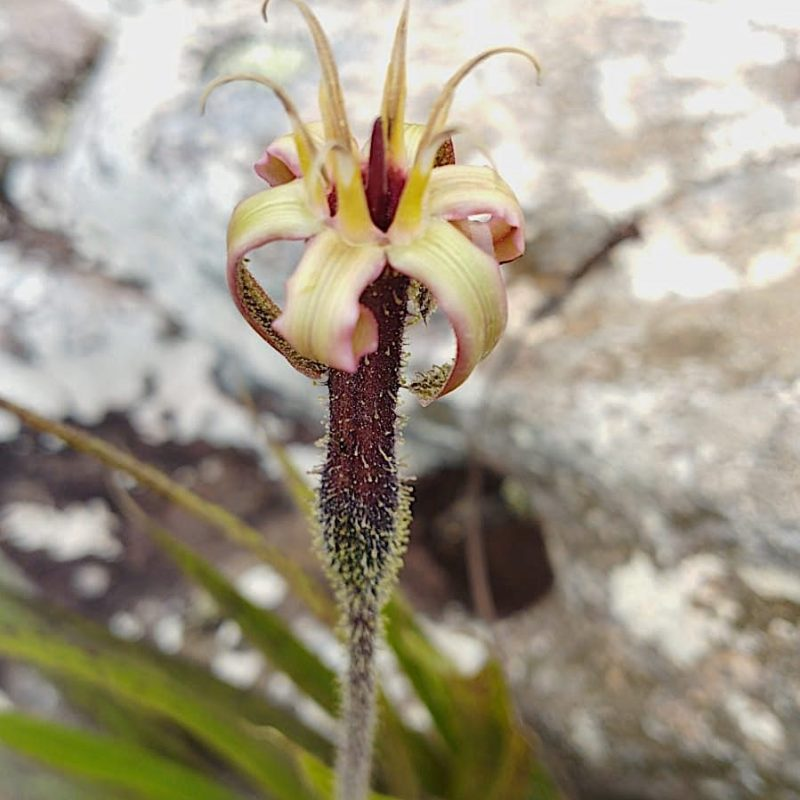
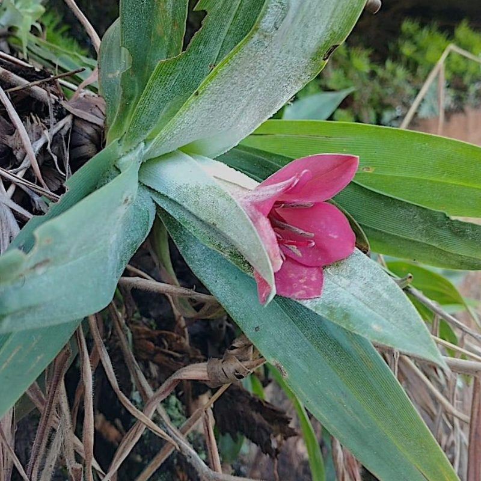
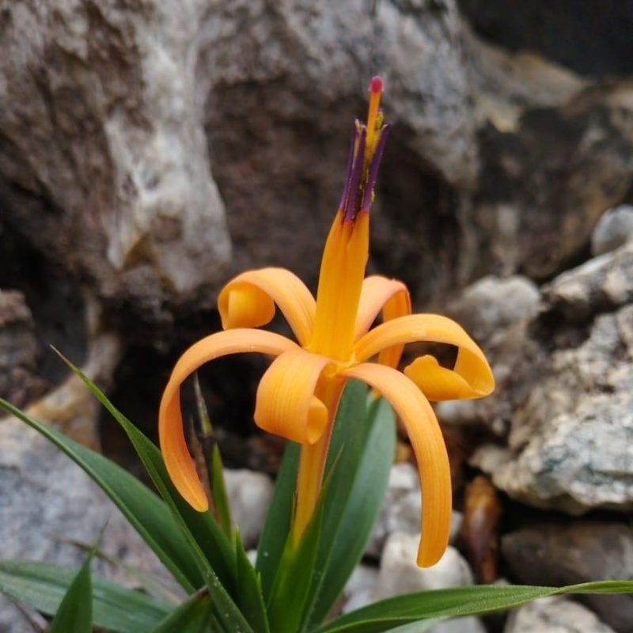
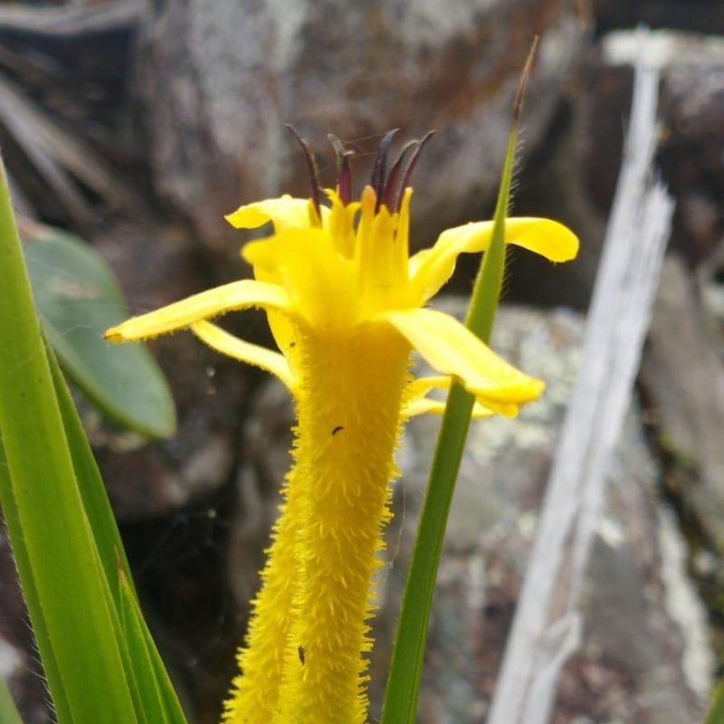
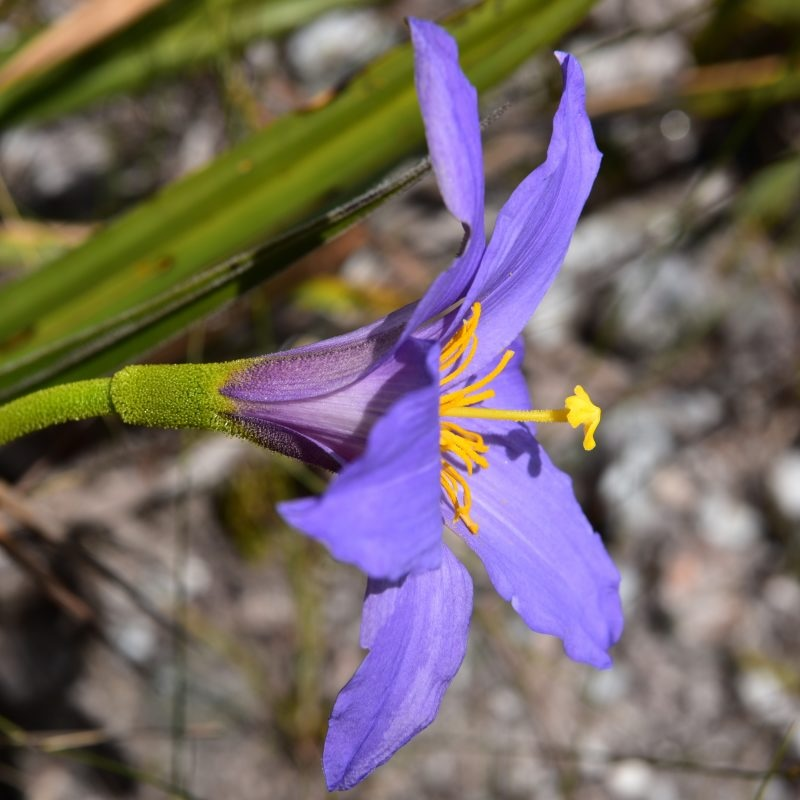
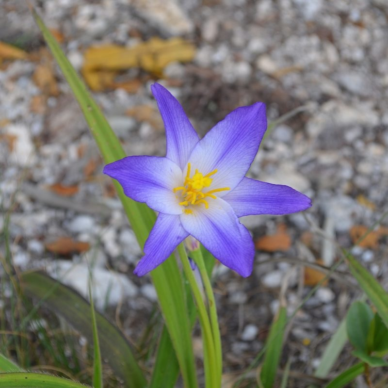
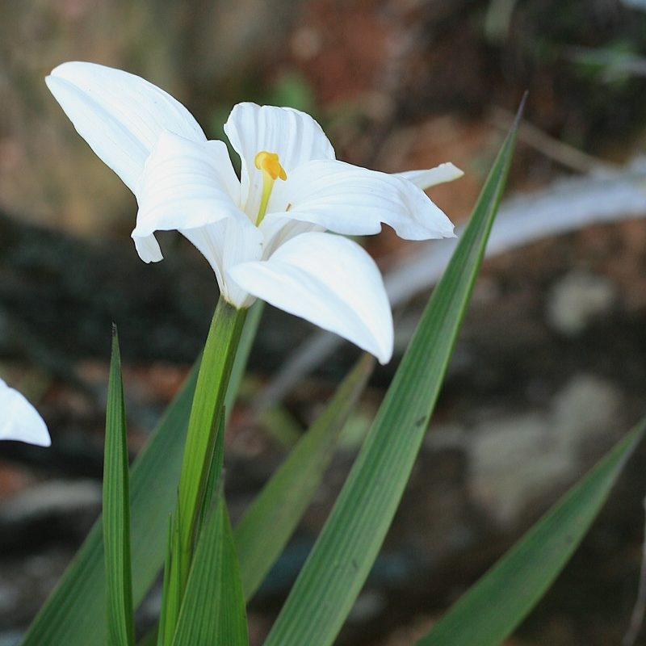
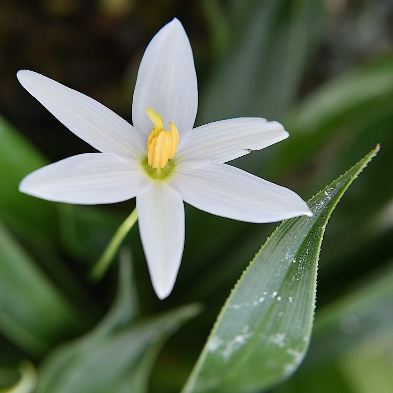

## Velloziaceae

__Administers:__ [Velloziaceae](/wfo-7000000634)

Primary TENs contact: Andressa Cabral

> "A Neotropical-centered, pan-tropically dispersed family with remarkable survival strategies in harsh environments." 

The Velloziaceae TEN brings together an international network of experts dedicated to advancing studies on the diversity of this ecologically important family. Taxonomic data curation is based on Rhakhis, the WFO's taxonomic curation tool. Please contact us if you would like to contribute to the Velloziaceae TEN.

Primary TENs contacts:

Andressa Cabral (German Centre for Integrative Biodiversity Research -- iDiv; Leipzig University, Germany)

Suzana Alcantara (UFSC -- Universidade Federal de Santa Catarina, Brazil)

### Contributors (in alphabetical order):

- Andressa Cabral (German Centre for Integrative Biodiversity Research -- iDiv; Leipzig University, Germany)
- Bianca (Bia) Schindler (Universidade de Brasília, Brazil)
- Carlos Alberto Ferreira Junior (Fundação de Parques Municipais e Zoobotânica de Belo Horizonte, Brazil)
- Peter (Pete) B. Phillipson (Missouri Botanical Garden, USA & MNHN, France)
- Porter (Pete) L. Lowry II (Missouri Botanical Garden, USA)
- Suzana Alcantara (UFSC -- Universidade Federal de Santa Catarina, Brazil)

### Key Literature

-   Abrahao, A., de Britto Costa, P., Teodoro, G. S., Lambers, H., Nascimento, D. L., Adrián López de Andrade, S., et al. (2020). Vellozioid roots allow for habitat specialization among rock‐and soil‐dwelling Velloziaceae in campos rupestres. Functional Ecology, 34(2), 442-457.
-   Alcantara, S., de Mello‐Silva, R., Teodoro, G. S., Drequeceler, K., Ackerly, D. D., & Oliveira, R. S. (2015). Carbon assimilation and habitat segregation in resurrection plants: a comparison between desiccation‐and non‐desiccation‐tolerant species of Neotropical Velloziaceae (Pandanales). Functional Ecology, 29(12), 1499-1512.
-   Alcantara, S., Ree, R. H., & Mello-Silva, R. (2018). Accelerated diversification and functional trait evolution in Velloziaceae reveal new insights into the origins of the campos rupestres' exceptional floristic richness. Annals of Botany, 122(1), 165-180.
-   Behnke, H. D., Hummel, E., Hillmer, S., Sauer-Gürth, H., Gonzalez, J., & Wink, M. (2013). A revision of African Velloziaceae based on leaf anatomy characters and rbcL nucleotide sequences. Botanical Journal of the Linnean Society, 172(1), 22-94.
-   Cabral, A., Magri, R. A., & Lopes, J. D. C. (2021). Vellozia inselbergae (Velloziaceae), a new species from the Brazilian Atlantic Forest inselbergs. Phytotaxa, 497(2), 138-146.
-   Cabral, A., Luebert, F., & Mello-Silva, R. (2021). Evidence for Middle Miocene origin and morphological evolutionary stasis in a Barbacenia Inselberg clade (Velloziaceae). Molecular Phylogenetics and Evolution, 161, 107163.
-   Cabral, A., Magri, R. A., & de Carvalho Lopes, J. (2022). Increasing knowledge on the diversity of canelas-deema in the campo rupestre. Plant Ecology and Evolution, 155(3), 343-352.
-   Cabral, A., Ferreira-Júnior, C. A., & de Menezes, N. L. (2023). Two new remarkable species of Barbacenia (Velloziaceae) from the Brazilian Espinhaço Range in honor of Renato Mello-Silva. Phytotaxa, 616(3), 279-287.
-   De Freitas Larocca, P., Saldanha Mancio, J., Padilha, P., Mello-Silva, R., & Alcantara, S. (2022). Recent divergence in functional traits affects rates of speciation in the Neotropical Velloziaceae (Pandanales). Botanical Journal of the Linnean Society, 199(1), 144-172.
-   Mello-Silva, R. (1995). Aspectos taxonômicos, biogeográficos, morfológicos e biológicos das Velloziaceae de Grão-Mogol, Minas Gerais, Brasil. Boletim de Botânica da Universidade de São Paulo, 49-79.
-   Mello-Silva, R. (1991). The infra-familial taxonomic circumscription of the Velloziaceae: a historical and critical analysis. Taxon, 45-51.
-   Mello-Silva, R. (1999). The Velloziaceae according to Lyman Smith. Harvard Papers in Botany, 4(1), 267-270.
-   Mello-Silva, R., Santos, D. Y. A., Salatino, M. L. F., Motta, L. B., Cattai, M. B., Sasaki, D., et al. (2011). Five vicarious genera from Gondwana: the Velloziaceae as shown by molecules and morphology. Annals of Botany, 108(1), 87-102.
-   Mello-Silva, R. (2005). Morphological analysis, phylogenies and classification in Velloziaceae. Botanical Journal of the Linnean Society, 148(2), 157-173.
-   Mello-Silva, R. (2010). Circumscribing Vellozia hirsuta and V. tubiflora (Velloziaceae). Hoehnea, 37, 617-646.
-   Mello-Silva, R., & Cabral, A. (2022). Taxonomic Revision of Barbacenia (Velloziaceae) Atlantic Forest Inselberg Group, with two New Species1. Annals of the Missouri Botanical Garden, 107(1), 32-63.
-   Menezes, N. L. (1988). Evolution of the anther in the family Velloziaceae. Boletim de Botânica da Universidade de São Paulo, 33-41.
-   Menezes, N. L., & Semir, J. (1990). New considerations regarding the corona in the Velloziaceae. Annals of the Missouri Botanical Garden, 539-544.
-   Menezes, N. L., & Semir, J. (1991). Burlemarxia, a new genus of Velloziaceae. Taxon, 413-426.
-   Padilha, P., Brum, F. T., Mello‐Silva, R., Sacramento, I., & Alcantara, S. (2025). Similar, but not the same: time and mode of climatic niche evolution in a highly endemic lineage. Journal of Biogeography, 52(3), 571-586.
-   [Schindler, B.; Figueira, M.; Noronha, S. E.; Matias, R. A. M.; Alves-da-Silva, D. & Simon, M. F. (2025). From the field to the laboratory: a multidisciplinary approach to conserving the microendemic Vellozia sessilis in Chapada dos Veadeiros, Brazil, Annals of Botany, mcaf244,](https://doi.org/10.1093/aob/mcaf244)
-   Smith, L. B. (1962). A synopsis of the American Velloziaceae. Contributions from the United States National Herbarium, 35(3/4), 251-292.
-   [Smith, L. B., & Ayensu, E. S. (1976). A revision of American Velloziaceae. Smithsonian Contributions to Botany, n 30.](https://doi.org/10.5962/bhl.title.122567)
-   Teodoro, G. S., Lambers, H., Nascimento, D. L., de Britto Costa, P., Flores‐Borges, D. N., Abrahão, A., et al. (2019). Specialized roots of Velloziaceae weather quartzite rock while mobilizing phosphorus using carboxylates. Functional Ecology, 33(5), 762-773.
-   Teodoro, G. S., de Britto Costa, P., Brum, M., Signori-Mueller, C., Alcantara, S., Dawson, T. E., et al. (2021). Desiccation tolerance implies costs to productivity but allows survival under extreme drought conditions in Velloziaceae species in campos rupestres. Environmental and Experimental Botany, 189, 104556.

### Acknowledgements

We thank Alan Elliott of the Royal Botanic Garden Edinburgh for supporting the establishment of the Velloziaceae TEN, as well as all researchers who have contributed to field sampling and studies on conservation, taxonomy, systematics, evolution, and biogeography of Velloziaceae. This effort is especially dedicated to Renato Mello-Silva, Nanuza Luiza de Menezes, Lyman B. Smith, and Edward Ayensu, whose influential work has provided the basis for much of our current understanding of the family's biodiversity. We are also grateful to our funding sources, including Flexpool iDiv (German Centre for Integrative Biodiversity Research), Instituto Serrapilheira, and FAPDF.

Selection of Velloziaceae flowers