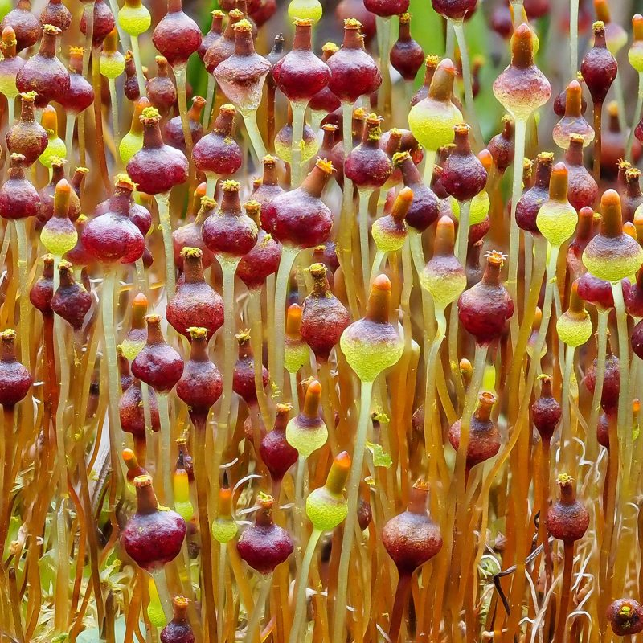
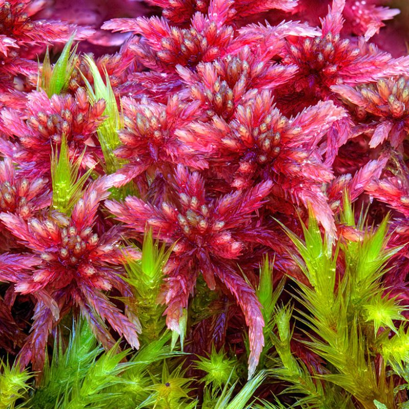
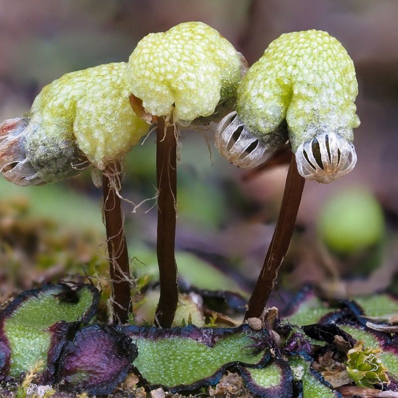
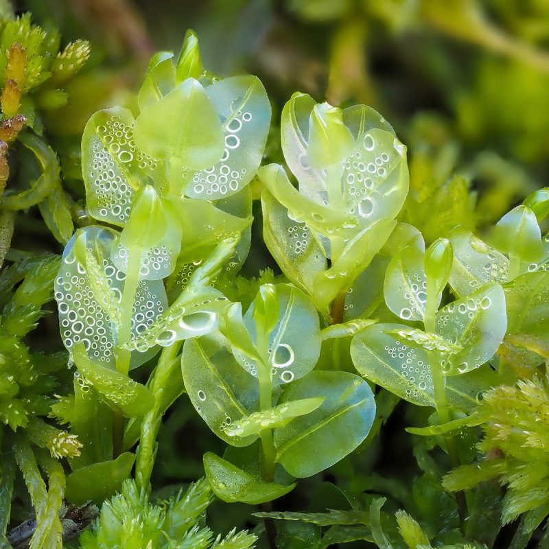

## The Bryophyte Nomenclator

Administers: Bryophytes

External website: <https://www.bryonames.org/>

Primary TENs contact: [John Brinda](mailto:john.brinda@mobot.org) from [Missouri Botanical Garden](https://about.worldfloraonline.org/consortium-members/missouri-botanical-garden)

Online, digital resources like TROPICOS, IPNI, and the [World Flora Online](https://about.worldfloraonline.org/ "WFO") are increasingly becoming the primary sources that people use to obtain information about plants and their scientific names. Efforts made to ensure that these resources are as accurate and up to date as possible will benefit all bryologists and anyone else interested in exploring digital data about bryophyte species. We encourage taxonomic experts interested in contributing their bryological expertise to contact us. As more experts review this dataset, the more accurate and useful it will become. Many bryologists have contributed to TROPICOS over the years, either by entering data directly or by sending corrections and literature to those of us who do. Like all scientific endeavors it has been a collaborative effort that has expanded on the work of previous researchers. Naturally, we hope to see this continued in the future. Because various projects require a list of accepted bryophyte names, we intend to use this tool as a means to provide that information. Among other things, this includes the bryophyte taxonomic expert network for the World Flora Online and the [GLOBAL TCN](https://globaltcn.utk.edu/ "GLOBAL") digitization project.

Key People

-   *John Brinda* is an assistant scientist at the [Missouri Botanical Garden](https://www.missouribotanicalgarden.org/ "Missouri Botanical Garden") in St. Louis, with research interests in the taxonomy, ecology, and conservation of bryophytes, including field experience in the United States, southern Chile, [Madagascar](https://www.madbryo.org/ "MadBryo"), and the Philippines. He is a member of the [IAPT Nomenclatural Committee for Bryophytes](https://www.iaptglobal.org/committee-bryophytes "IAPT"), sits on the steering committee for the [TROPICOS](https://www.tropicos.org/ "Tropicos") botanical database, and is a point of contact for the [World Flora Online](https://about.worldfloraonline.org/tens/bryophytesgroup "World Flora Online - Bryophyte TEN") bryophyte taxonomic expert network.
-   *John Atwood* is Curator of the Crosby Bryophyte Herbarium at the [Missouri Botanical Garden](https://www.missouribotanicalgarden.org/ "Missouri Botanical Garden"). His interests include the taxonomy and nomenclature of bryophytes as well as floristic studies in North America. He is a member of the [TROPICOS](https://www.tropicos.org/ "Tropicos") steering committee and has for more than a decade contributed to the Recent Literature on Bryophytes project published in [*The Bryologist*](https://bioone.org/journals/the-bryologist "The Bryologist"). The RLB project is one of the main reasons why [TROPICOS](https://www.tropicos.org/ "Tropicos") is the most comprehensive and up to date public database of bryological nomenclature.

[Bryophytes around the world - Des Callaghan](https://bryophytes.myportfolio.com/)