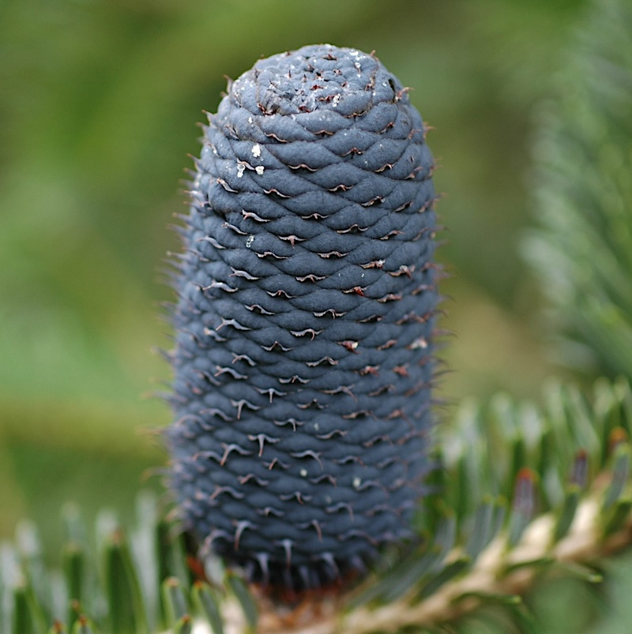

## Conifers

__Administers:__ Araucariaceae, Cupressaceae, Ginkgoaceae, Pinaceae, Podocarpaceae, Sciadopityaceae and Taxaceae.

__Primary TENs contact:__ Philip Thomas from Royal Botanic Garden Edinburgh
