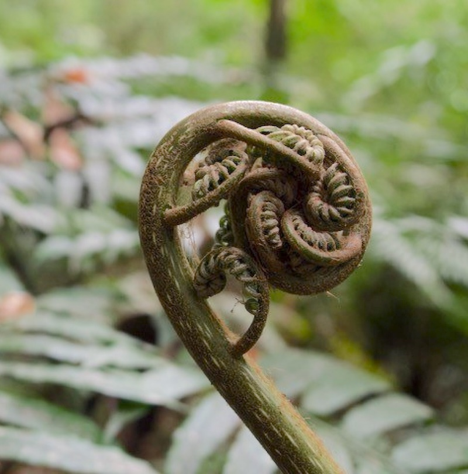

## Pteridophyte Phylogeny Group

Administers: Anemiaceae, Aspleniaceae, Athyriaceae, Blechnaceae, Cibotiaceae, Culcitaceae, Cyatheaceae, Cystodiaceae, Cystopteridaceae, Davalliaceae, Dennstaedtiaceae, Desmophlebiaceae, Dicksoniaceae, Didymochlaenaceae, Diplaziopsidaceae, Dipteridaceae, Dryopteridaceae, Equisetaceae, Gleicheniaceae, Hemidictyaceae, Hymenophyllaceae, Hypodematiaceae, Isoëtaceae, Lindsaeaceae, Lomariopsidaceae, Lonchitidaceae, Loxsomataceae, Lycopodiaceae, Lygodiaceae, Marattiaceae, Marsileaceae, Matoniaceae, Metaxyaceae, Nephrolepidaceae, Oleandraceae, Onocleaceae, Ophioglossaceae, Osmundaceae, Plagiogyriaceae, Polypodiaceae, Psilotaceae, Pteridaceae, Rhachidosoraceae, Saccolomataceae, Salviniaceae, Schizaeaceae, Selaginellaceae, Tectariaceae, Thelypteridaceae, Thyrsopteridaceae, Woodsiaceae

External website: <https://pteridogroup.github.io/>

Pteridophyte Phylogeny Group (PPG) is a collaborative effort by the pteridological community to maintain a classification for ferns and lycophytes that reflects our current understanding of phylogeny. The first version, PPG I, was published in 2016 and treats an estimated 11,916 species in 337 genera, 51 families, 14 orders, and two classes. Since that time, many new names have been published and various parts of the fern and lycophyte tree of life have come into clearer view. Accordingly, efforts are currently underway to revise the classification and publish PPG II. This effort is taking place completely in the open and online, and anyone interested may participate (please see [https://​pteri​dogroup​.github​.io/](https://pteridogroup.github.io/) for more information). There is no firm timeline for publication of PPG II, but the project is aiming for Fall 2024, with continuous updates to follow.

#### Key Literature

-   [Pteridophyte Phylogeny Group I. 2016. "A Community-Derived Classification for Extant Lycophytes and Ferns." Journal of Systematics and Evolution 54 (6): 563--603.](https://doi.org/10.1111/jse.12229)