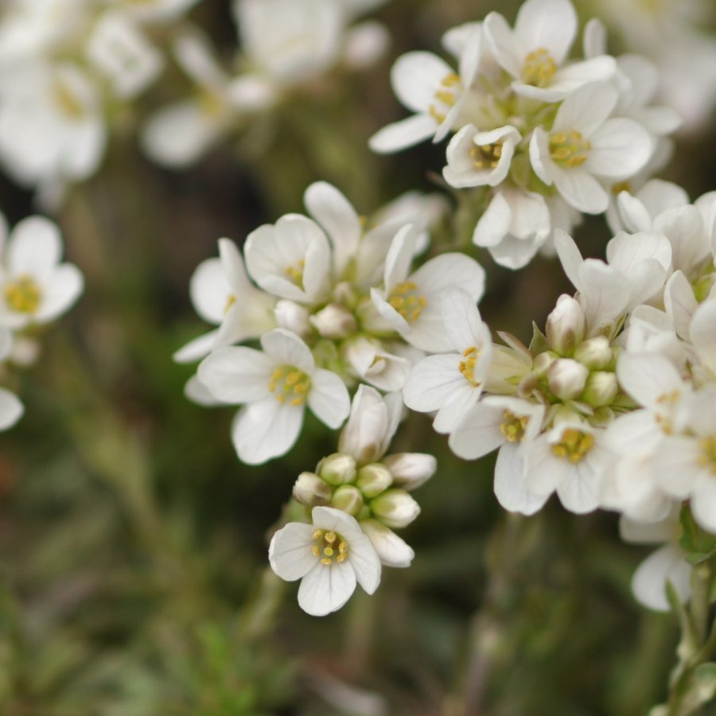
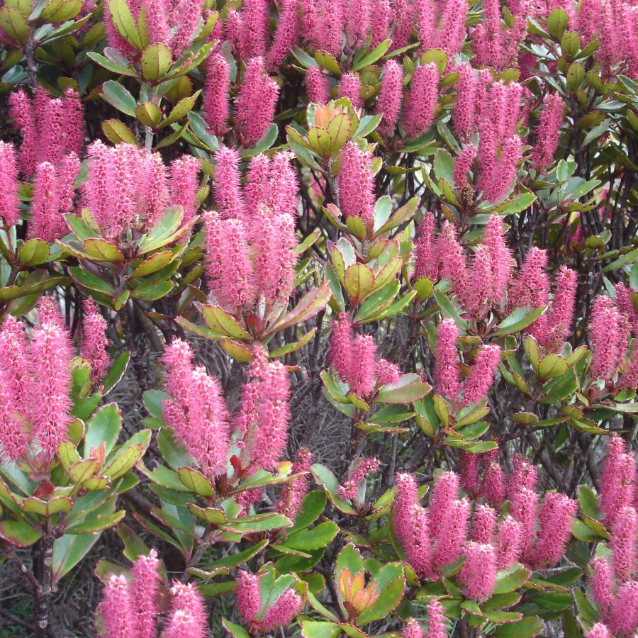
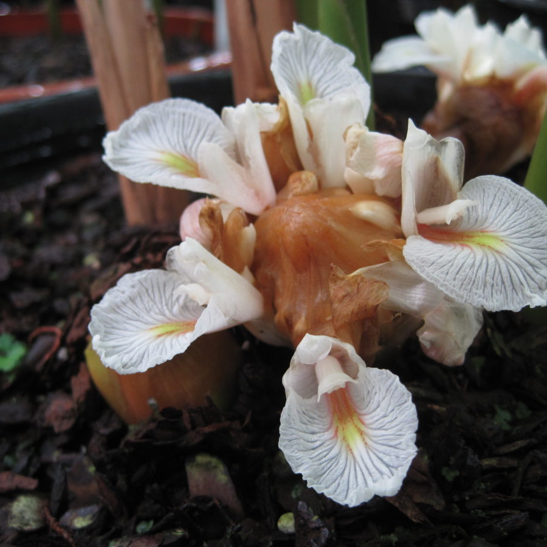

List of TENs > [Contributing to a TEN](/pages/tens_background.md)

## List of Approved Taxonomic Expert Networks (TENs)

WFO maintains a global consensus classification for all bryophytes and vascular plants. This is used as the taxonomic backbone for the WFO’s data portal, for publishing six-monthly versions of the WFO Plant List, and contributes to Catalogue of Life and GBIF. WFO appoints Taxonomic Expert Networks (TENs) to curate this consensus classification, thereby establishing the taxonomy to be used for their groups. The WFO Consortium welcomes engagement by the international taxonomic community to create and join TENs.

----

-----

The following is an alphabetic list of currently approved TENs. Read more about how TENs operate, how you can participate and families needing TENs [here](/pages/tens_background.md). 

<!-- List of all TENS from the subdirectories -->
